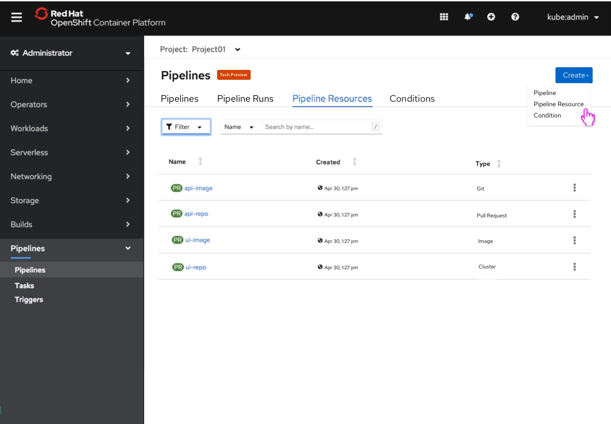
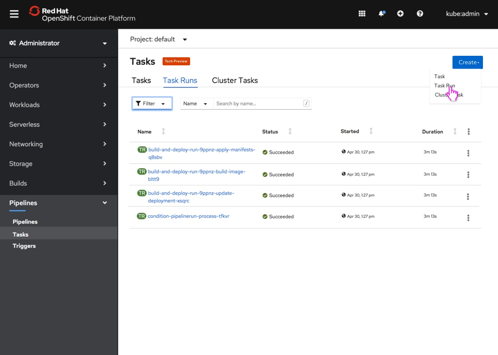
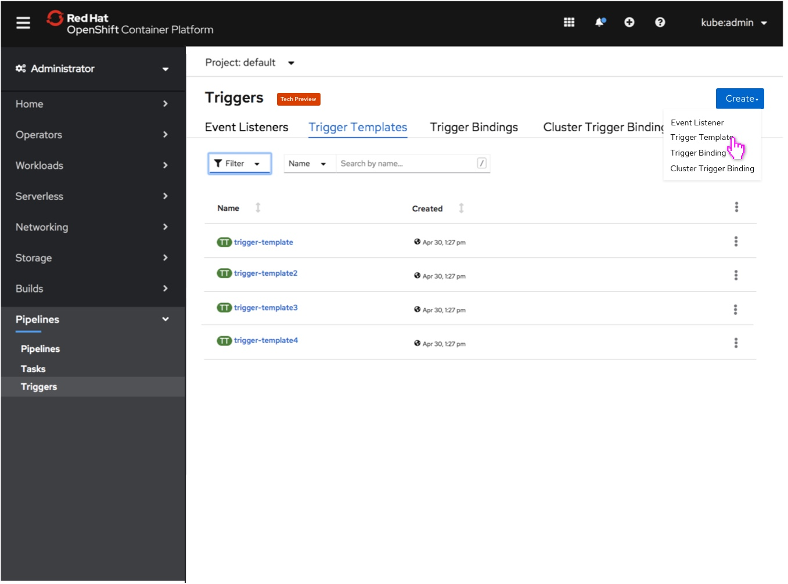

# Pipelines

## Description
The Pipelines pages should be updated on the Admin console to be representative of a view that makes sense for the Admin user. Across all pages:
 - The Namespace column appears when the All-projects selection has been made by the user.
 - The kebab on the table functions as it does today.
 - The Tech Preview badge has now been moved next to the title to make room for the Create button on the  right hand side.
 - The Create button should be styled with the dropdown as it shows on the Secrets page.

## Pipelines page
On the Pipelines page the user can navigate between Pipelines, Pipeline Runs, Pipeline Resources, and Conditions via the tabs on the top of the page.
- From the Create button the user can create Pipelines, Pipeline Resources, and Conditions.
- The main action the user can take on the Pipelines page is creating a Pipeline from the Pipelines page
- The Pipelines page contains the Pipelines Name, Last Run, Last Run Status, and Last Started columns
- If the user selects all-projects from the project selector, the Namespace column appears.

## Pipeline Runs
If the user selects all-projects from the project selector, the Namespace column appears. The Pipelines Runs page contains the Name, Status, Started, and Duration columns.

## Pipeline Resources
If the user selects all-projects from the project selector, the Namespace column appears. The main action the user can take on the Pipelines Resources tab is creating a Pipeline Resource from the Pipeline page. The Pipelines Resources page contains the Name, Created, and Type columns.

## Condition
If the user selects all-projects from the project selector, the Namespace column appears. The main action the user can take on the Condition tab is creating a Condition from the Pipelines page. The Pipelines Resources page contains the Name and Created columns

## Tasks
If the user selects all-projects from the project selector, the Namespace column appears. The main action the user can take on the Tasks page is create a Task, Task Run, and Cluster Tasks.

## Task Runs
If the user selects all-projects from the project selector, the Namespace column appears. The user can create a Task Run from the Task Run button.

## Cluster Tasks
If the user selects all-projects from the project selector, the Namespace column appears.The user can create a Cluster Task from the Cluster Task button.

## Event Listeners
If the user selects all-projects from the project selector, the Namespace column appears. The main action the user can take from this page is to create an Event Listener from the Create dropdown.

## Trigger Templates
If the user selects all-projects from the project selector, the Namespace column appears. The main action the user can take from this page is to create a Trigger Template from the Create dropdown.

## Trigger Bindings
If the user selects all-projects from the project selector, the Namespace column appears. The main action the user can take from this page is to create a Trigger Binding from the Create dropdown.

## Cluster Trigger Bindings
If the user selects all-projects from the project selector, the Namespace column appears. The main action the user can take from this page is to create a Cluster Trigger Binding from the Create dropdown.

