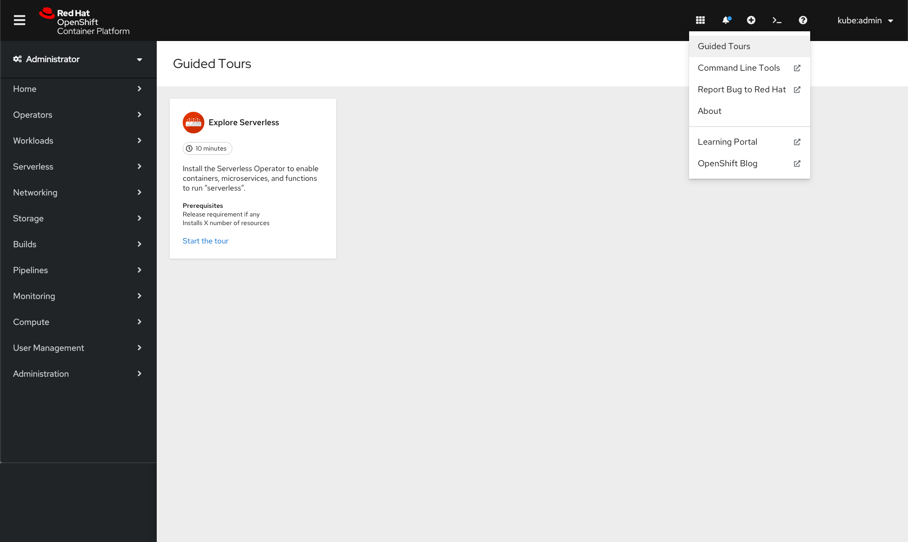
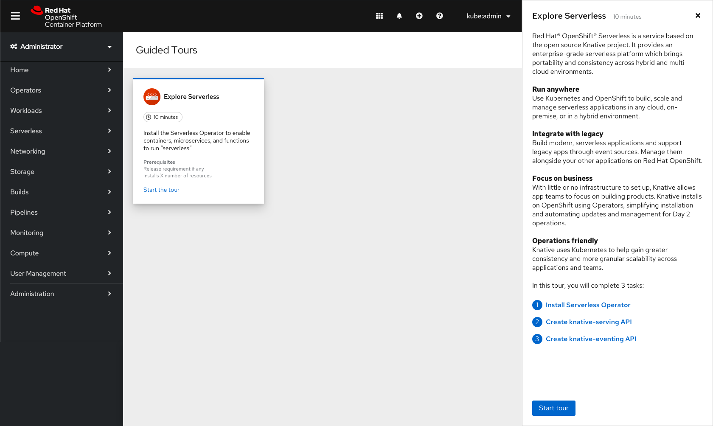
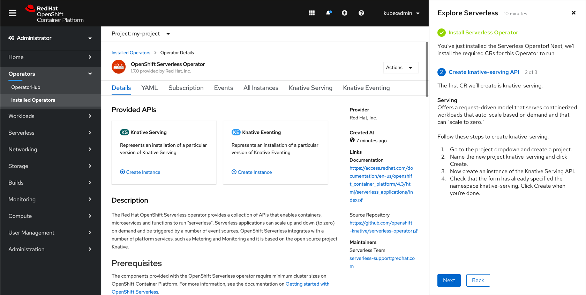
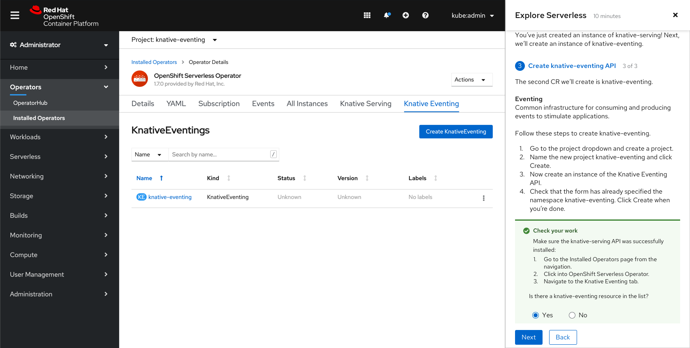
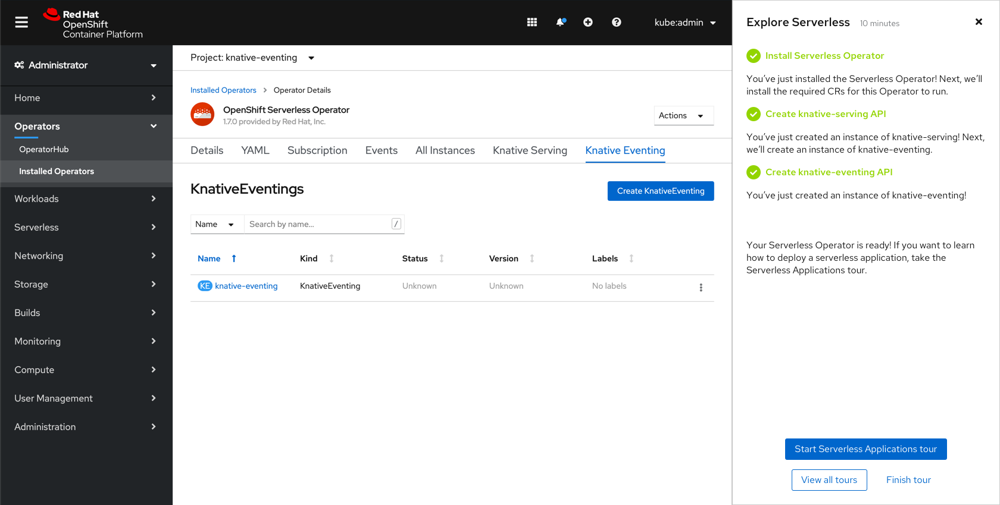
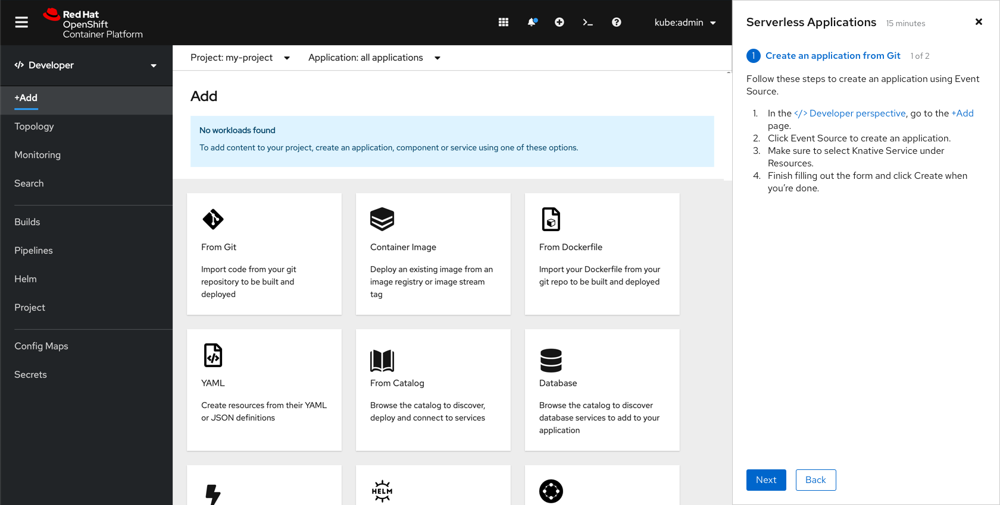
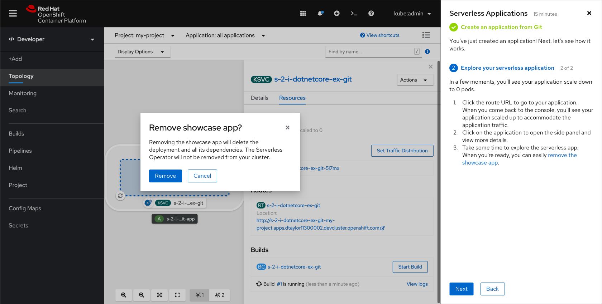
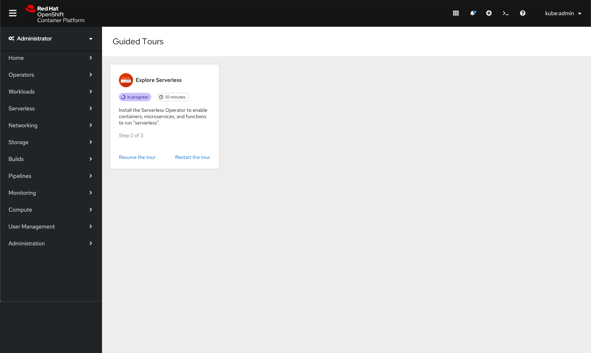

# Guided tours

In 4.6, guided tours will be added to the console. This documentation will outline how tours are designed and should behave. The content of the tour will not be detailed here. Content copy can be found [here](https://docs.google.com/document/d/1qEBDNZYaKF4TDogJLYUqX-8xHCmPCKdaHfKLxMlnZQs/edit?usp=sharing), where it will be reviewed and updated as needed.

## Accessing tours
Tours can be accessed on both the Administrator and Developer perspectives by going to the **Help menu** and selecting Guided Tours. Each of the perspectives will also surface links to the tours in other places around the console. For more detail around how these links will be surfaced in the Developer perspective, view the Developer side documentation.

In the Administrator perspective, a badge will appear on the Overview page informing users that guided tours are available. When clicked, the badge will redirect users to the Guided Tours page.

The Guided Tours page will use a catalog-like design with each tour being shown on a tile. Tiles will provide a brief description of the tour, a time estimate for completing the tour, as well as prerequisites for completing the tour, if any.

If a user clicks on a tour tile, the tour side panel will open. The introductory panel will give users more information and allows the user to start the tour using the **Start tour** button.

## Tour permissions
For 4.6, tour permissions will be as follows:
* If a user can install Operators, show the first Serverless tour (Explore Serverless) which walks users through installing the Serverless Operator.
* If a user cannot install Operators, do not show the first Serverless tour. Instead show an empty state. The empty state can inform users that tours will be added in future.
* If an Operator has been installed, show the second Serverless tour (Serverless Applications) which walks users through deploying a Serverless application.
* Any tour that has been completed should remain on the Guided Tours page with the option to **Review the tour** or **Restart the tour**.

## Tour 1: Explore Serverless
The first tour walks users through installing the Serverless Operator by completing a series of 3 tasks. Each task will have a number of sub steps that the user should execute in order to successfully complete the tour. Any links within the tour instructions will redirect users to that page in the console.

### Check your work
There will not be any validation from the console that users have successfully completed any sub steps or tasks. Instead, there will be an optional **Check your work** feature that asks users to validate that the tasks have been completed.

The **Check your work** feature will appear after a user clicks **Next**. Users may click **Next** again to skip the validation step, or can read the instructions to make sure they are following the tour correctly.

If users select **Yes**, the Check your work alert will turn green. If users select **No**, the alert will turn red and will recommend that users walk back through the steps in order to complete the task.

Users can click Next again to advance to the next screen, where they will see that the first task has been marked as completed and the second task is shown.

### Panel overflow
In cases where content does not fit in the panel, the content should scroll up and a shadow should be used to indicate that scrolling is possible.

### Completing a tour
When the user has finished the first tour, they can exit the tour, start the second tour, or go back to the Guided Tours page.

## Tour 2: Serverless Applications
The second tour walks users through deploying a Serverless application. The following shows an example screen from the Serverless Applications tour.

Upon completing the second tour, users will be given an easy way to clean up the showcase application they've created through the tour.

## Leaving a tour
Users can choose the leave a tour before finishing by using the 'x' in the top right corner of the tour panel. A confirmation modal will be shown for users to confirm they want to leave in the middle, and will inform them that their progress will be saved.

If a user wants to continue a tour, they can do so on the Guided Tours page. They will have the option to **Resume the tour** or **Restart the tour**. Tour progress will be saved per user per browser.

