# Quick starts

In 4.6, quick starts will be added to the console. This documentation will outline how quick starts are designed and should behave. The content of the quick start will not be detailed here. Content copy can be found [here](https://docs.google.com/document/d/1qEBDNZYaKF4TDogJLYUqX-8xHCmPCKdaHfKLxMlnZQs/edit?usp=sharing), where it will be reviewed and updated as needed.

## Accessing quick starts
Quick starts can be accessed on both the Administrator and Developer perspectives by going to the **Help menu** and selecting **Quick Starts**. Each of the perspectives will also surface links to the quick starts in other places around the console. For more detail around how these links will be surfaced in the Developer perspective, view the [Developer side documentation](https://docs.google.com/document/d/1TOMeB-9Z-fnFz2ynxWri9Y7q8MHI8fwOFFX-432cSfk/edit?usp=sharing).

In the Administrator perspective, a badge will appear on the Overview page informing users that quick starts are available. When clicked, the badge will redirect users to the Quick Starts page.

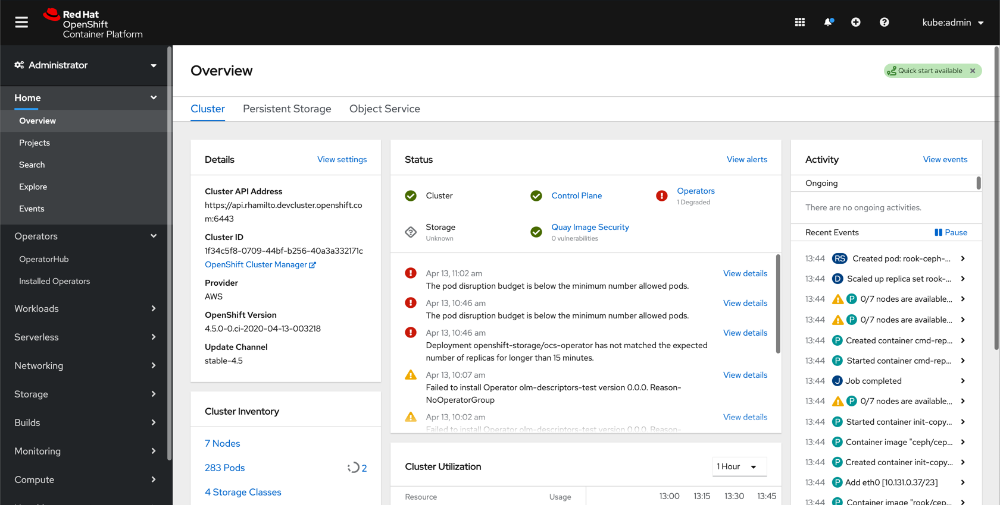

The Quick Starts page will use a catalog-like design with each quick start being shown on a tile. Tiles will provide a brief description of the quick start, a time estimate for completing the quick start, as well as prerequisites for completing the quick start, if any. If there are no prerequisites, do not include the prerequisite section.

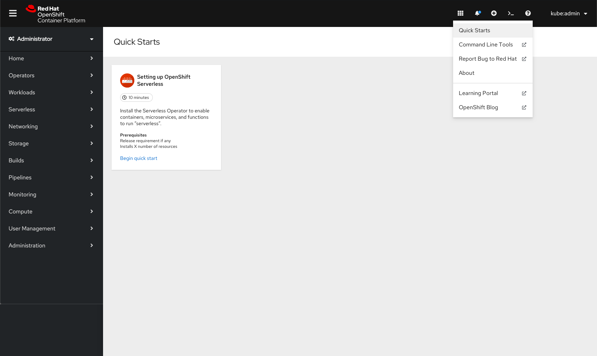

If a user clicks on a quick start tile, the side panel will open. The introductory panel will give users more information and allows the user to start the quick start using the **Begin quick start** button. The task headers should use the step component from PatternFly's wizard. If clicked, they should redirect users to the related task.

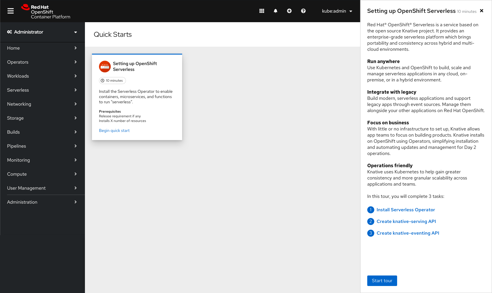

## Quick start permissions
For 4.6, quick start permissions will be as follows:
* If a user can install Operators, show the first Serverless quick start (Setting up OpenShift Serverless) which walks users through installing the Serverless Operator.
* If a user cannot install Operators, do not show the first Serverless quick start. Instead show an empty state. The empty state can inform users that quick starts will be added in future.
* If the Serverless Operator has been installed, show the second Serverless quick start (Exploring Serverless applications) which walks users through deploying a Serverless application.
* Any quick start that has been completed should remain on the Quick Starts page with the option to **Restart the quick start**.

## Quick start 1: Setting up OpenShift Serverless

**Reminder**: The content of the quick starts will not be detailed here. Content copy can be found [here](https://docs.google.com/document/d/1qEBDNZYaKF4TDogJLYUqX-8xHCmPCKdaHfKLxMlnZQs/edit?usp=sharing), where it will be reviewed and updated as needed.

The first quick start walks users through installing the Serverless Operator by completing a series of 2 tasks. Each task will have a number of sub steps that the user should execute in order to successfully complete the quick start. Any links within the quick start instructions will redirect users to that page in the console.

### Check your work
There will not be any validation from the console that users have successfully completed any sub steps or tasks. Instead, there will be an optional **Check your work** feature that asks users to validate that the tasks have been completed.

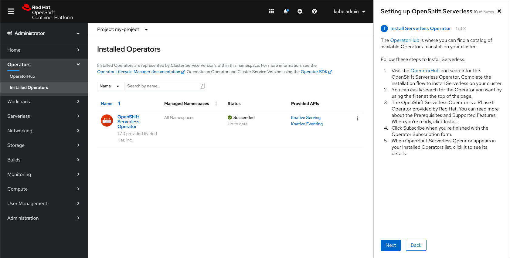

The **Check your work** feature will appear after a user clicks **Next**. The user may click **Next** again to skip the validation step, or can read the instructions to make sure they are following the quick start correctly.

If the user clicks **Back**, they will be taken to the previous step or page.

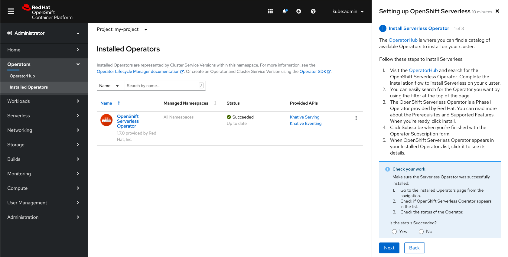

If the user selects **Yes**, the Check your work alert will turn green.

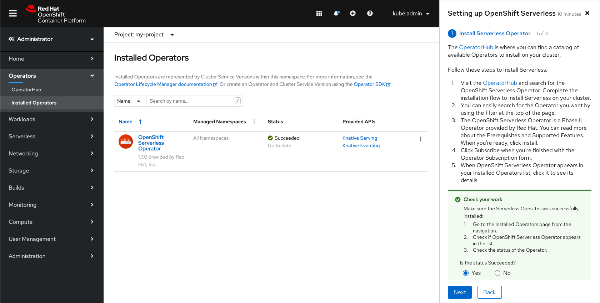

Users can click Next again to advance to the next screen, where they will see that the first task has been marked as completed and the second task is shown.

If the user selects **No**, the alert will turn red and will show an error message.

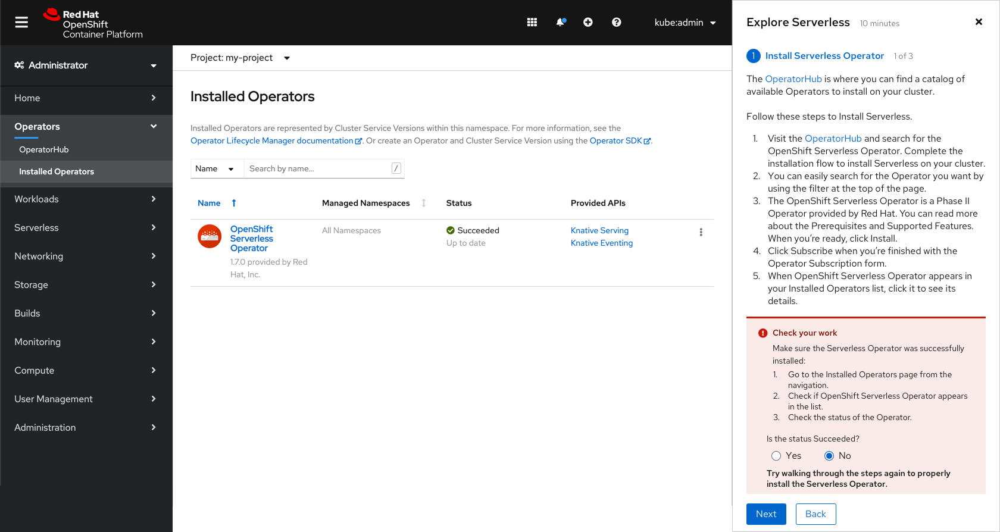

If the user chooses to continue to the next screen anyway, the task will be marked red and will remind the user to go back to the task to check their work.

Users can click the numbered task headers to jump between tasks.

### Panel overflow
In cases where content does not fit in the panel, the content should scroll up and a shadow should be used to indicate that scrolling is possible.

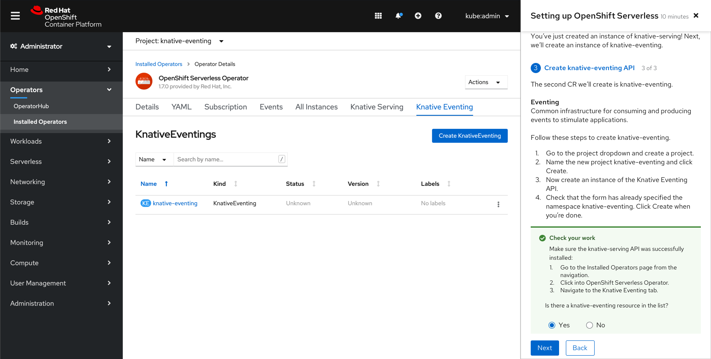

### Completing a quick start
The final screen of the quick start will show users the completed tasks and give them the option to exit the quick start, go back, or go to the Quick Starts page. In the case of this quick start, there will also be a link to start the second quick start. The link should open the second quick start's introductory screen.

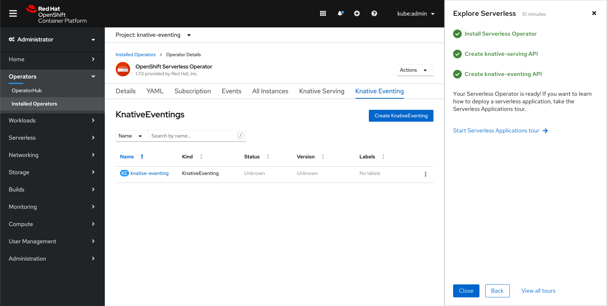

## Quick start 2: Exploring Serverless applications
**Reminder**: The content of the quick start will not be detailed here. Content copy can be found [here](https://docs.google.com/document/d/1qEBDNZYaKF4TDogJLYUqX-8xHCmPCKdaHfKLxMlnZQs/edit?usp=sharing), where it will be reviewed and updated as needed.

The second quick start walks users through deploying a Serverless application. The following shows an example screen from the Exploring Serverless applications quick start.

The final screen of the quick start will show users the completed tasks and give them the option to exit the quick start, go back, or go to the Quick Starts page.

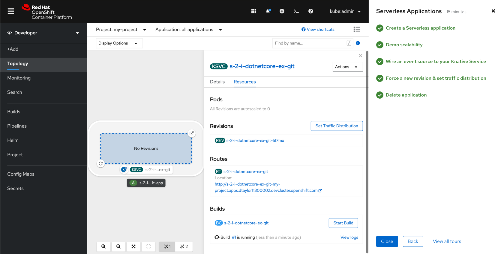

If the user has successfully completed both quick starts and navigates back to the Quick Starts page, they will see the tiles have been updated and marked as completed. They will still have the option to **Restart the quick start**.

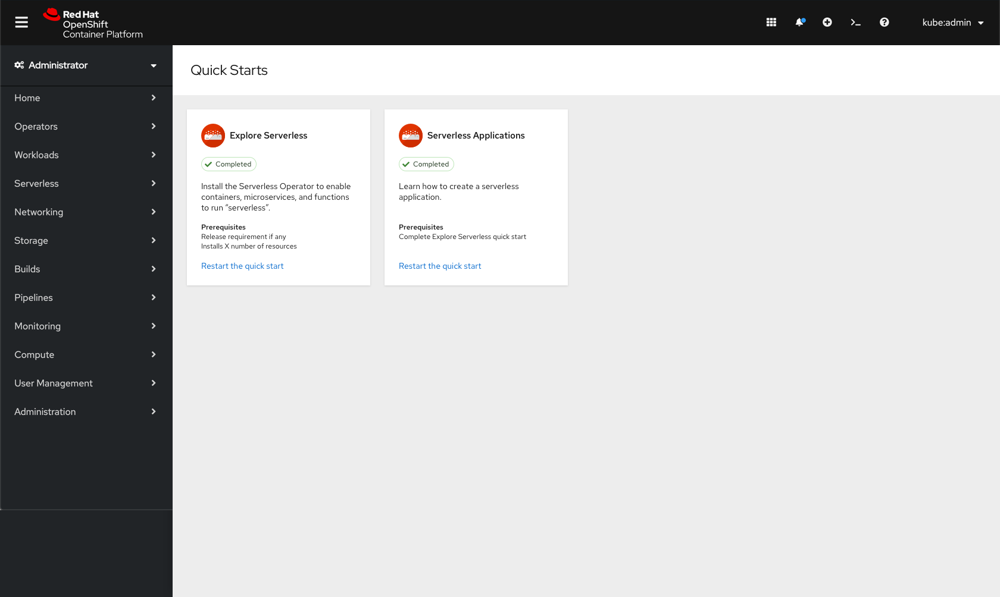

## Restarting a quick start

If the user chooses to **Restart the quick start**, the quick start will reset the task statuses and start users on the introductory screen.

## Leaving a quick start
Users can choose the leave a quick start before finishing by using the 'x' in the top right corner of the quick start panel. A confirmation modal will be shown for users to confirm they want to leave in the middle, and will inform them that their progress will be saved.

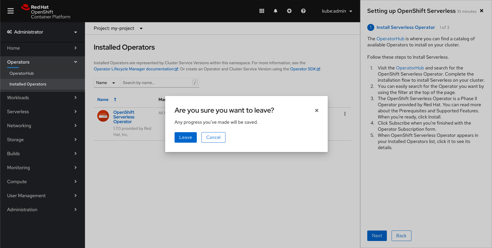

If the user wants to continue a quick start, they can do so on the Quick Starts page. They will have the option to **Resume the quick start** or **Restart the quick start**. Quick start progress will be saved per user per browser.

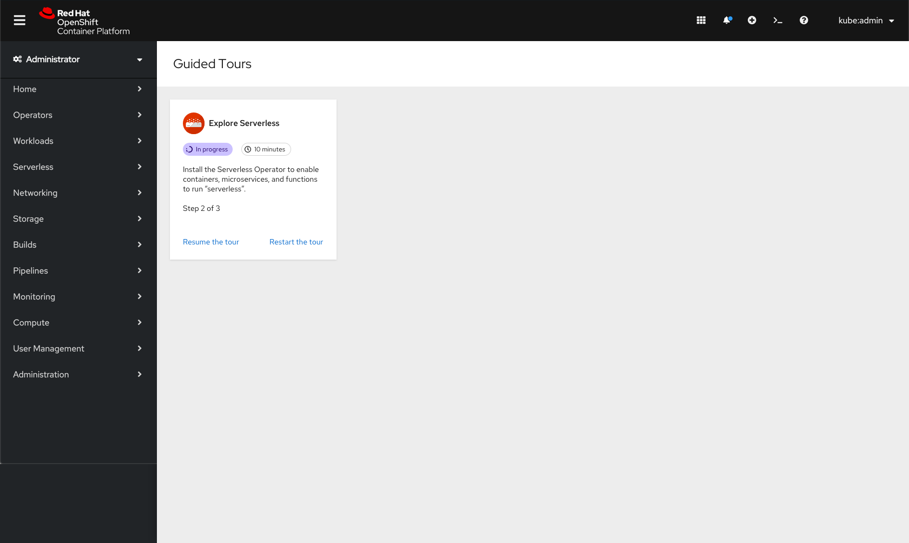
