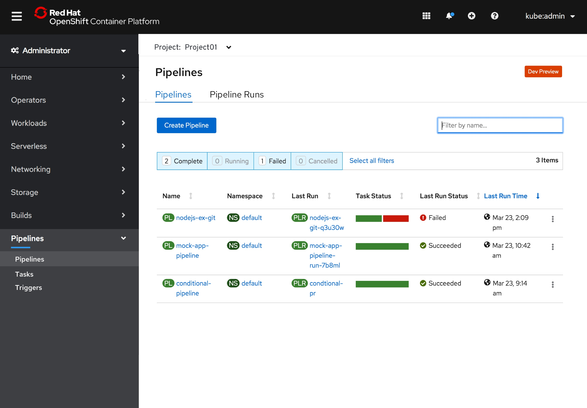
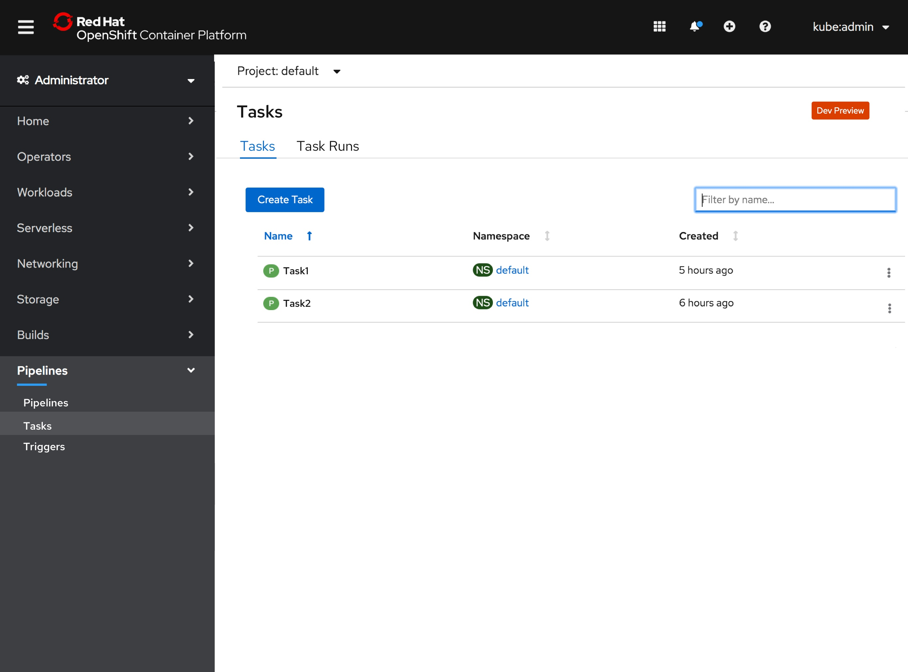
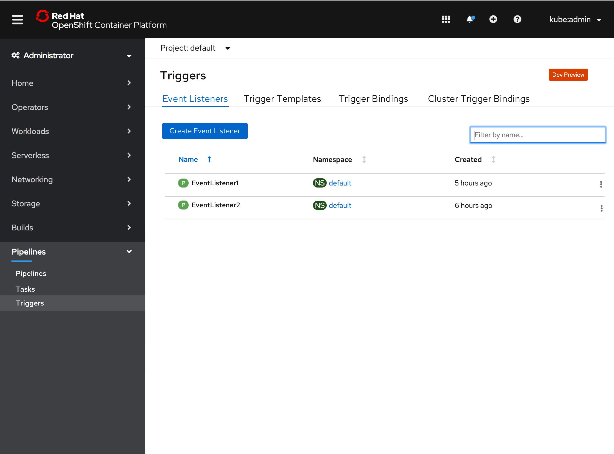

# Tekton Triggers

## Adding Pipelines, Tasks, and Triggers pages under Pipelines
On the left navigation, the user now has access to Pipelines, Tasks, and Triggers.

Pipelines is now a tabbed page with Pipelines & Pipeline Runs. This allows the user to get to a list of pipeline definitions and the execution of them.

### Pipelines page with Pipelines and Pipeline Runs tabs

- When the user clicks into Tasks, they now have access to Tasks via the Tasks and Task Runs tabs
- Under the Pipeline Runs tab, we should have 3 columns in the table: Name, Namespace, and Created. The button under Pipeline Runs is “Create Pipeline Runs”
- The Dev Preview badge should be included on the top right of the page

### Tasks page with Tasks and Task Runs tabs

- Under the Tasks and Task Runs tabs, we should have 3 columns in the table: Name, Namespace, and Created. On the Tasks Runs tab the button should say “Create Task Run”
- The Dev Preview badge should be included

- Users can now access Triggers as a tabbed page with Event Listeners, Trigger Templates, Trigger Bindings & Cluster Trigger Bindings. Each page contains Name, Namespace, and Created.
Under the Triggers page, we will have Name, Namespace, and Created columns.
  - Under Event Listeners, the button reads as “Create Event Listener”
  - Under Trigger Templates the column reads “Create Trigger Templates”
  - Under the Trigger Bindings tab the button reads “Create Trigger Bindings”
  - Under the Cluster Trigger Bindings reads “Create Cluster Trigger Bindings”
  - The Dev Preview badge should be included
