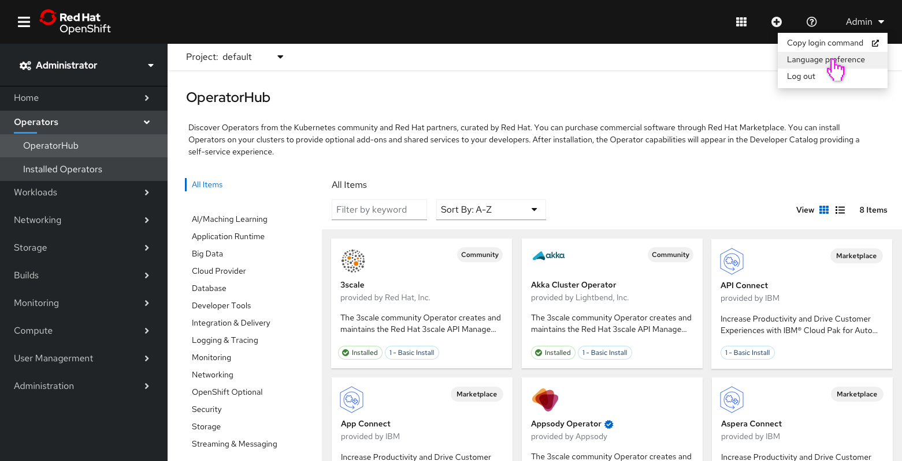
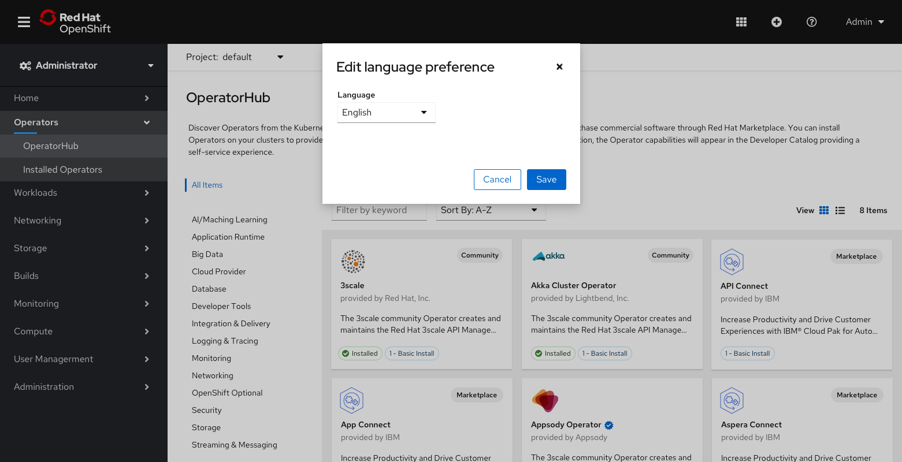
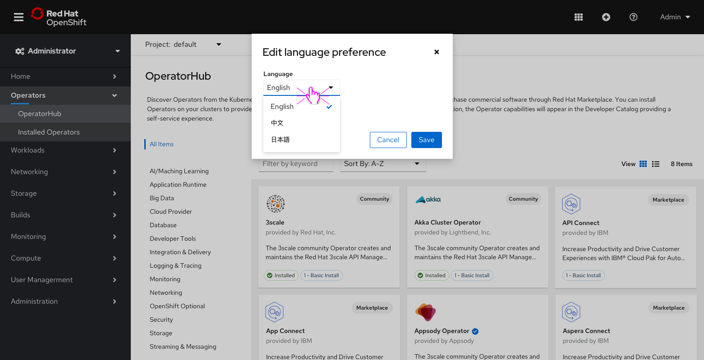

# Adding language preferences to the OpenShift Console

In OpenShift 4.7, we introduced support for two new languages - Simplified Chinese and Japanese - with more to come in the future. As apart of this effort we added the ability to configure and manage language preferences in the console.

## Where to access the new language settings 

- Users can set their language preference by clicking on the **Language preference** menu item listed in the login dropdown component in the masthead. 

## Setting a language preference

- Clicking on the **Language preference** menu item will launch a modal to edit your preference. 

- Clicking on the **Language** dropdown will allow users to select from the languages the console currently supports.
