# Enabling and disabling dynamic plugin UIs

OpenShift console currently has static plugins that allow teams to contribute features to the UI such as OpenShift Virtualization and OpenShift Container Storage. These plugins live inside console code which means they can only be updated at the same cadence as the console. Newly developed ‘dynamic plugins’ will allow operators to contribute their included UIs at runtime, meaning that operators can update their UIs on their own cadence and more frequently.

Admins installing operators which include dynamic plugins will need to opt-in to having their UIs included in the console UI, which can happen as the operator is being configured for install. Trusted operators could perhaps have this option included by default, whereas other not-explicitly-trusted operators would need to have the user explicitly opt in, as there could be a security risk.

Once the operator with the dynamic plugin UI is installed, the user can also turn the dynamic plugin UI on or off in the operator details. The operator list view would also convey any operators with disabled dynamic UIs.

## Enabling dynamic plugin UI during operator install

### Trusted operator install

- A new radio group would appear for operators that include dynamic plugin UIs.
- Trusted operators would have their dynamic UIs enabled by default.
- A note on “trusted”: Disconnected environments need all operator sources manually added so they all (even Red Hat & certified operators) will appear as “untrusted”.

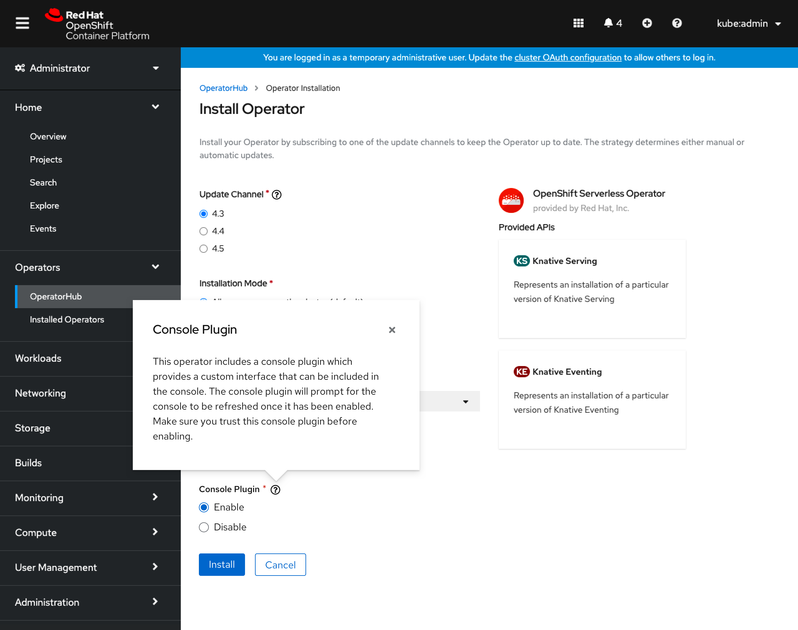
- An info popover would further describe implications of enabling an operator’s UI.

### Untrusted operator install

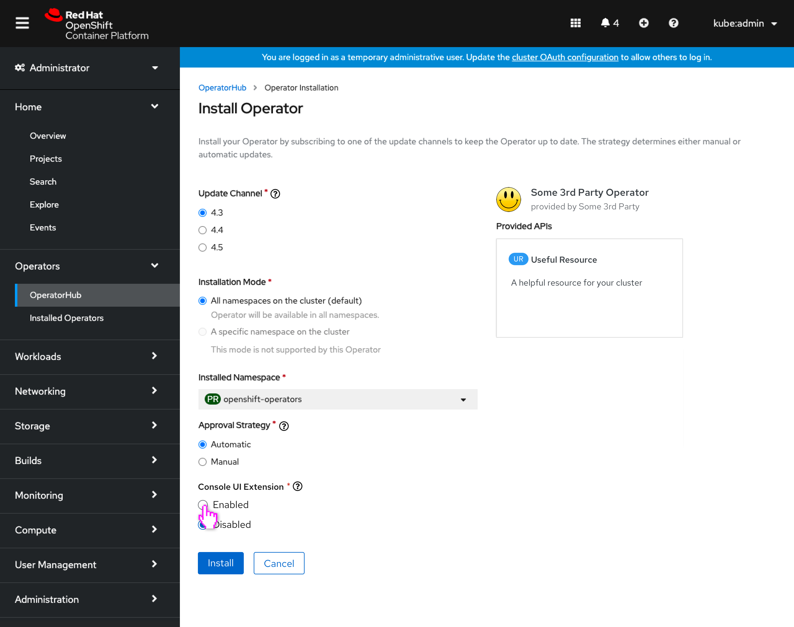
- Untrusted operators would have dynamic UIs disabled by default.

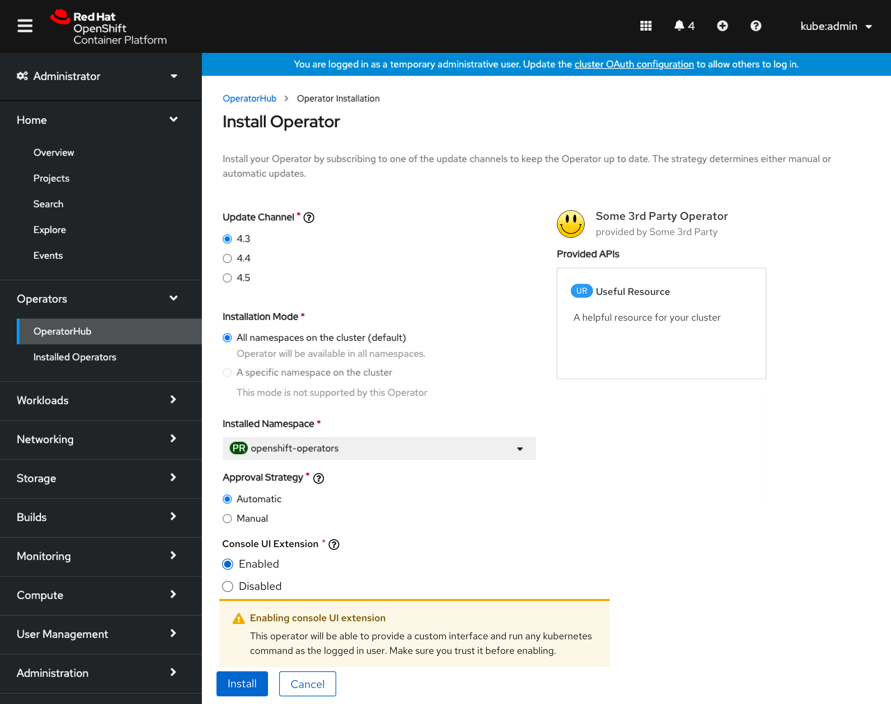
- Enabling the UI for the untrusted operator shows an inline alert conveying implications.

## Enabling/disabling dynamic plugin UIs in operator details

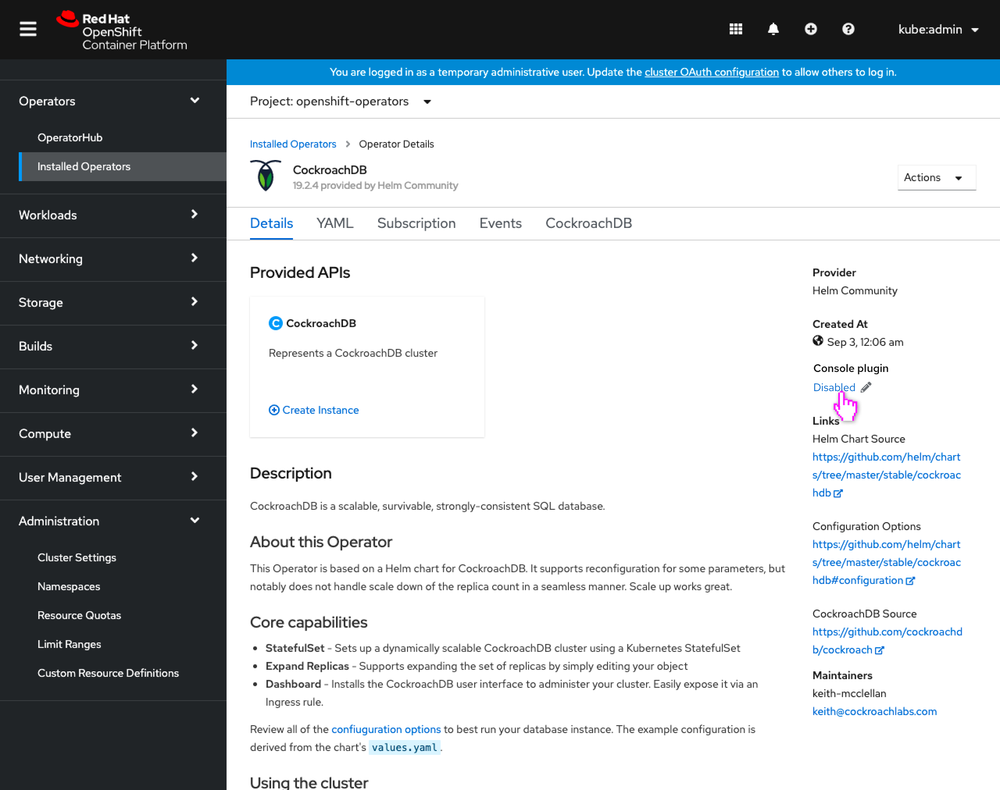
- Operators with dynamic plugin UIs would now include a setting in their details that conveys if their dynamic UI is enabled or disabled.

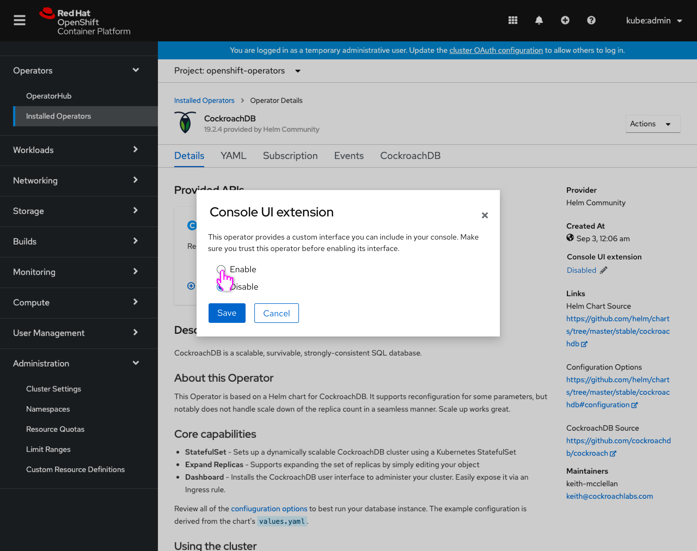
- Using the existing editing paradigm, this setting would be launched in a modal.
- The content of the modal would be the same as the Operator Install page popover and setting.

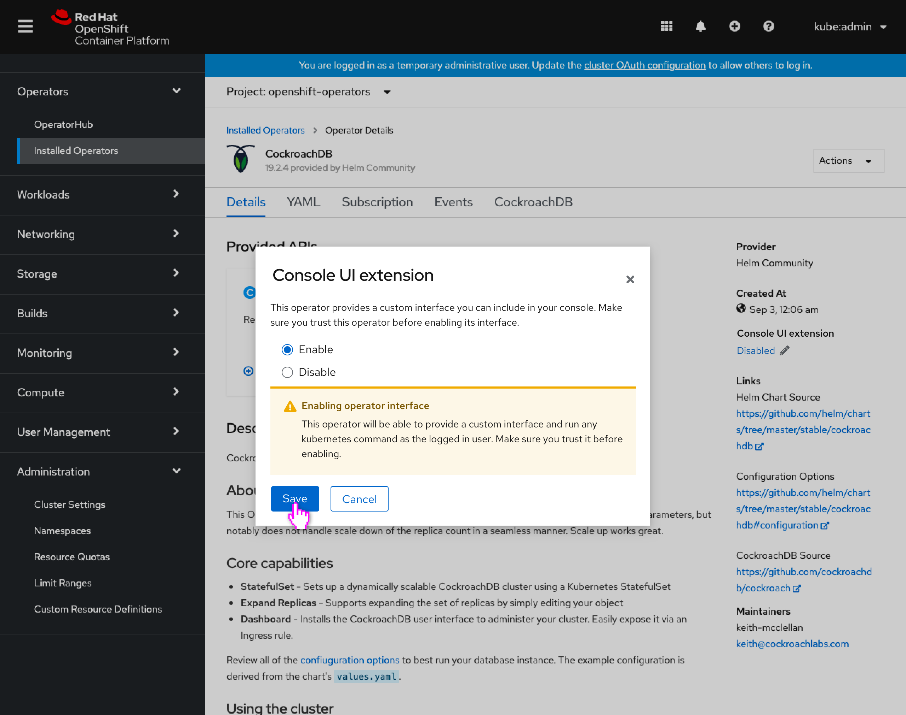
- The modal would include the same inline alert when enabling UIs for untrusted operators.

- The setting is updated to convey the dynamic plugin UI is enabled.

## Notifying of available dynamic plugin UIs in operator list

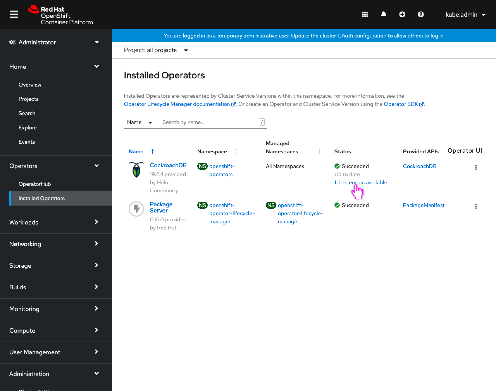
- An operator that supports dynamic UIs but does not have them enabled would have an additional status on the Installed Operators page.
- This status would only appear for users that have ‘read’ access on the operator config and would also be the only users able to update this setting as well.
- Operators that have dynamic UIs and are enabled, or operators that do not have dynamic UIs would not have any additional status.

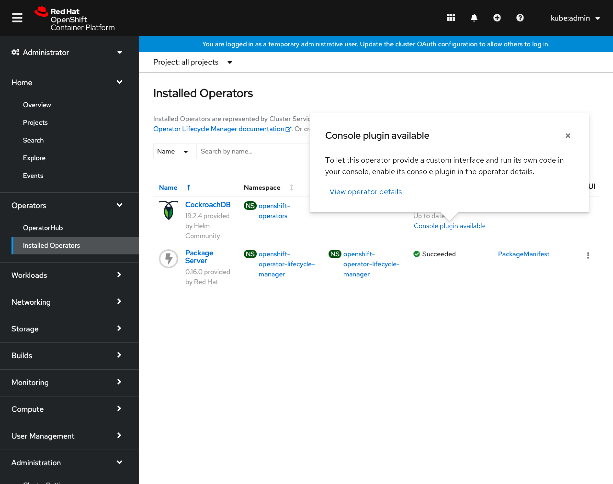
- Clicking the status would give the user more information about the available dynamic plugin UI, and how to enable it, as well as a link to the operator details.

## Operators with multiple plugins

In rare cases, it's possible that an operator may contribute multiple plugins. It's unlikely to occur as creating each dynamic plugin UI does have some overhead, but the console UI should support displaying multiple.

### Operator install with multiple plugins

- When multiple plugins exist, on the operator install page their name will be included above the associated radio button set.

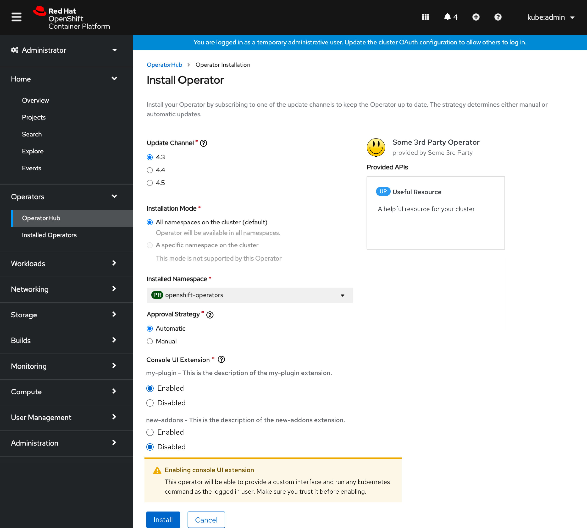
- Enabling a UI for an untrusted operator would still show an inline alert conveying implications.

### Operator details with multiple plugins

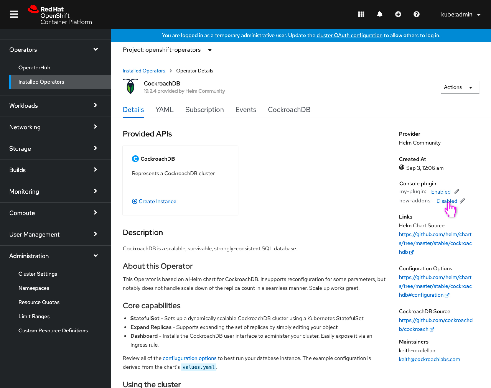
- When multiple plugins exist, on the operator details page their name will be included to the left of the associated enablement control.

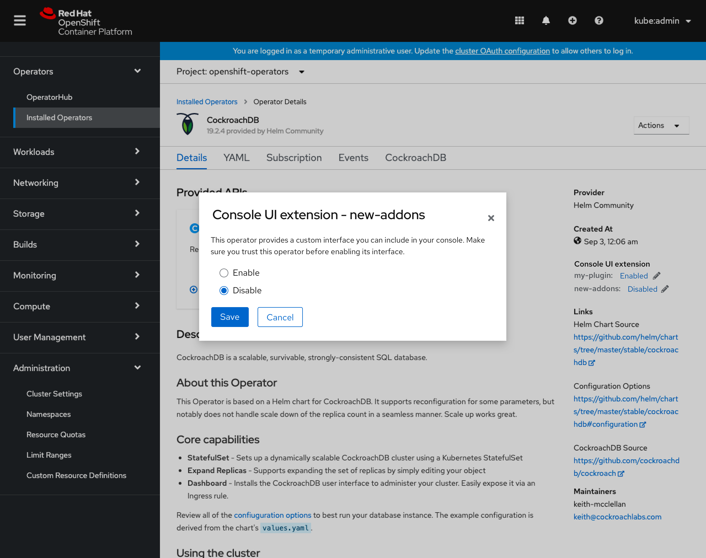
- The same modal would be shown to enable or disable that particular dynamic plugin UI.