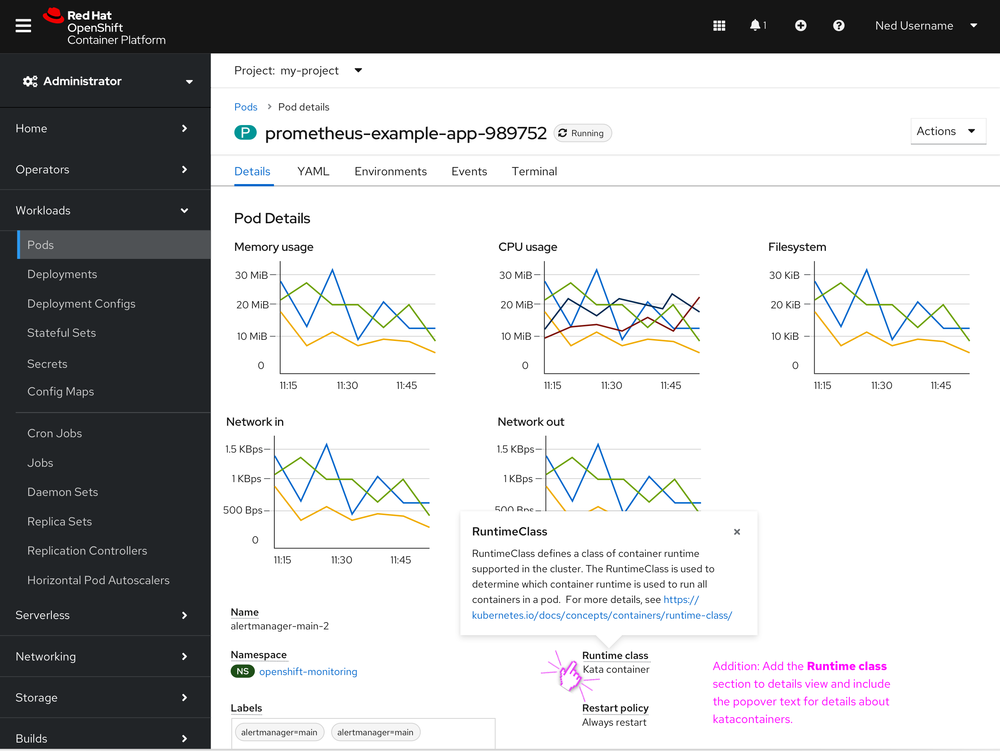

# RuntimeClass Kata Containers

## Background
Kata containers are in tech preview for OpenShift 4.8. As deployments begin to use Kata container pods, users will need a mechanism to distinguish between runC and kata container runtimeClasses.

## Goal
Surfacing the runtimeClass field in the details page will help users identify which Deployments are using Kata container pods. The RuntimeClass heading should have a popover description which can be pulled from the Schema. 

## Design for 4.8 release (MVP)
The screenshot (below) introduces the RuntimeClass field to the Pod details page. The label links to a popover displaying information on RuntimeClass from the Schema. 

