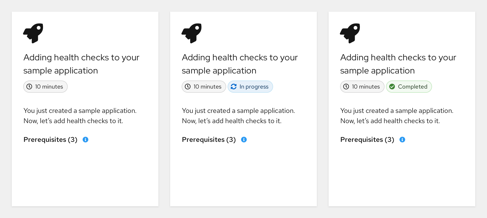
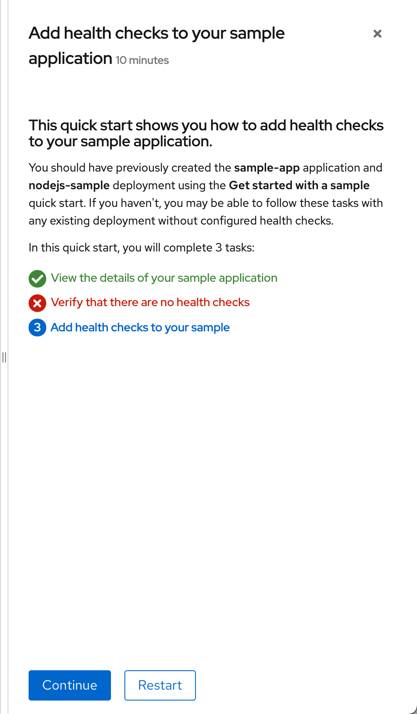
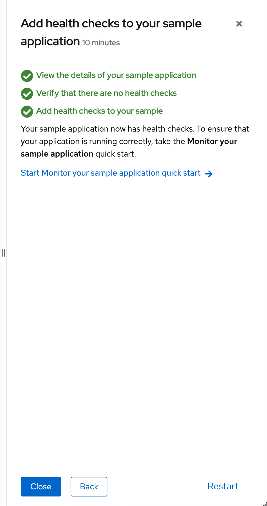

# Quick start action updates
In 4.8, quick starts will be updated to provide more clear actions to the user.

## Design

Regardless of whether a quick start has not been started, is in progress, or is completed, do not show an action link on a quick start card.

If a user opens a new quick start that they have never started, it is opened to the details panel (no change from 4.7 behavior).

If a user has previously opened and started a quick start, when they click the card from the catalog, automatically open it to the current step (no change from 4.7 behavior).

If the user then clicks **Back** until the details panel, show the task headers with their respective statuses. The CTAs at the bottom should be **Continue** and **Restart**.
* Clicking **Continue** will take them to the next unstarted task, and all previous task statuses will remain.
* Clicking **Restart** will take them to the first task, with all the task statuses reset.

If a user completes a quick start, the option to **Restart** should be added to the final panel.

Additionally, remove the word "tour" from any CTAs that have it today; e.g. **Start tour** should become **Start**.
