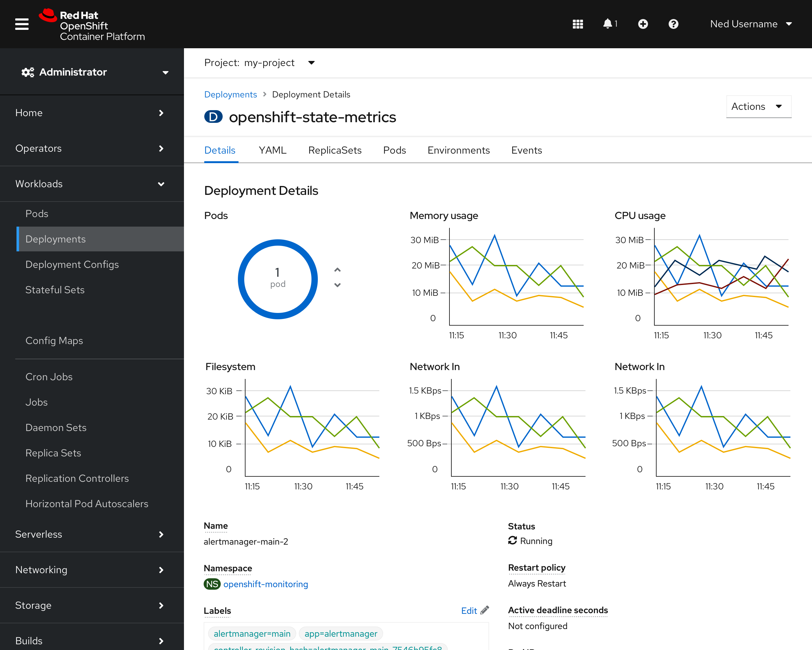
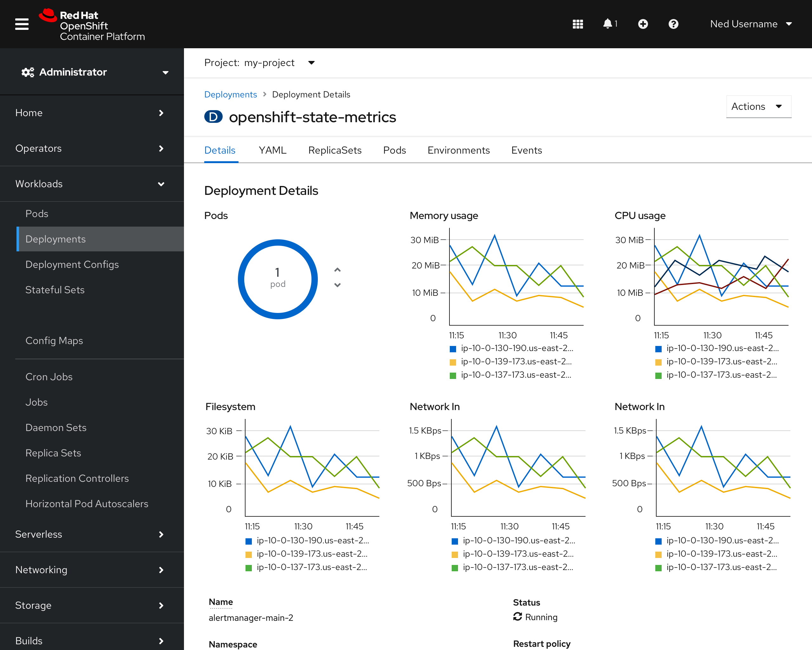
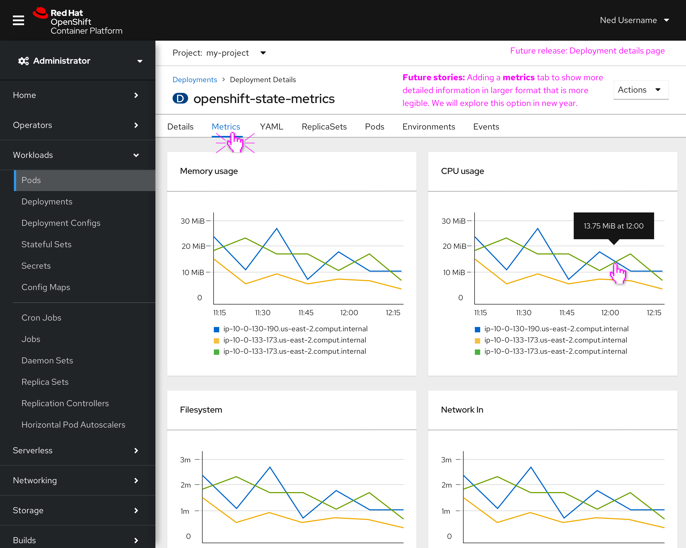

# **Workloads: Utilization Charts **

Reported issues:

[https://issues.redhat.com/browse/PD-662](https://issues.redhat.com/browse/PD-662)

[https://issues.redhat.com/browse/CONSOLE-2384](https://issues.redhat.com/browse/CONSOLE-2384)

Marvel prototype (4.8 release):

[https://marvelapp.com/prototype/fg10a04/screen/75532540](https://marvelapp.com/prototype/fg10a04/screen/75532540)

Link to Google doc: 
[https://docs.google.com/document/d/1GdMapBB-WnTwQx3zJTlxU8qfrM24BSqf4j4TBeK68S0/edit?usp=sharing](https://docs.google.com/document/d/1GdMapBB-WnTwQx3zJTlxU8qfrM24BSqf4j4TBeK68S0/edit?usp=sharing)

# Background

When moving to OCP 4 metrics charts for Deployments, Deployment Configs, StatefulSets, DaemonSets, ReplicaSets, and ReplicationControllers. These should be the same charts that we show on the Pods page: Memory, CPU, Filesystem, Network In and Out. Currently, in the 4.7 release, this was only completed for the Pods page.

## Goal

Present options including multi-line charts across workloads Details pages or some other representation.

## Design for 4.8 release (MVP)

The first screenshot (below) introduces multi-line charts on a Deployments page. The Pods view remains the first option as it is an interactive feature that allows users to scale pods within a deployment. The multi-line charts have a tooltip available on hover that can click through to a Grafana metrics view.

The second screenshot includes a legend for each chart to help distinguish between datasets. 

## Future enhancements

The three column view of these charts makes it difficult to understand the data when you think about the number of pods that could be running and displayed on these charts. Additionally the  Details content area with editable fields is pushed further down the page making the user scroll through a long page.

Other areas of the console such as Pipelines are in a tech preview for a **Dashboard** tab to separate the  metrics from the main Details page. This gives the space the user needs to read  the data more easily.

