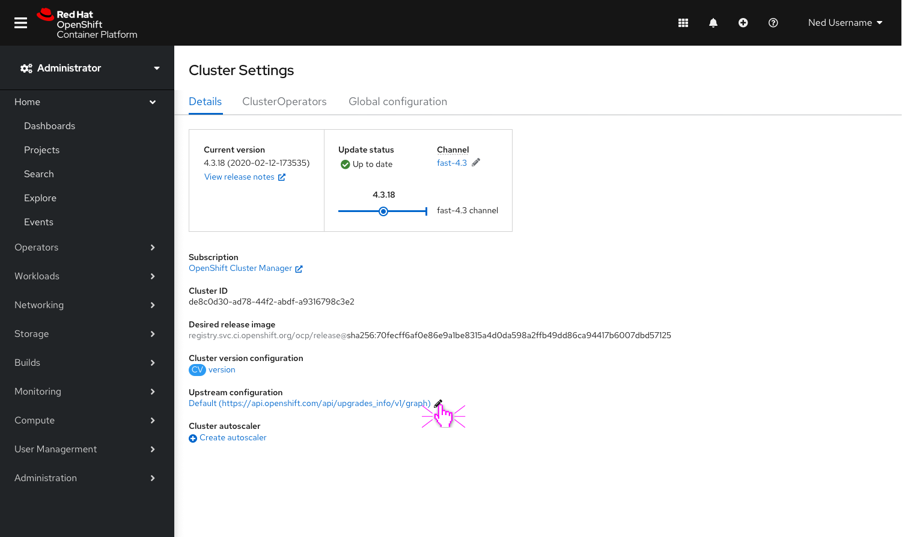
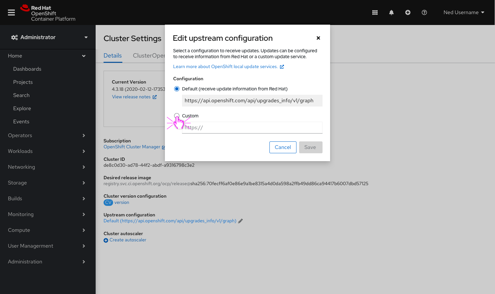
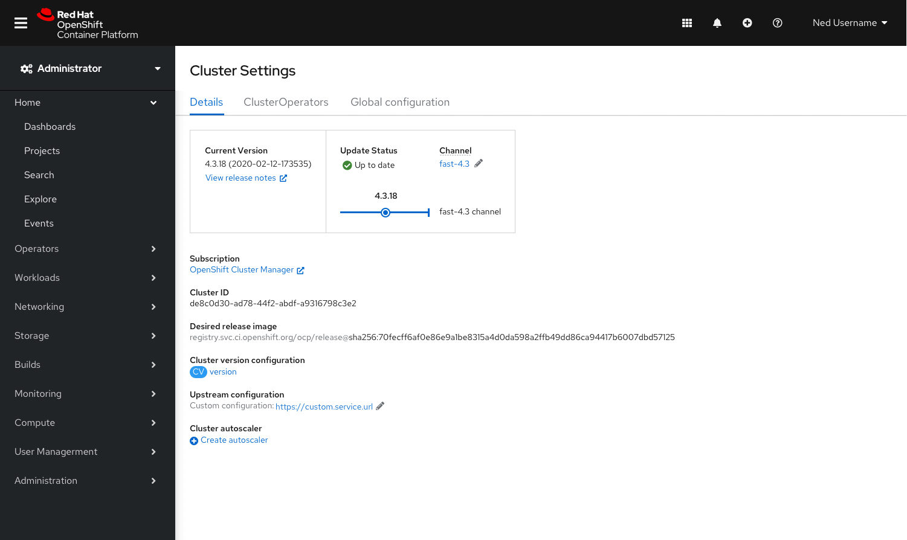
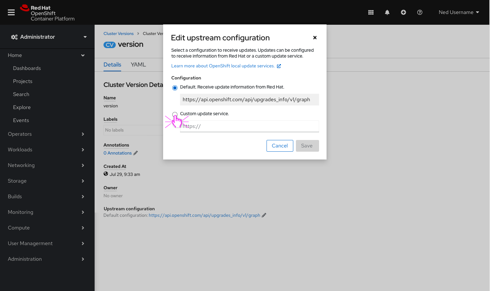
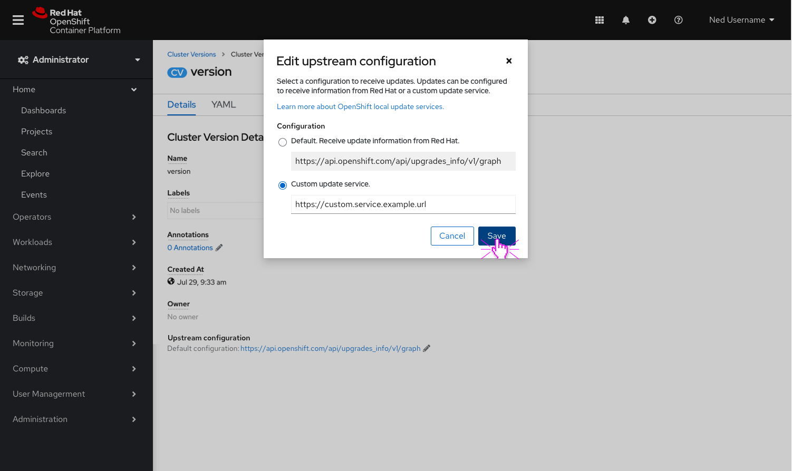
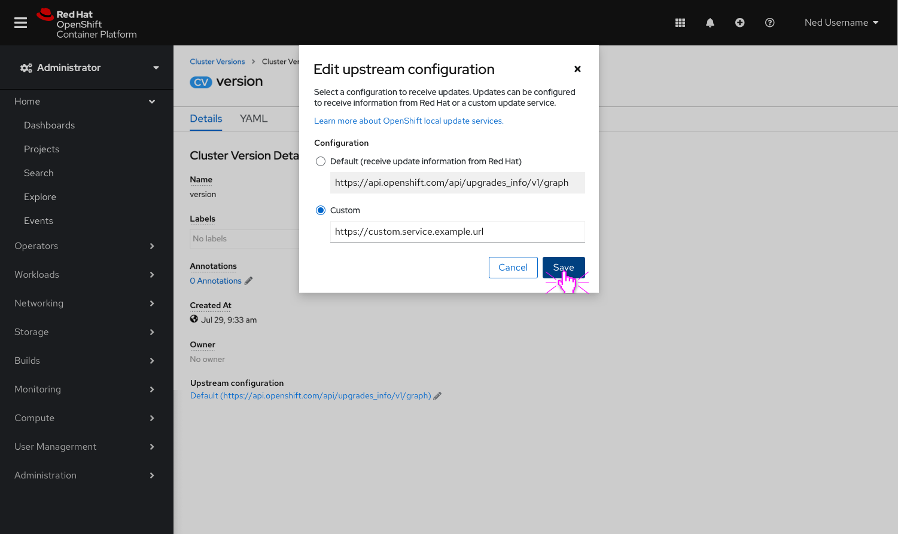
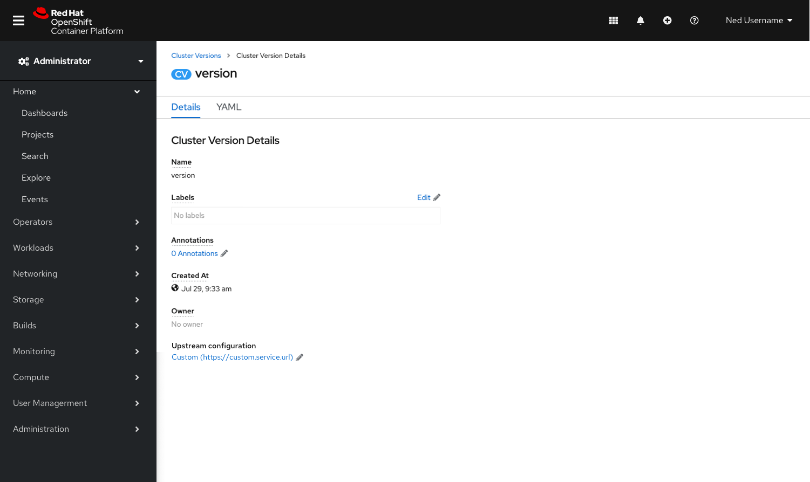

# Configuring Air Gapped Environments
This unit of work is a part of our continuous effort to improve the upgrade experience. Updates can be configured to receive information from Red Hat or via a custom update service. This set of enhancements allows customers to edit the Cincinnati server location directly in the console UI. 

## 01 | Adding the ability to edit the Cincinnati server location via console to Cluster Settings details

- Add a new **Upstream configuration** field to the **Cluster Settings details** page and allow users to edit the configuration.

- Clicking the pencil icon will open a modal that allows the user to edit the way in which their cluster is configured to receive updates. 
- The modal provides two ways to configure the upstream service: 
    1. Default (receive updates from Red Hat)
    2. Custom (provide a URL for a custom update service)
- We also provide a link to documentation to learn more about OpenShift local update services.

- Configuring a custom update service.

- When the custom configuration is saved, it will be reflected on the **Cluster Settings details** page under the **Upstream configuration** field.

## 02 | Adding the ability to edit the Cincinnati server location via console on the Cluster Version details
- Provide the same editing capability on the CV-details page.

