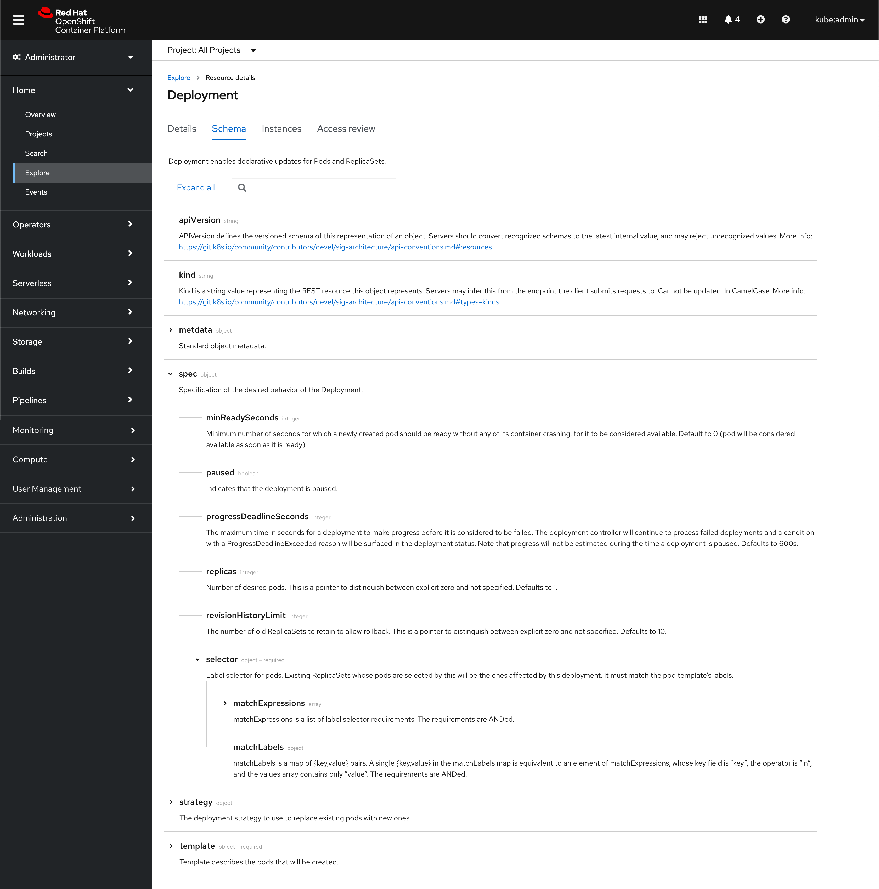
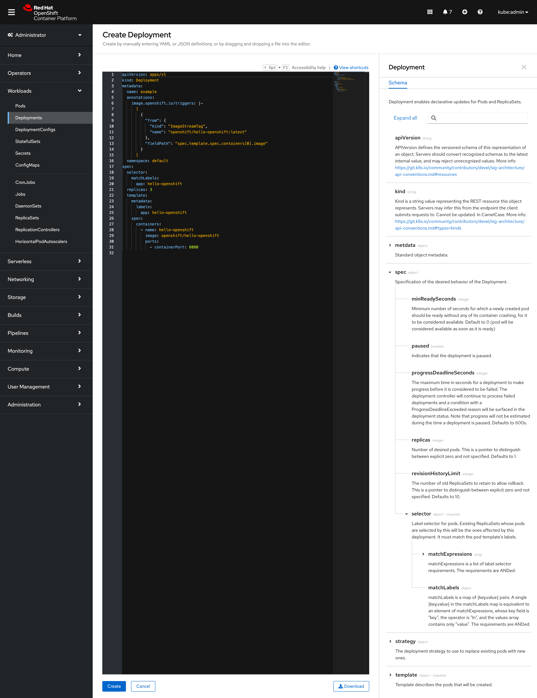

# API Explorer enhancements
This design covers future enhancements for the API Explorer.

## Design

The intent of this design is to improve the Explore area to make it easier for users to navigate. In order to achieve this, we should convert the Schema view to use PatternFly's [tree view](https://patternfly-react.surge.sh/components/tree-view/). With the tree view, we also get the **search** field and the ability to **expand and collapse** all sections for free with the component.

As a part of this design, we opened two enhancement requests to the tree view:
1. Add horizontal dividers and vertical branches ([Issue #1020](https://github.com/patternfly/patternfly-design/issues/1020))
2. Add a compact version that allows it to be rendered in a sidebar ([Issue #994](https://github.com/patternfly/patternfly-design/issues/994))

### Full page schema view

### Sidebar view

### Future considerations
Future enhancements should be considered to:
* Add the ability to link to specific items within the tree (anchor links).
* Make the sidebar resizable.
