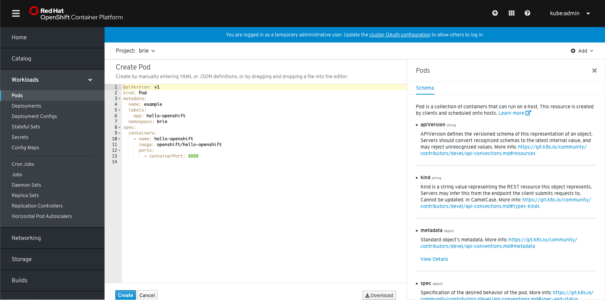
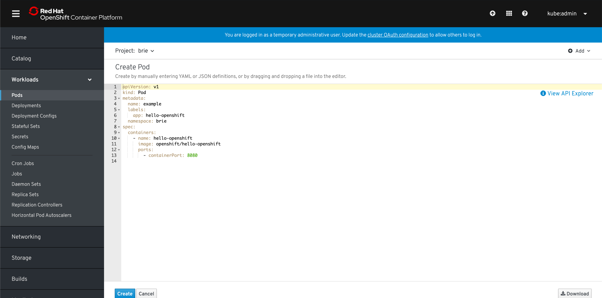
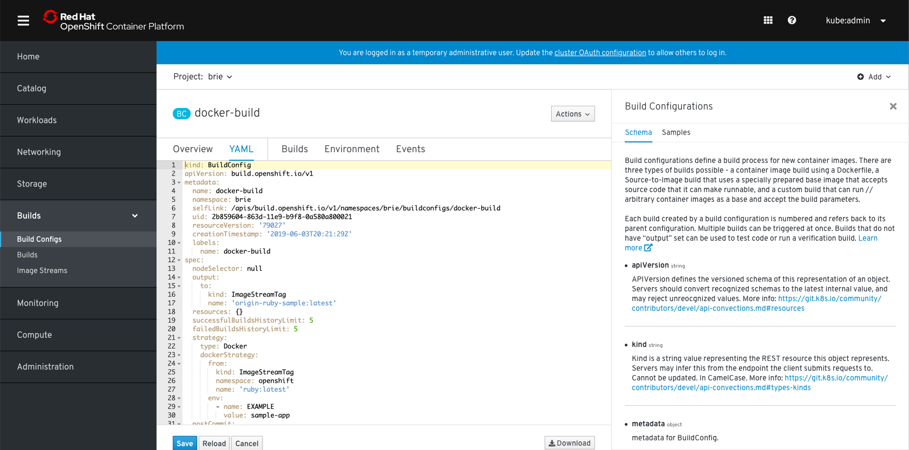
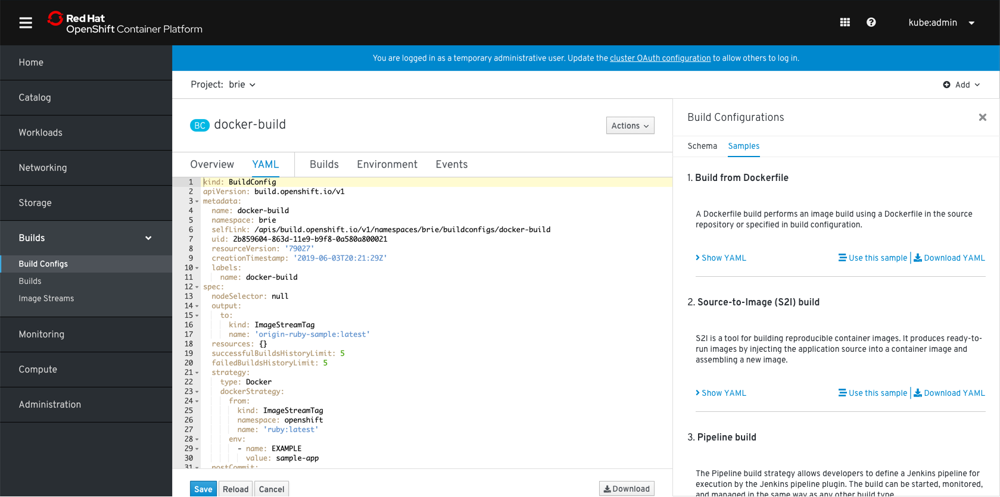
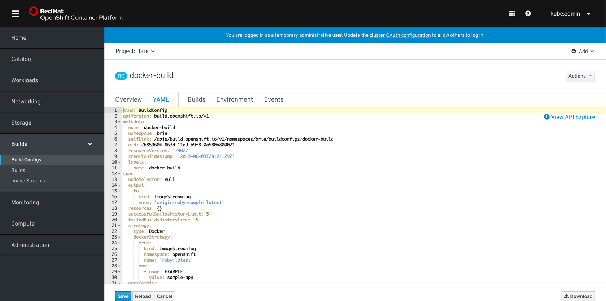
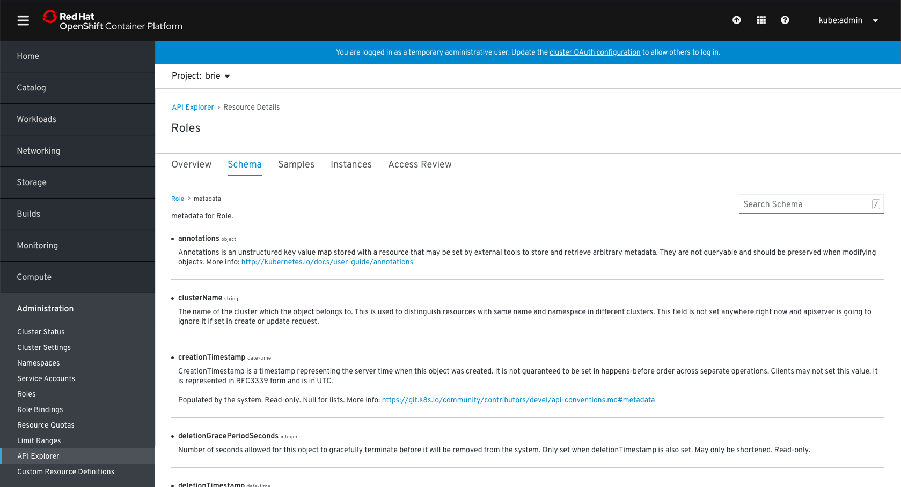
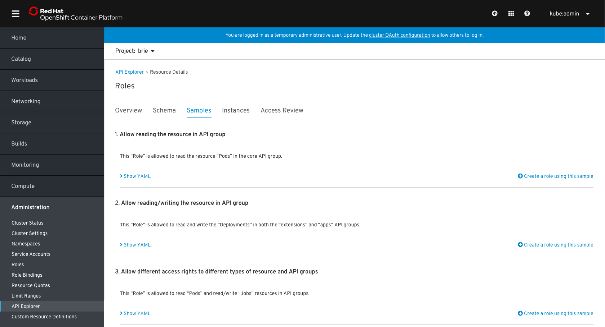
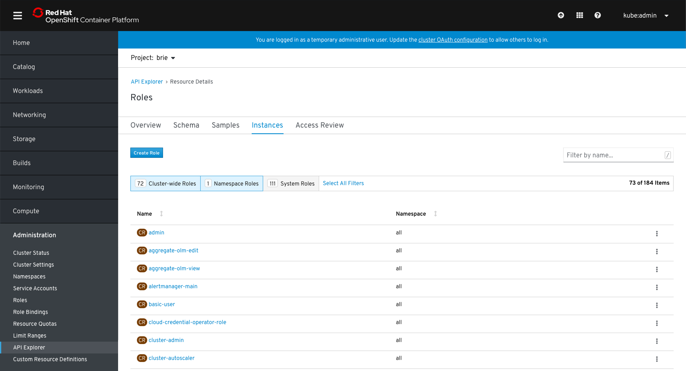
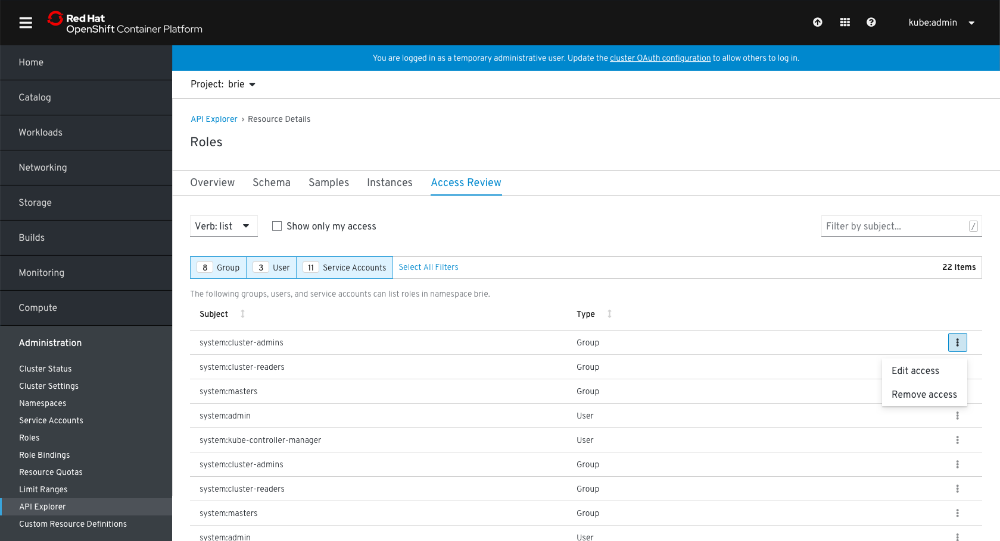

# API Explorer

The API Explorer will be available on YAML editors, for both creation and edit flows.

## Side panel
* The explorer will have the following tabs:
  * **Schema**: A short description of the resource with a 'Learn more' link pointing to full documentation. Also includes a description of resource's elements.
  * **Samples**: If applicable, samples for the resources. If there are no samples, this tab is hidden.
  * In future, the Access Review tab may also be surfaced in the side panel.
* The explorer will be open by default.
* Users can close the side panel by clicking the 'x'. The panel can be opened by clicking the floating 'View API Explorer' link in the upper right hand corner of the page view.

### Create flow
In this example, there are no samples so the Samples tab is hidden.

### Edit flow
In this example, there are samples so the tab is available.

## Full page
* A full page view of the API Explorer will be available in the Administration section.
* Users can select a resource from the list to view more details.
* The details page will have the following tabs:
  * **Overview**: Details the kind, group, and version.
  * **Schema**: Full page view of the schema information.
  * **Samples**: Full page view of the samples if applicable.
  * **Instances**: List view of the instances of that resource.
  * **Access Review**: Overview of access for that resource in a specific namespace or all namespaces.

