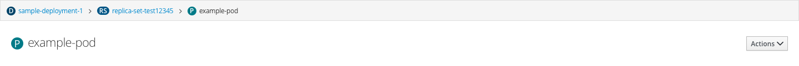
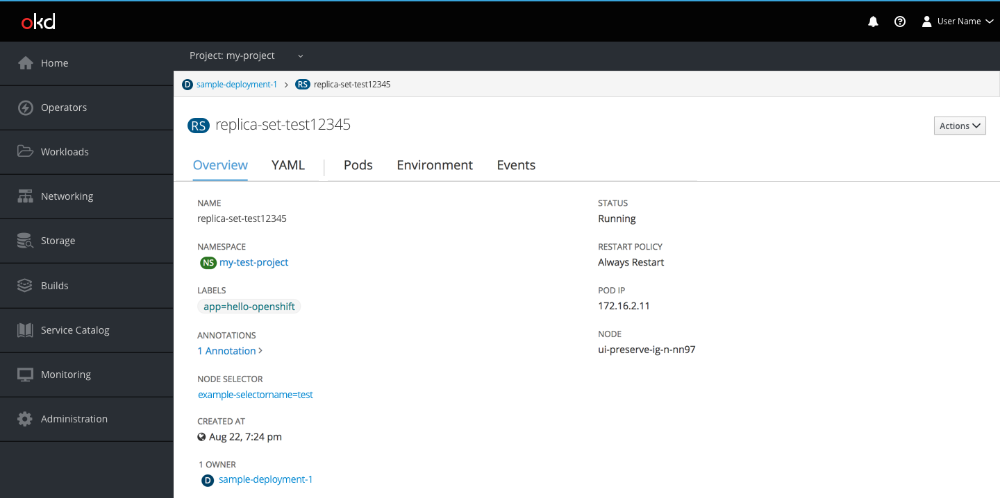
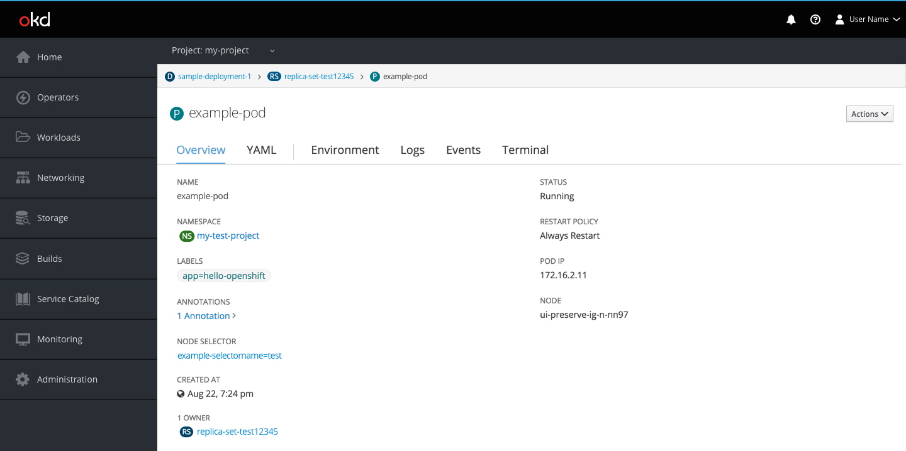
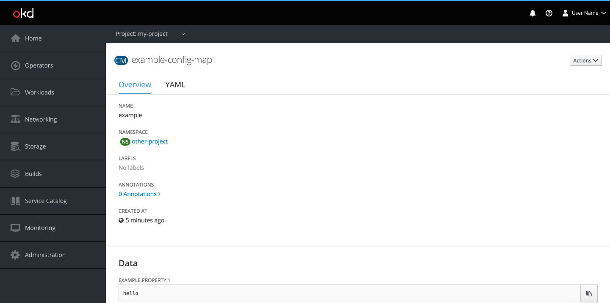
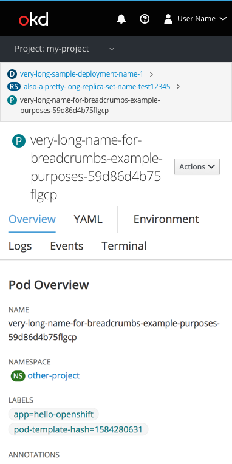

# Breadcrumbs

## Structure
* Display at most 3 levels in a breadcrumb string
  * When objects are owned by other objects, the breadcrumb string should be displayed as “Parent object > Current object”
  * When objects are owned by objects that are also owned by other objects, the breadcrumb string should be displayed as “Parent object > Parent object > Current object”
    * Note: in instances where an object has multiple owner levels, only display the two parent objects directly above the current object
* The page title should be displayed below the breadcrumb string
* In instances where objects do not have owners, display the page title alone
* Summary pages will also display the page title alone
* Do not list tab titles in breadcrumbs

## Design
* **Breadcrumbs bar**
  * The breadcrumbs bar should be 38 pixels high with a background color of pf-black-150 (#F5F5F5)
  * The breadcrumb string should be vertically centered in the breadcrumb bar
  * Leaves that link to objects should follow link text guidelines (font size 12 and pf-blue-400 (#0088CE))
  * The last leaf of the breadcrumb string should follow body copy guidelines (font size 12 and #363636)
  * Use fa-angle-right icon between leaves in the breadcrumb string
  * Use a horizontal divider below the breadcrumb string on all pages
* **Title area**
  * The title area should be 82 pixels high with a background of white (#FFFFFF)
  * The page title should be vertically centered in the title area
  * The page title should follow Level 2 Header h2 guidelines (font size 22 light and #363636)
* **Badge use**
  * Display badges for every object leaf in the breadcrumb string
    * Badge text in breadcrumb strings should be font size 12 semibold and white (#FFFFFF)
  * Display badges for page titles where a badge exists
    * Badge text in page titles should be font size 18 and white (#FFFFFF)
  * Follow documentation for resource badge color
* **Responsive view**
  * In a responsive state, the breadcrumbs will wrap

Object page (with 2 leaves)

Object page (with 3 leaves)

Object page (without parent)

Summary pages

Responsive view 

