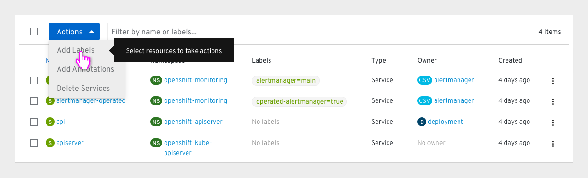
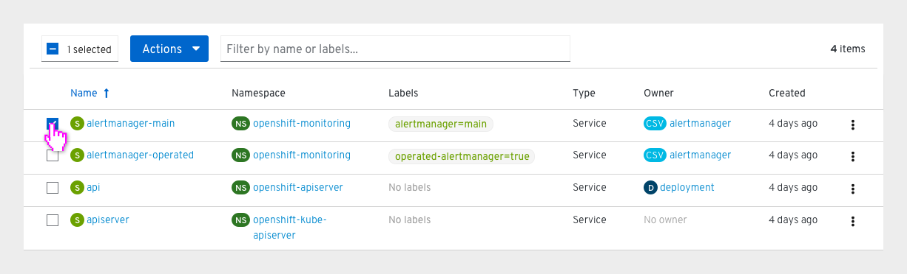
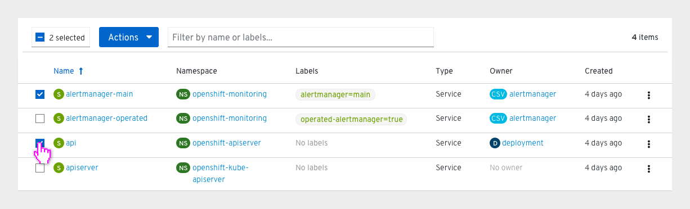
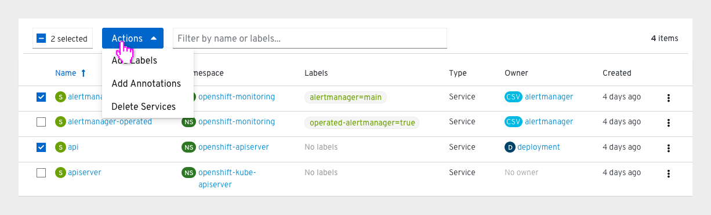
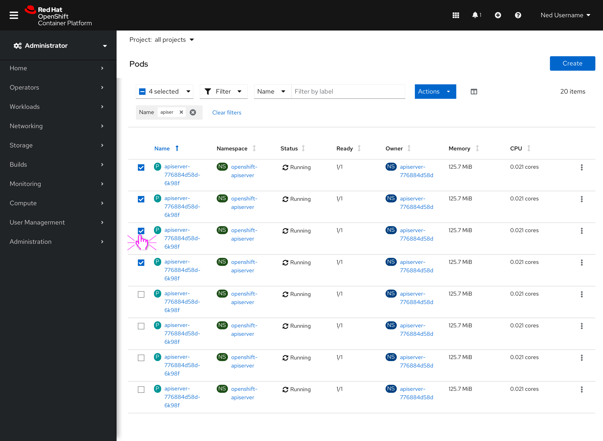
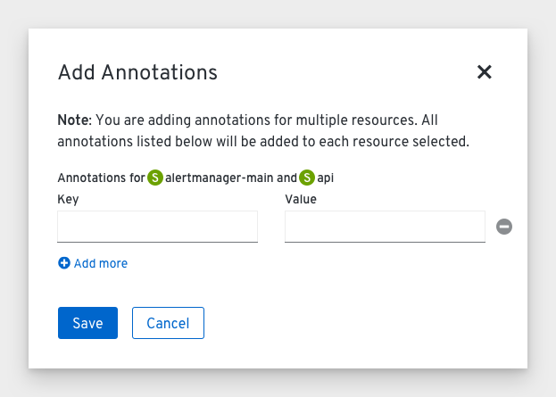
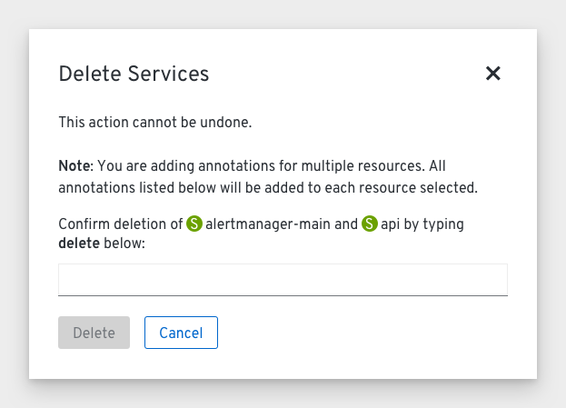

# Bulk actions

Bulk actions will be added to a number of pages in the OpenShift console.

## Behavior
* The bulk selector will be the first component in the toolbar on pages where bulk actions are available.
* Users can click the checkbox in the bulk selector to select all items in the list. If all items are selected, the bulk selector checkbox will be filled with a check and the bulk selector will read 'All [#] selected', informing users that all known items in the list are selected. Clicking the bulk selector checkbox again will deselect all items.
* Users can also choose to select a group of items by clicking the associated checkboxes next to them. The bulk selector checkbox will be filled in with a '-' to indicate that some items are selected, and the bulk selector will display the number of items selected (e.g. '2 selected'). Clicking the bulk selector checkbox will deselect all items.
* If no items are selected, the bulk actions dropdown will be enabled, but the actions within will be disabled. A tooltip will explain to users that they must select resources in order to take actions.

## Actions
* Only specific actions will be available to take on multiple resources. The default bulk actions are `Add Labels`, `Add Annotations`, and `Delete Resources`.
* Additional actions may be added in future depending on the resource type.
* When taking actions on five resources or fewer, the modal will list out the resource names. When taking actions on more than five resources, the modal will simply list the number (e.g. "Labels for 25 resources.").

### Add Labels

* The `Add Labels` modal is the same as the `Edit Labels` modal, but notes that any changes will add labels rather than replace.
* Users can add labels in the textbox and click 'Save' to add the labels to the selected resources.
* The new labels will appear in the list and the items will remain selected.

### Add Annotations

* The `Add Annotations` modal is the same as the `Edit Annotations` modal, but notes that any changes will add annotations rather than replace.
* Users can add annotations and click 'Save' to add the annotations to the selected resources.
* The items will remain selected.

### Delete Resources

* To bulk delete resources, users will be asked to confirm by typing **delete** in a textbox. Then the delete destructive action button will be enabled.
