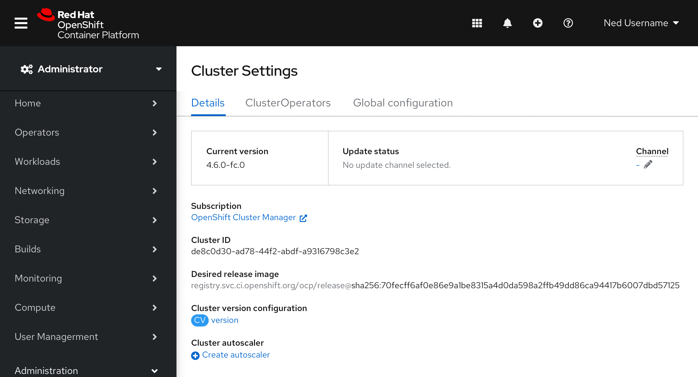
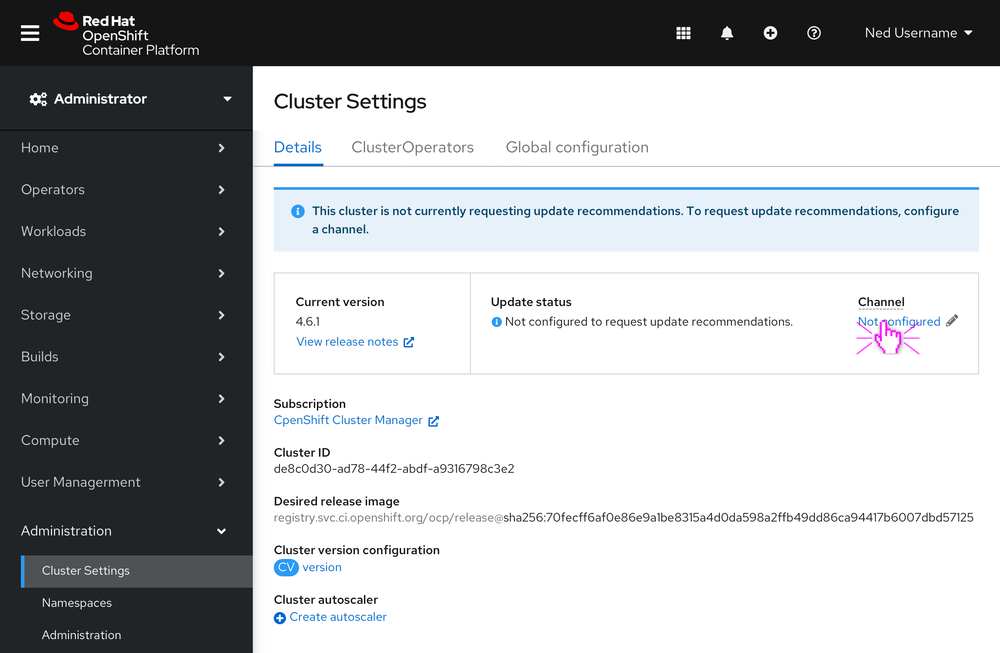
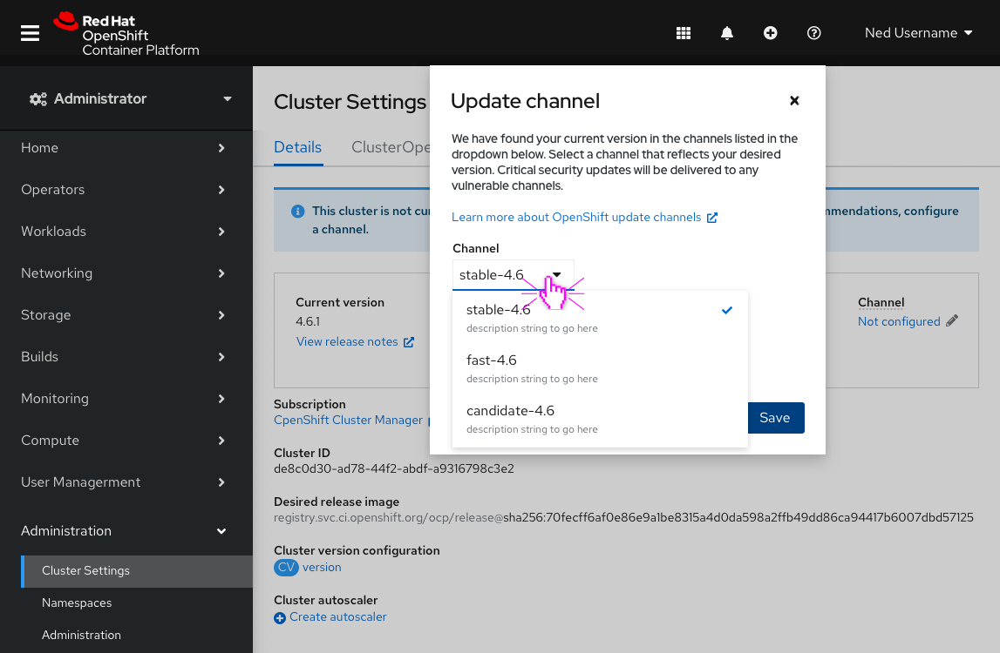
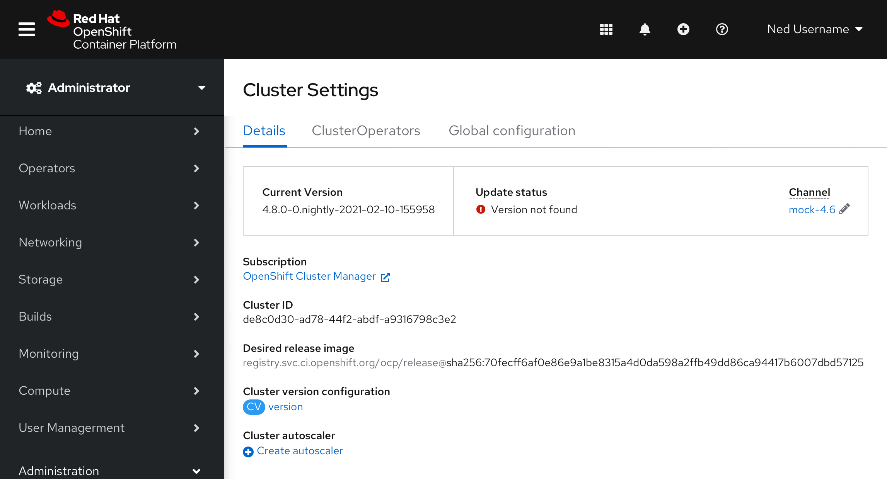
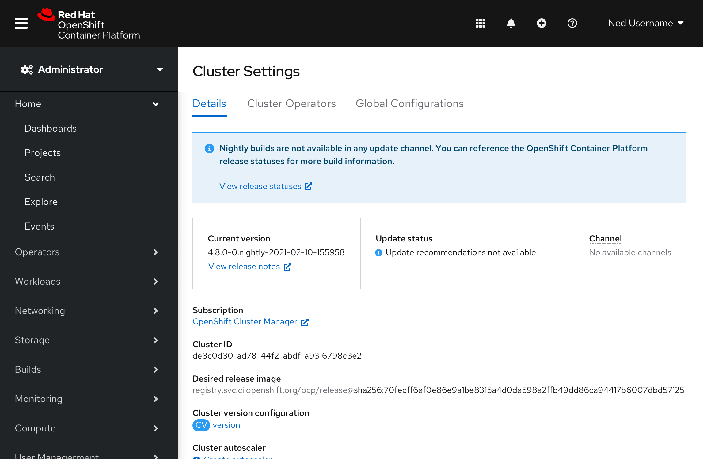
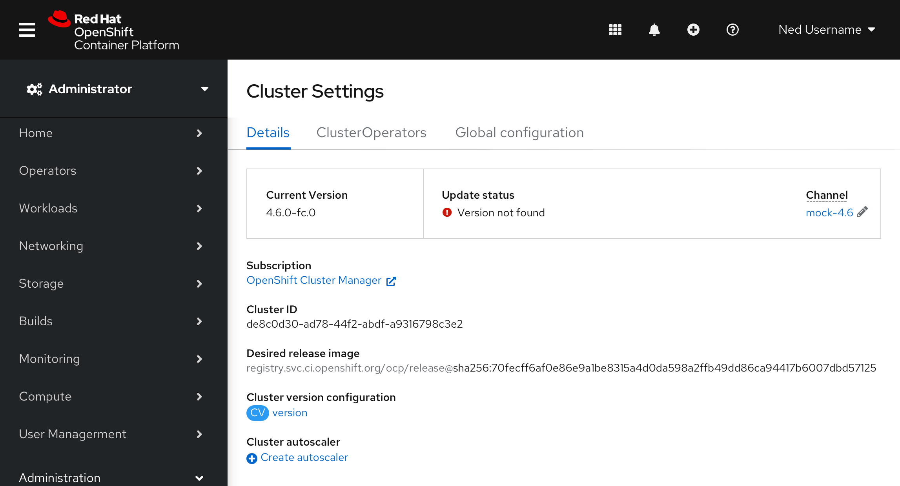
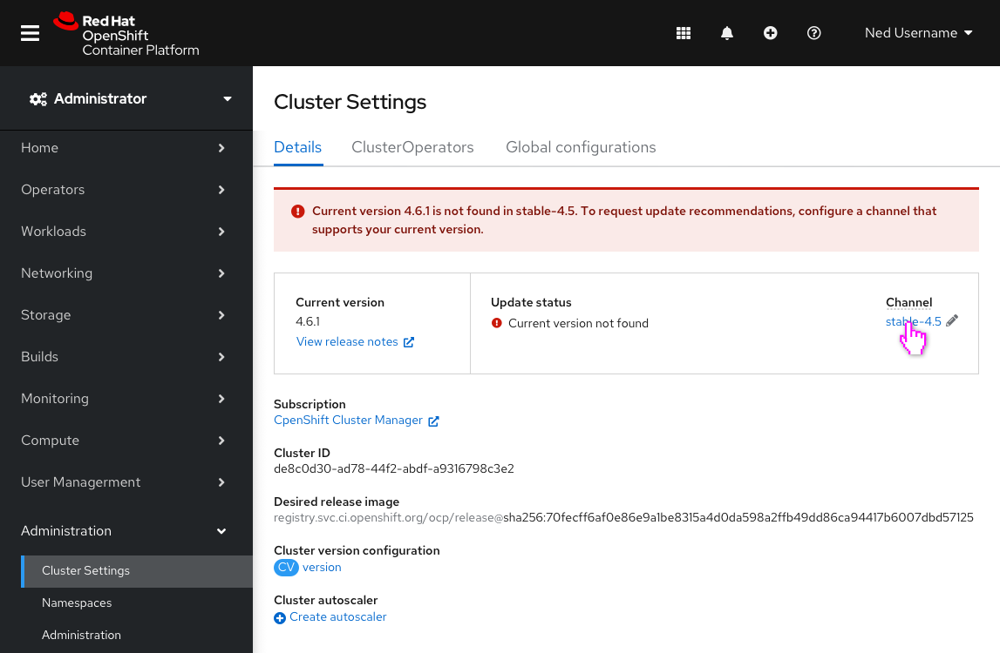
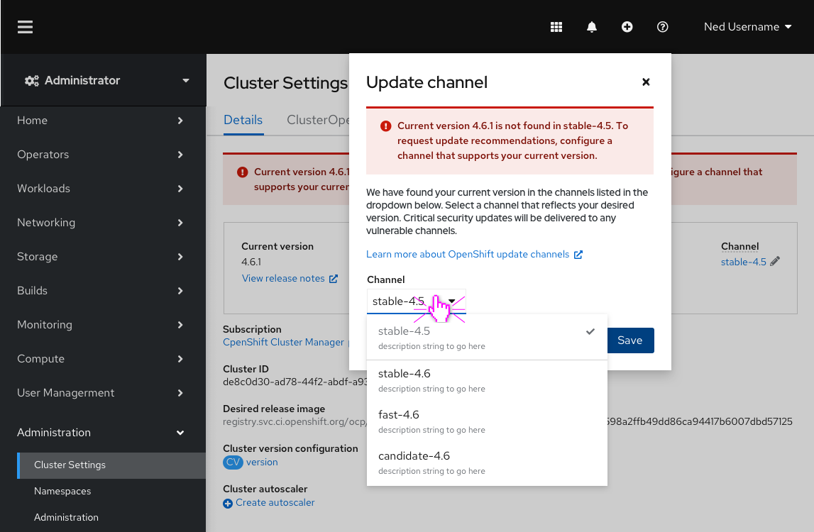

# Improvements to channel states and statuses

This unit of work is a part of our continuous effort to improve the upgrade experience. In particular, this set of enhancements focuses on improving how we communicate the state a channel is in, as well as the actions users can (or cannot) take to configure channels and receive update recommendations. Channel descriptions will be available in the channel dropdown to provide as much in context information as possible for users to make an informative decision on what channel to select based on their needs.

The enhancements focus on improving the following scenarios:
1. Create a more informative empty state for when a channel is not configured.
2. Help users who end up without any available channel choices understand why.
3. Help users recover from unknown versions.

## Scenario 01 | Create a more informative empty state for when a channel is not configured

- The current implementation for when a channel is not configured falls short in informing users the value of configuring a channel.

- The new design (picutred above) improves how we handle 'I'm not in any channels': 
    1. The new message under **Update status** lets users know the impact of not configuring a channel and directly states under the **Channel** selector that one is "Not configured."
    2. An informational alert was added to inform users that they are not requesting update recommendations and provides the action necessary for users to resolve. 

- In addition to the improvements on the **Cluster setting details page** the **Update channel model** now explicitly states that we have found your current version in the channels listed in the dropdown. 
- The channels in the dropdown now contain corresponding description strings. By exposing channel descriptions we are able to provide more context about the current channel and possible channel choices.

## Scenario 02 | Help users who subscribe to nightly builds understand why they have no channel choices available

- There are a few obvious issues with the current implementation when users are subscribed to a nightly build. We allow users to select a channel when no channels are available and the **Update status** makes it appear as if there is an error that the user must take action on to resolve.

- The new design (pictured above) improves how we handle **Nightly builds** by: 
    - Modifying the **Update status** to let users know update recommendations are not available. 
    - Removing the ability to edit the channel. Channels are not available for nightly builds.
    - Adding an informational alert to let users know that nightly builds do not have update channels.

## Scenario 03 | Help users recover from unknown versions

Users may misconfigure their channel or force an update to a release that does not belong to their current channel (e.g. forcing an update to 'stable-4.6.1' while remaining on 'stable-4.5').

In those situations, tooling will not be able to determine the channels to which the current release belongs, because the release will not appear in requests for the configured channel.

- Current implementation provides no way for users to know what the issue is at hand or how to resolve it.

- With this enhancement, we can help customers recover from unknown versions by providing them with:
    - An inline alert to let users know that their current version is not found in the current channel they have configured, resulting in an **Update status** of "Current version not found." 
    - Clear actions users can to take in order to request update recommendations for the current version.

- The error is repeated in the modal and the channels listed in the dropdown support the current version. 

