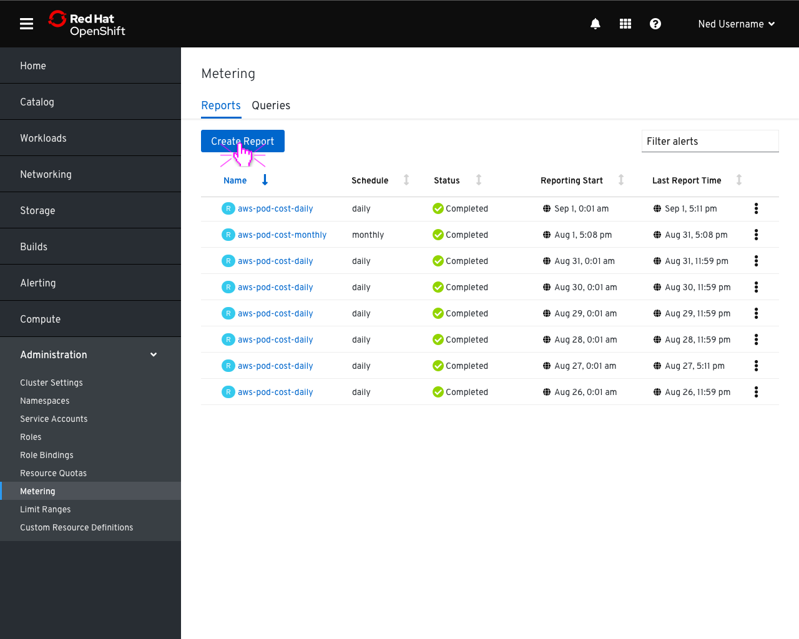
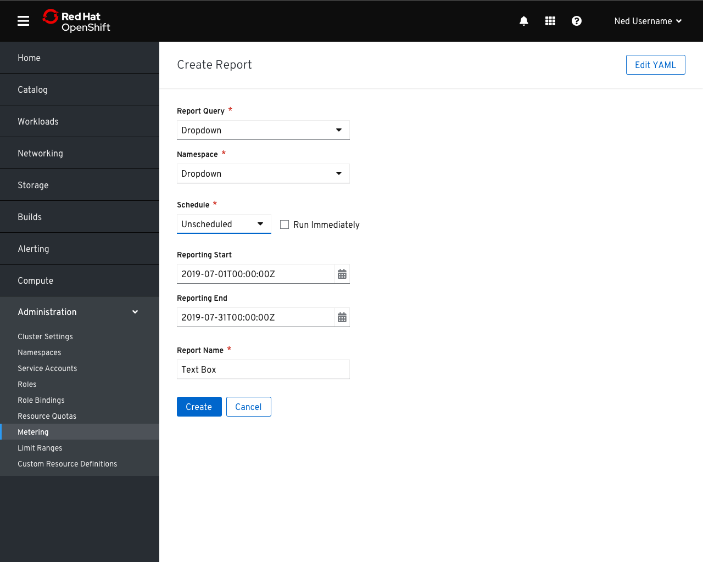
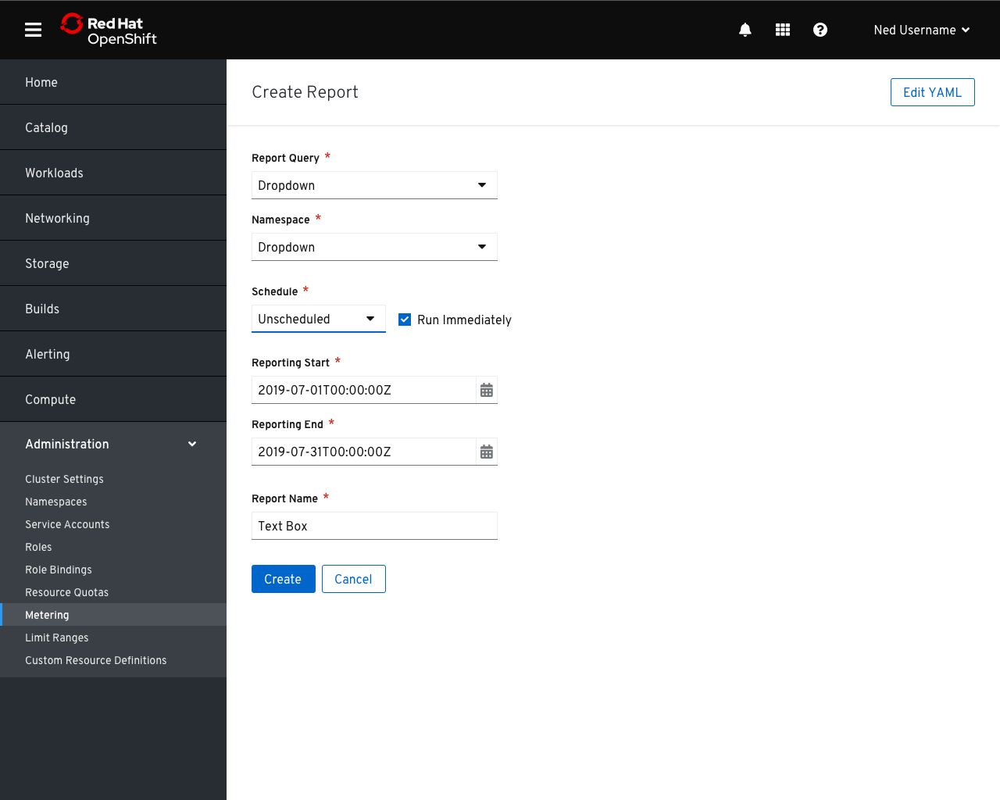
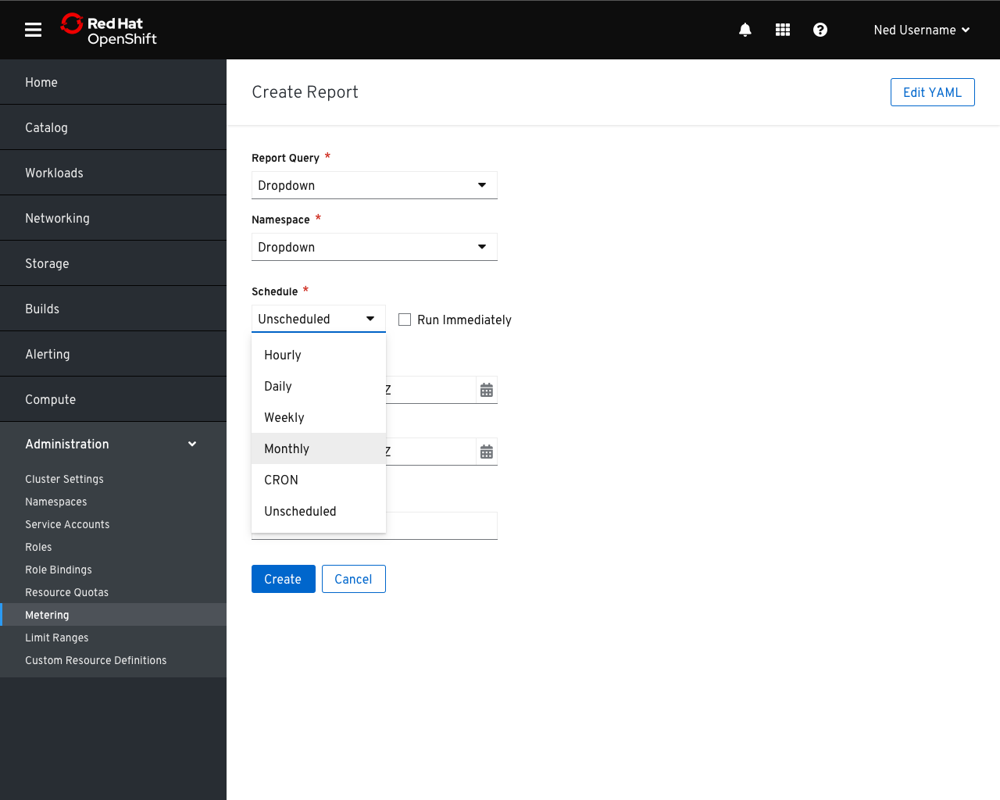
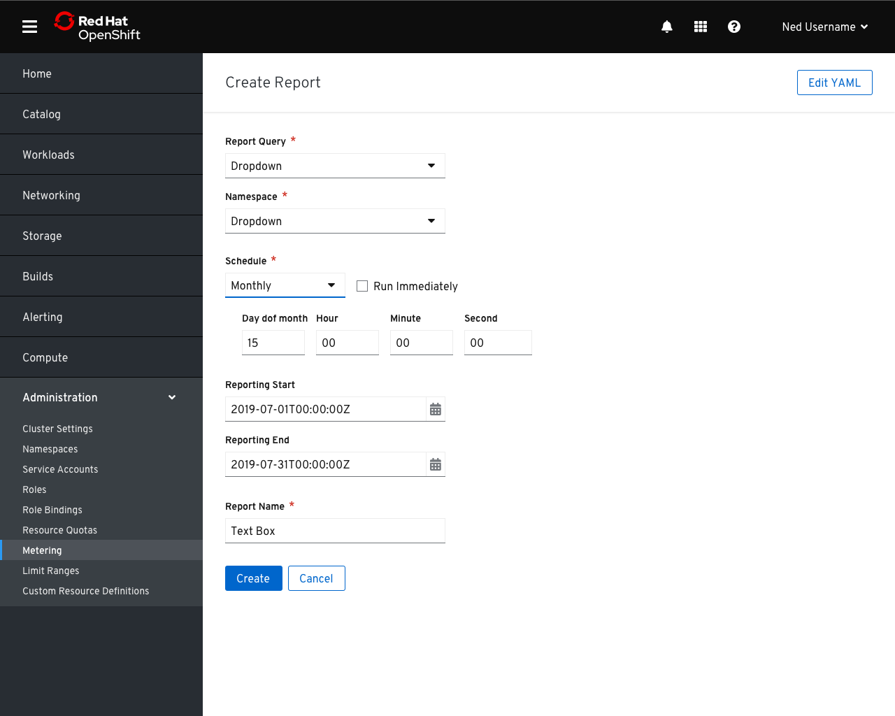
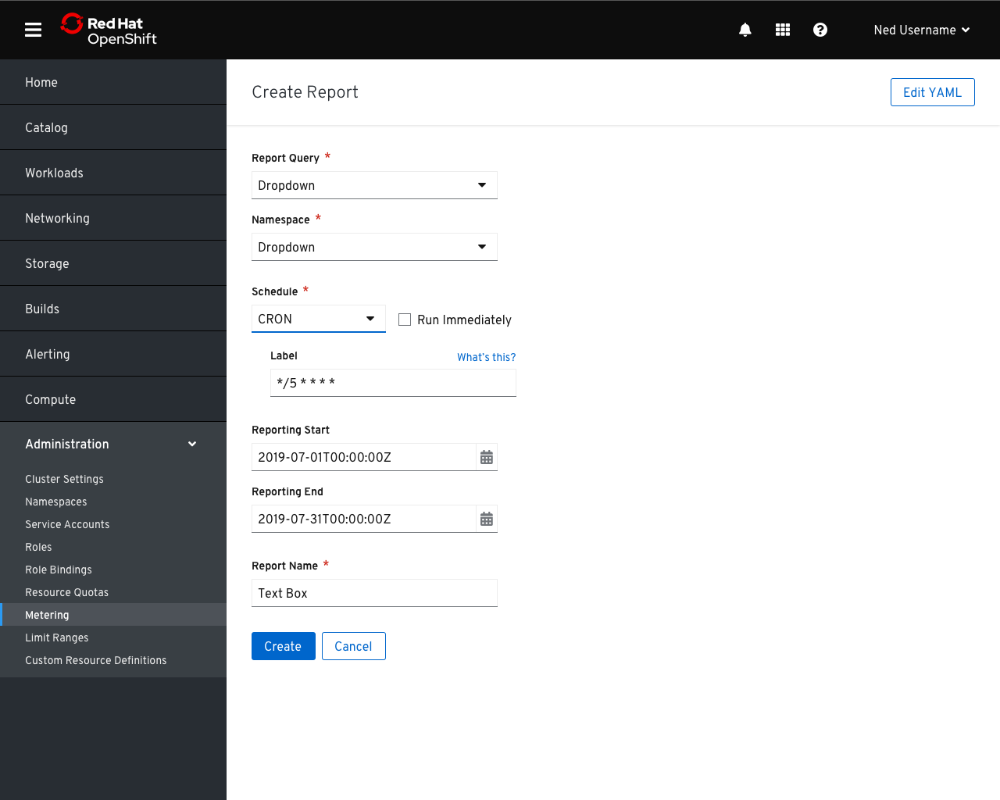
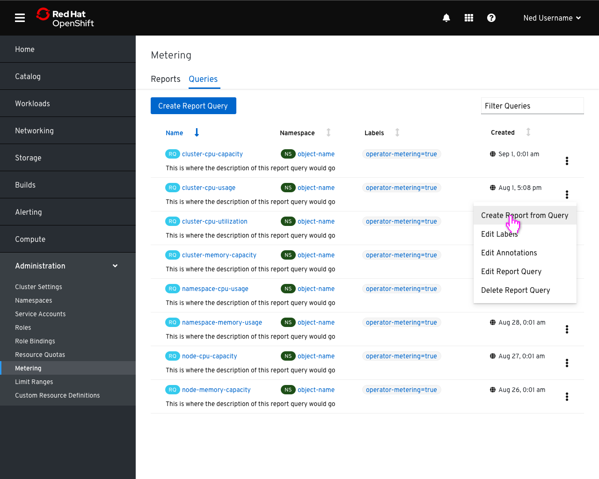

# Chargeback

## Reports

## Creating a Report

- The `Report Query` selector contains a list of the queries that could be used to create a report.
- The namespace could be selected, or potentially filled in automatically depending on the selected query.

- Checking `Run Immediately` would make the start and end dates required fields if applicable.

- In addition to creating an unscheduled report, users would be able to choose from a number of available periods or manually enter a CRON expression.

- Selecting a period provides the relevant fields for describing when the report should be run.

- Selecting the `CRON` option would provide a text box to enter an expression.
- A link to documents explaining cron syntax would be provided in this case

## Queries

- Reports could also be created from the context of a query.

- In this case, the `query` and `namespace` fields could be automatically populated with the details of the query.
- Ideally, the report name would be automatically updated with the name of the query and the period. Users could override this by typing in the `Report Name` box.
