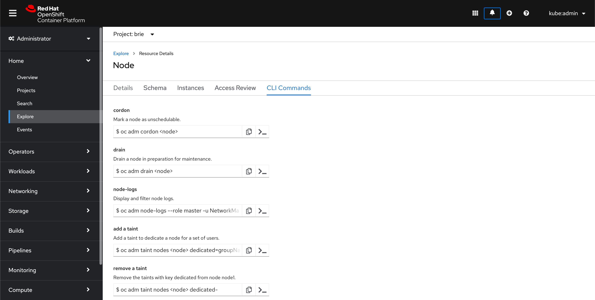
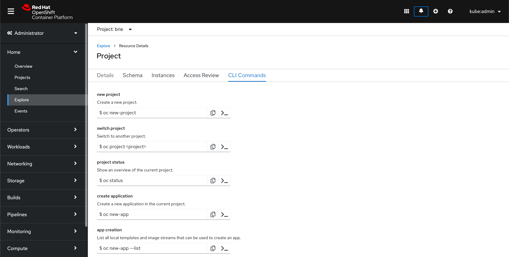

# CLI tips
We know many users leverage the UI to learn more about Kubernetes and understand what's available. We need a consistent way to help users find out corresponding or more advanced CLI commands. The following details the MVP version of this new feature.

## Design
When drilled down into a specific resource from the Explore page, add a tab called **CLI commands**. CLI commands relevant to the current resource will be shown with a name, a short description of the command, and the oc command itself.

Users can copy the command to their clickboard using the copy icon or may click the terminal icon to run the command directly into the console terminal. Users may have to replace parts of the commands to specify resources.

### Examples in context

### Resources
For the MVP version of this feature, CLI commands will be added to a specific subset of resources. They are:
* Pods
* Nodes
* Roles
* Projects
* Events
* Deployments
* Secrets
* Services
* Storage

To see a full working list of commands, [click here](https://docs.google.com/document/d/18CdJ9DqlU96wdrGpjsi_cuWdEVl8pni7fUVPSwdXNE8/edit#heading=h.xaug5xtl3dna).
