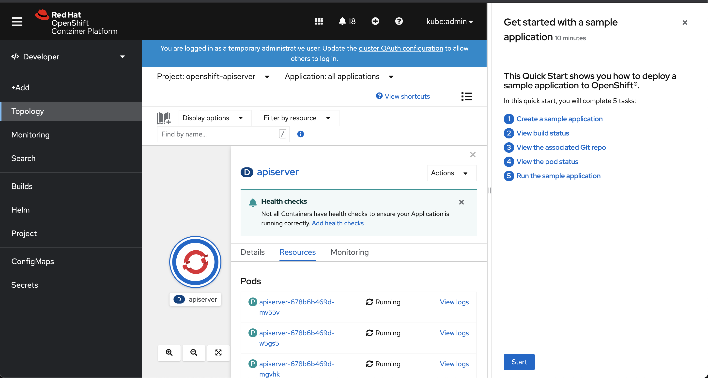
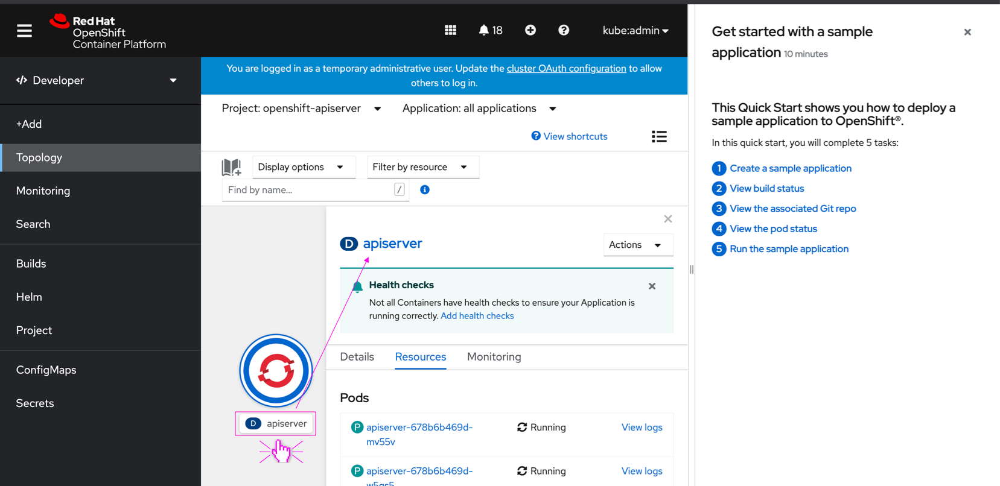

# Clickable Badges

Resource badges can be made clickable to expose further info about the resources.
By making the badge clickable, we can surface further information pulled from the "Explore" menu item, thus surfacing the "Explore" content on the go.
This could also reduce confusion around acronyms.

## General behaviour

* Currently, resources are implemented to have the name clickable. Badges are currently not clickable and detached from the resource link.    
* On clicking the resource badge, a popover appears displaying the following:
  * Full acronym breakdown as the title of the popover.
  * Resource description, pulled from the Explore>Resource>Details>Description.
  * Link to the Explore>Resource page.

### Specs

* All badges placed in-page or within a modal can be made clickable, including the following placements:
  * Resource details page title
  * Within a list.
  * Within an infobox
  * Within a modal (in page)
* Badges that appear on drop-downs should be excluded and not be made clickable.
* the badge popover should be triggered by clicking, but also by hovering with a 0.5 seconds timeout.

* The badge should have a clickable active area with the same height as a primary button
* This active area should be the same length as the badge (no margins).
* On hover, the curser should be changed to "clickable object"
* In the current badge implementation (OS 4.8), no visual change will be made to the badge on hover or click.

## Future expansions

* Once in page description bellow resources lists will be introduced, we can enhance this behaviour by making the "Learn more" to open an Explore side panel.
* This side panel can be considered the "Extended view" of  the explore info, while the popover is the "Quick view" (keeping the user as close to the content).

* The 'Explore badge' side panel is a stand-alone panel.
* It should not appear side by side with the workload page.
* Firing one of these panel types should close the other.
* The Quickstart panel should remain open, like it is in the workload side panel

* Currently, on the Developer perspective > Topology menu item > List view, the name of the workload is coupled with the workload badge. Meaning, both of them link to the workload side panel.
This is different from the Admin perspective, where they are decoupled.
A part of this suggestion is to align both, decoupling the badge from the workload name.
By doing so, firing the 'Explore Badge' side panel will not conflict with the workload side panel.
