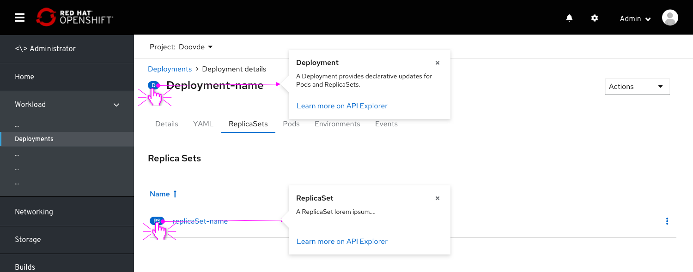
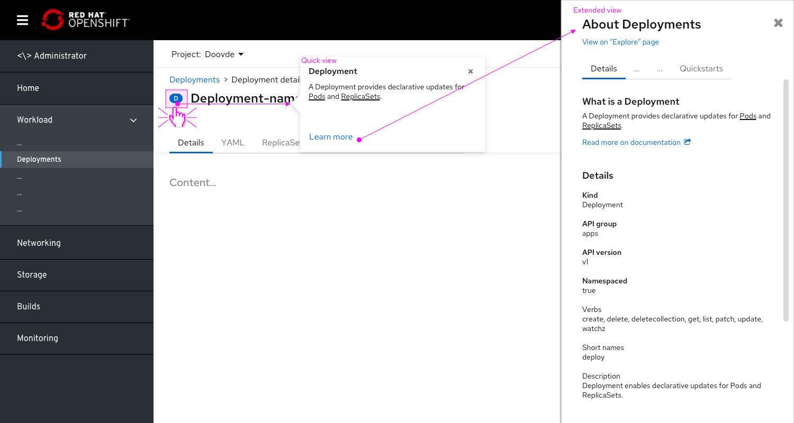
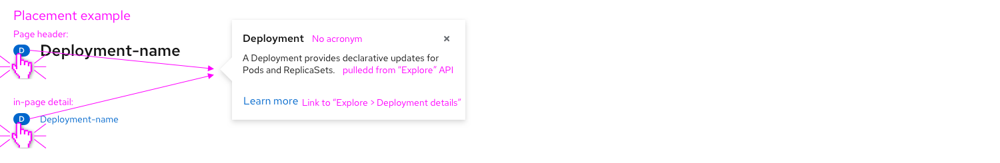
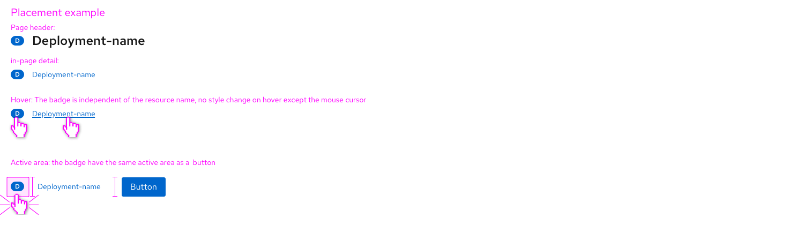

# Clickable Badges

Resource badges can be made clickable to expose further info about the resources.
By making the badge clickable, we can surface further information pulled from the "Explore" menu item, thus surfacing the "Explore" content on the go.
This could also reduce confusion around acronyms.

## General behaviour

* Currently, resources are implemented to have the name clickable.
Badges are currently not clickable and detached from the resource link.    
* On clicking the resource badge, a popover appears displaying the following:
  * Full acronym breakdown as the title of the popover.
  * Resource description, pulled from the Explore>Resource>Details>Description.
  * Link to the Explore>Resource page.

## Badges on list pages

Badges will be placed on list pages as well, next to the list title. This will help users identify the workload, increase consistency and hep users get access to learn more about that workload.

## Specs

* All badges placed in-page or within a modal can be made clickable, including the following placements:
  * Resource details page title
  * Within a list.
  * Within an infobox
  * Within a modal (in page)
* Badges that appear on drop-downs, as well as the ones that appear on the topology view, should be excluded and not be made clickable.
* the badge popover should be triggered by clicking, but also by hovering with a 0.5 seconds timeout.

* The badge should have a clickable active area with the same height as a primary button
* This active area should be the same length as the badge (no margins).
* On hover, the curser should be changed to "clickable object"
* In the current badge implementation (OS 4.8), no visual change will be made to the badge on hover or click.
