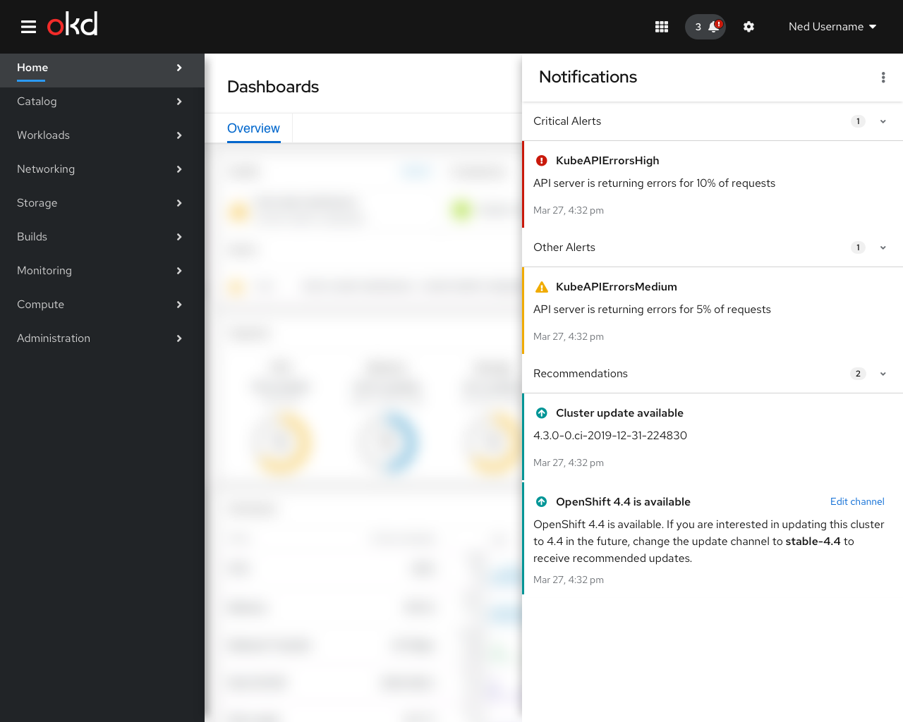
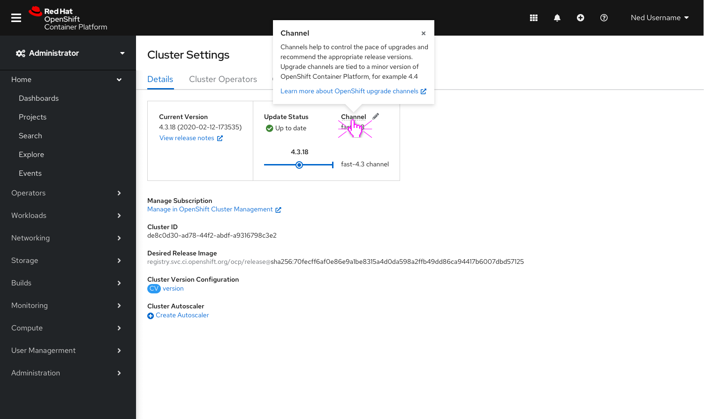
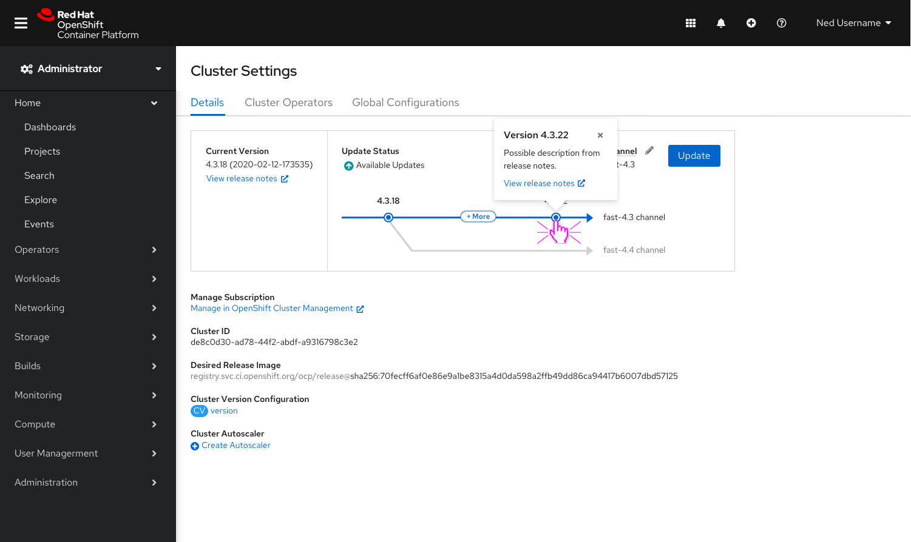
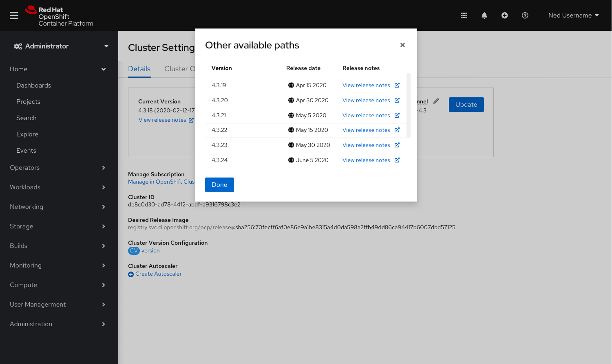
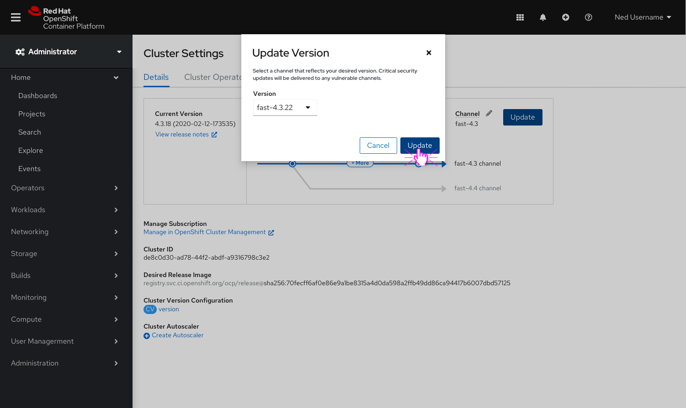
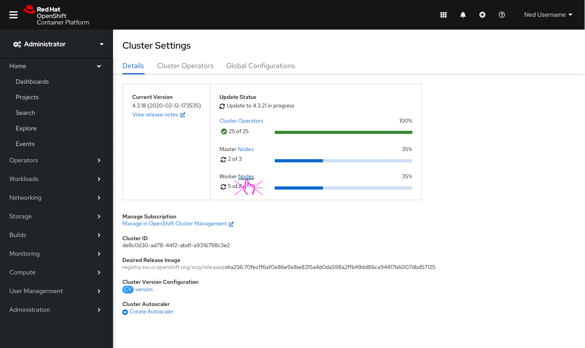
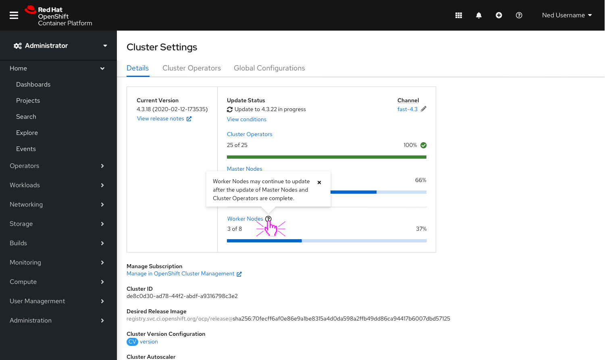
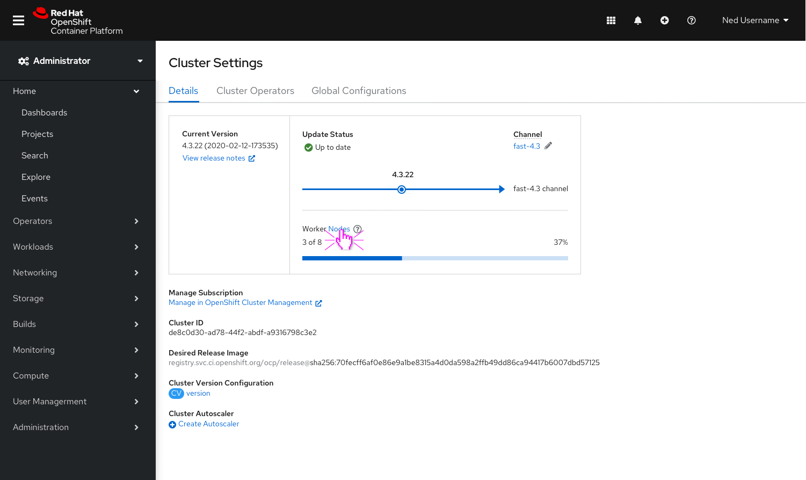
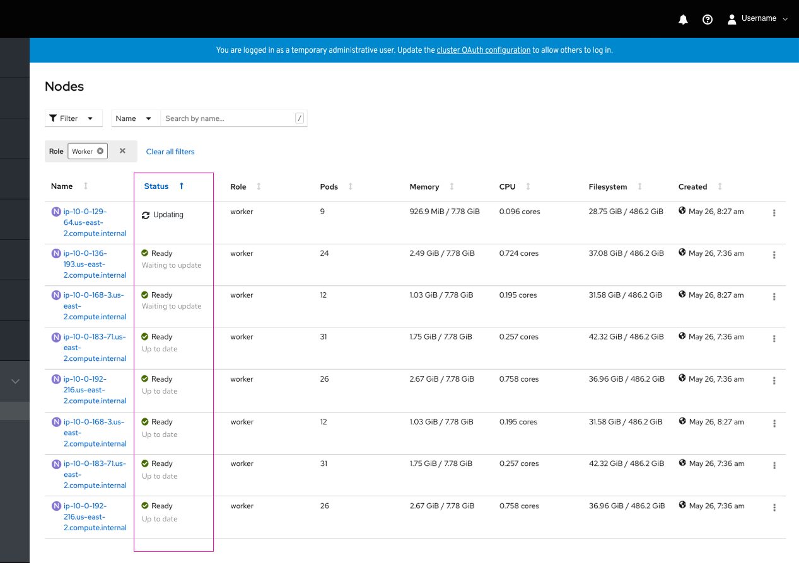

# Cluster Settings 

Users complete upgrades in cluster settings. The following design focuses on making improvements to the current upgrade experience in cluster settings by making upgrading as simple and transparent as possible. Specific improvements include adding more information around recommended upgrade paths and notifying users when new versions and channels become available. 

## Adding Recommendation Alerts to the Notification Drawer

- Today, available updates appear in the message section of the notification drawer. 
- Three new recommendation alerts will be added to inform users if (1) a new patch becomes available, (2) a new minor release becomes available, and/or (3) new channels become available. 
- All three messages send users to the cluster settings section of the console to take further action.

## Channel Visualization and In Context Help

The new channel visualization provides users with more transparency into recommended upgrade paths, informs users what changes happen in each release, and guides users to the correct channel. 

In addition to the visualization: 
- Field level help text was added for channels
- A new manage subscription field was added with a direct link to manage subscriptions in OpenShift Cluster Manager

- Clicking `Channel` surfaces a popover that provides context as to what a channel is along  with a link to documentation to learn more about channels in OpenShift.

- Clicking the `Pencil` next to `Channel` will surface a modal that allows users to edit the channel. 
- The link to documentation to learn more about channels in OpenShift is included here as well.

- The blue line signifies the current channel you are on. The current version and recommended version (if available) are both marked with blue dots. 
- The gray line signifies the next available channel.
- To surface recommended versions in the next available channel, users must switch to the channel by clicking the `Pencil` next to `Channel`. 
- If no other channels are available the gray line will not be visible. 
- At this time the visualization only supports surfacing one additional channel - the next available.

- Clicking on the recommended version, in this case the `4.3.22 dot`, will surface a popover with recommended minor release information and a direct link to release notes.

- Clicking `+ More` will surface a popover that lists out all versions (between the current version and recommended version) in a table with direct links to release notes. 

- In the case that there are more than 5 versions available (between the current version and recommended version), clicking `+ More` will surface a modal.

## Updating a Channel and Viewing the In Progress Checklist

It was important to provide more transparency to the user when an update is in progress. The mockups below illustrate the steps a user takes to update to a minor release in their current channel, and surfaces the in progress checklist that allows users to see the status of the update in real time.

- Clicking `Update` launches a modal to confirm the update.

- The recommended version is preselected. 
- If available, users can select an alternative version in the dropdown.
- Clicking `Update` will begin the update.

- The channel visualization is replaced with an in progress checklist including: Cluster Operators, Master Nodes and Worker Nodes. 
- Each item contains a corresponding count (ex. 2 of 3), a status icon, and a progress bar to provide more context to the user. 
- Clicking `Cluster Operators` will navigate users to the Cluster Operators list. 
- Clicking `Nodes` will navigate users to the Nodes list to view detailed progress of each node.
- Clicking `View conditions` will navigate users to the Cluster Version Details page where users can view the details of the four possible condition types: available, failing, progressing and retrieved updates.

- Worker Nodes are visually separated from Cluster Operators and Master Nodes as they are not included as a part of the data that marks an update as complete.
- The info icon to the right of Worker Nodes surfaces a tooltip, stating that: Worker Nodes may continue to update after the update of Master Nodes and Cluster Operators are complete.

- In the case that Worker Nodes are still in progress after the Cluster Operators and Master Nodes are complete, the Master Node and Cluster Operator checklist items will be replaced with the channel visualization. The "In progress" update status will change to "Up to date" and the Worker Node progress bar will remain until complete.

- The nodes list can be sorted by `Status`. 
- Additional context has been added under “Ready”. The node will display “Up to date” or “Waiting on update” below the existing “Ready” status, to reflect the status of that particular node. 
