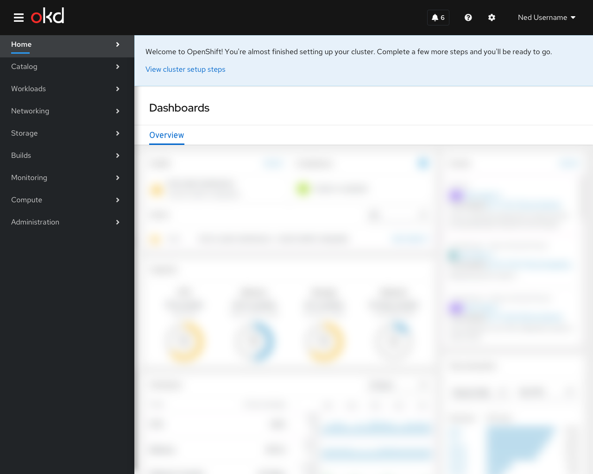
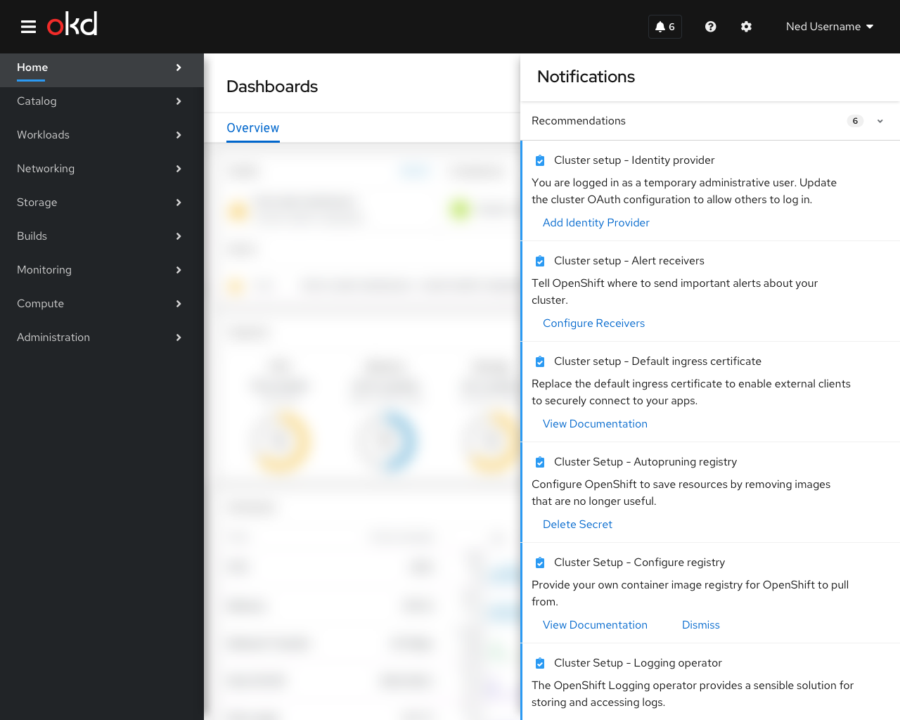
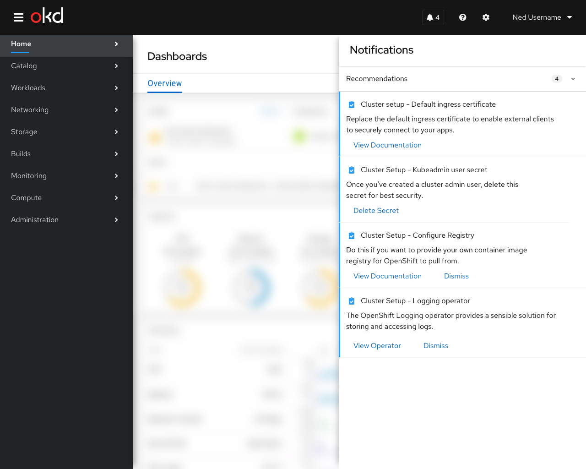

# Cluster Setup

## First time use

When the user first signs into OpenShift after installation they are presented with a hint block that directs them to complete the cluster setup steps. Clicking on the action button in the hint should open the notification drawer. Once the notification drawer has been opened, either with the action button or from the masthead, the hint pattern is removed.

## Behavior
Cluster setup items appear in the "recommendations" section of the notification drawer. Once a user has clicked on the action of the recommendation or if the cluster detects that the desired state has been reached, the item disappears from the notification drawer.

## Contents

**Note: the exact phrasing and action targets of these items is not final**
- Configure an identity provider
  - "You are logged in as a temporary administrative user. Update the cluster OAuth configuration to allow others to log in."
  - The action button for this item should kick off the "add identity provider" form.
- Configure alert receivers
  - "Tell OpenShift where to send important alerts about your cluster."
  - This action should link to alertmanager configuration page
- Default Ingress Certificate
  - Replace the default ingress certificate to enable external clients to securely connect to your apps
  - [This action should link to docs for ingress certificates](https://docs.openshift.com/container-platform/4.5/security/certificates/replacing-default-ingress-certificate.html)
- Autopruning Registry
  - "Configure OpenShift to save resources by removing images that are no longer useful.""
  - [This action should link to docs for autopruning](https://docs.openshift.com/container-platform/4.5/applications/pruning-objects.html#pruning-images_pruning-objects)
- Delete kubeadmin user secret
  - "Now that you've created a cluster admin user, delete this secret for best security."
  - The action on this item should take the user to the secrets page filtered to show only the "kubeadmin"secret.
  - **Note: This recommendation should appear only after the cluster contains at least one user with Cluster Administrator permissions:**

### Optional Steps

Some recommended setup steps may not be appropriate for every user. In these cases, the recommendation item should contain a "dismiss" button that would remove it from the notification drawer without taking any action.
The following are examples of useful optional steps:
- Configure Registry
  - "Do this if you want to provide your own container image registry for OpenShift to pull from."
  - [This should link to the docs for registry configuration](https://docs.openshift.com/container-platform/4.5/registry/configuring-registry-operator.html)
- Install logging operator
  - "The OpenShift Logging operator provides a sensible solution for storing and accessing logs"
  - Link to operator catalog page for the logging operator

## Future-looking
- When the Overview status card gets updated to display icons for the different items in the notification drawer, the hint block on first use may not be necessary.
- User settings about notification drawer contents should let people turn off these kinds of recommendations, but they would always be on by default in a fresh installation
