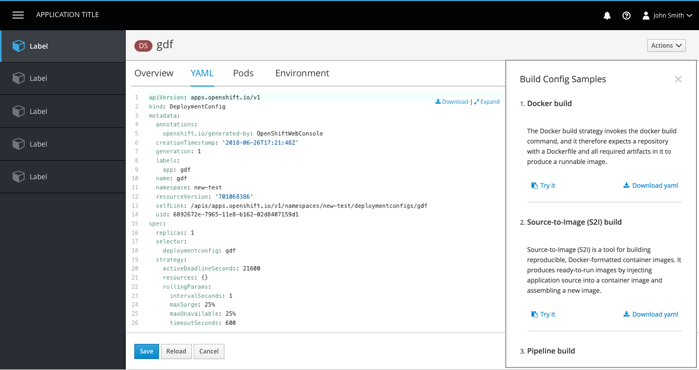
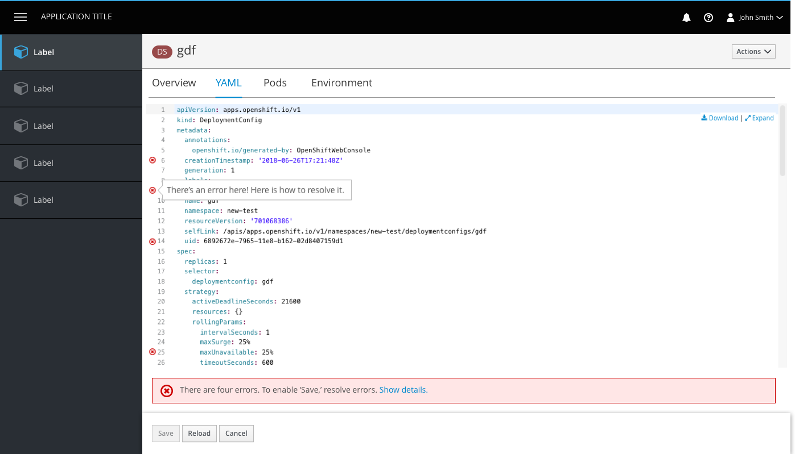
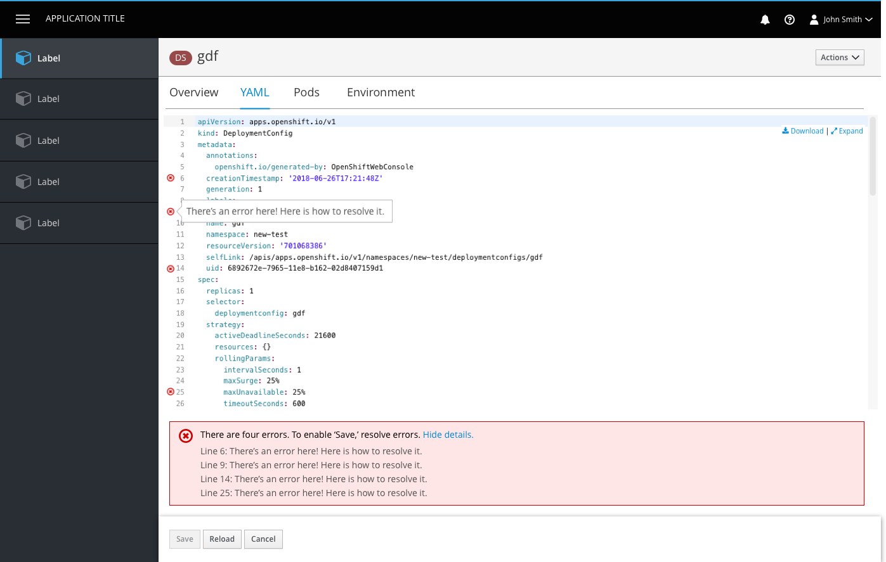
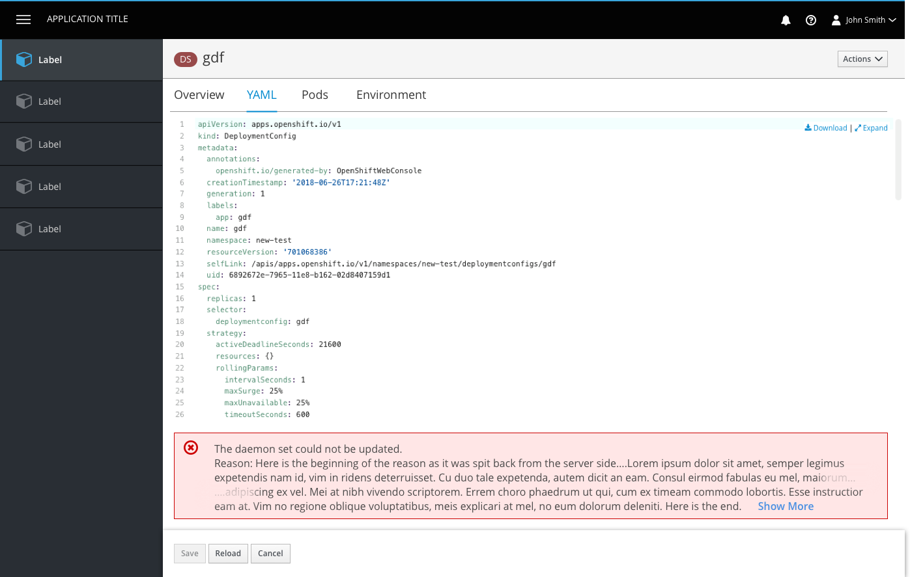
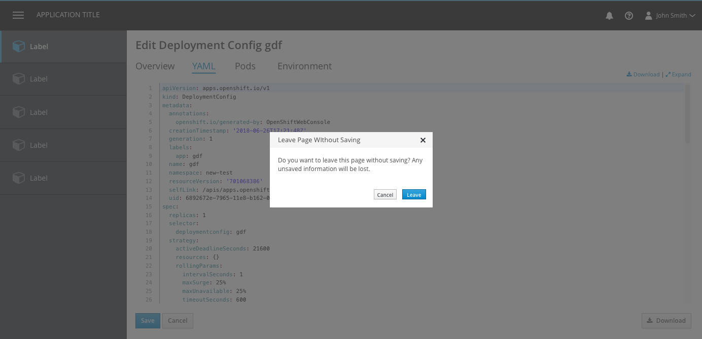
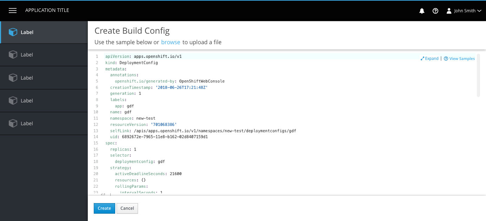
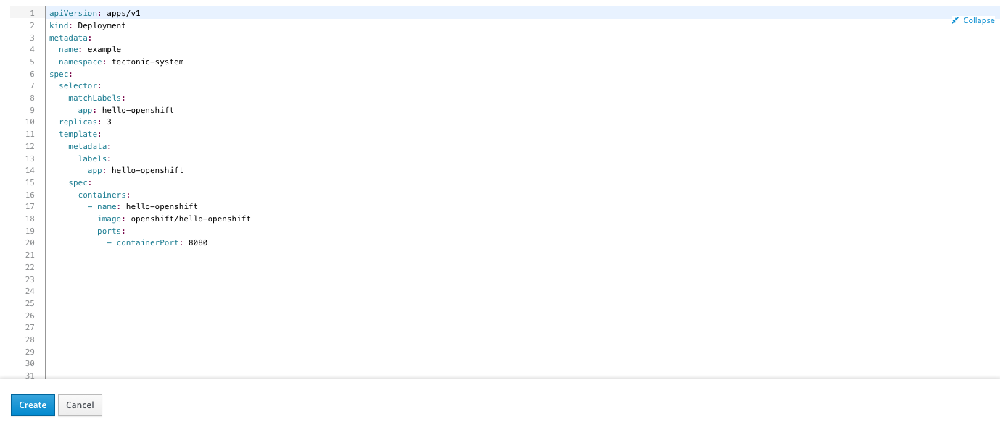
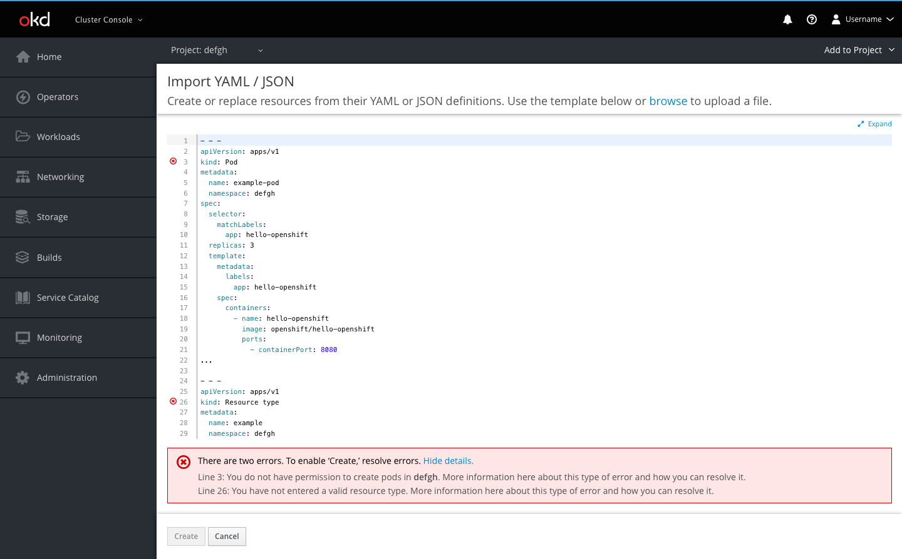
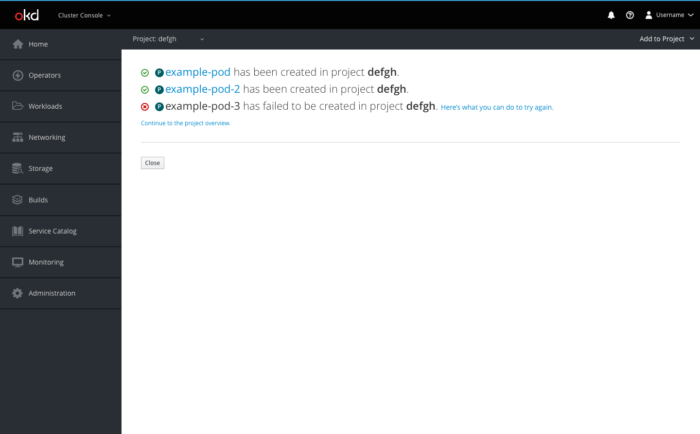

# Code Editor

## Edit YAML

- The code area is borderless at the top and has the button bar at the bottom as a separator.
- The Download, Expand, and View Samples links are sticky in the top right corner of the YAML editor, with vertical separators between them. The icons belong to the left of each link.
  - Download will produce a YAML output for the user to view outside of OpenShift.
  - Expand will allow a user to view the code in fullscreen mode.
  - View Samples will open a panel for resources that have available templates.

#### Expanded State

- When the editor is expanded, it takes up the entire screen, covering the console entirely (including navigation and masthead).
- The bottom button bar remains visible in the expanded state.
- A new tab is not opened for the expanded view.
- The Expand link turns into a collapse icon and link in the top right corner of the expanded view for users to exit full-screen mode.

#### View Samples

- Some resources have additional YAML samples available for users to paste or download.
- View Samples should use the help icon and should always be to the right of the Expand link.
- Clicking the link will open a [modaless overlay](https://www.patternfly.org/pattern-library/forms-and-controls/modeless-overlay/) with the YAML samples provided. Users can close the panel using the X in the top right corner.
- Floating links will still remain visible in the top right corner when the side panel is open.

#### Errors
- Errors are shown with an icon on the corresponding line. Users can hover over the icons to see details of each error.

- If errors exist, an inline notification will appear below the editor summarizing the number of errors. Users can click the Show Details link to view all error details in one place.
- The button bar is sticky at the bottom of the page and actions include Save, Reload, and Cancel.
- The Save button is disabled if changes have not been made or if there are still errors to resolve.
- The Reload button allows users to reload the code in the event that there was a change in the backend or they made a change that they would like to undo.
- The Cancel button does not save changes and brings users back to the page they were on prior to the edit page.

- For cases where save is enabled but a server side error occurs, an inline error notification will be displayed.
- **Note:** If the error message is too long, the middle should be truncated, leaving the beginning and the end of the message visible, where key information tends to show up.

- If save is enabled and a user clicks away from the editor (by clicking on another tab or a navigation item) a modal dialog will appear to remind the user they have unsaved changes.

## Create YAML

- The create page is a newly loaded page within the console.
- Users are presented with a preloaded YAML sample with which they can create their object (primary way to create new).
- Users may alternatively choose to browse their file directory and upload a file with which they can create their object (secondary way to create new). This would replace the original template contents.
- The expand link and functionality is available on the create page.
- The bottom button bar is sticky and actions are Create and Cancel. Both buttons are enabled unless there are errors detected, then create is disabled.
- Error handling is the same for both Create YAML and Edit YAML. See error handling above.

## Import YAML

The Import YAML action is accessible from the Add dropdown in the project selector bar, making it accessible from most every page within the console.

**Create page**

* Users can create resources using YAML or JSON by dragging and dropping a file, pasting in code, or browsing their directory to upload
* The button bar allows users to Create or Cancel
  * The Create button will create the resource(s) and redirect users to a success screen if there are no errors in the code
  * If there are errors, the button will prompt an inline notification to appear with error details
  * Cancel will bring the user back to the page they were previously on.

**Error example**

* Errors are shown with an icon on the corresponding line
  * Users can hover over the icons to see details of each error
* When a user tries to click Create when there are errors, an inline notification will appear below the editor summarizing the number of errors
  * Users can click the Show Details link to view all error details in one place

**Template overlay**

* If a user chooses to import a file, when they click Create they will be presented with a modal overlay giving them the option to process the code as a template, save a template, or both

**Summary page**

* After users click Create, they are redirected to the results summary page
* The user will be able to see a list of the resources they created and in which project they were created
* Successful creations will be displayed with the pficon-ok to the left
  * The resource name for successful creations will link users to that resource's overview page
* Failed creations will be displayed with the pficon-error-circle-o to the left and a recommendation on how the user can remedy the error
* Users may also go to the project overview page using the link or go back to the page they were previously on using the Close button
