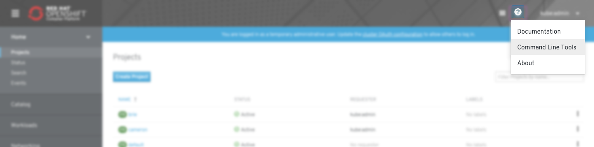
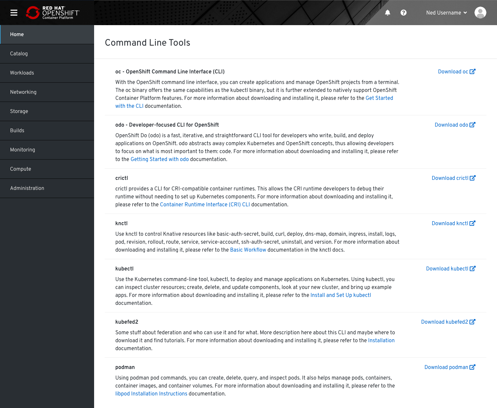

# Command Line Tools

If users do not already have the `oc` command line tool, they can download the version corresponding to the OpenShift cluster they are using from the Command Line Tools page. They can also download OpenShift do (`odo`) from this page. More command line tools will be added to this page over time.

## Help Menu

* The command line tools page will be accessible from the help menu.

## List view

* The command line tools page will be a full page list view. Each row will have the tool name, description, and download link.
* **Note**: These descriptions are placeholder and will be reviewed and updated if and when the tools are added in future.
