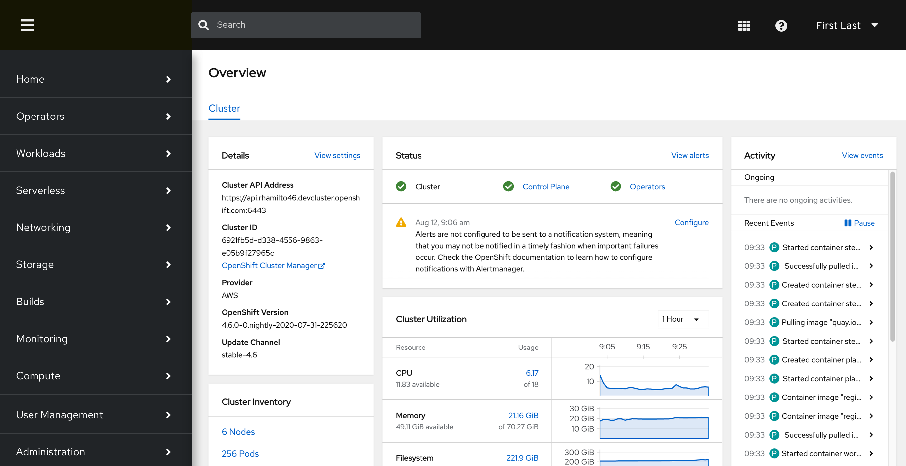
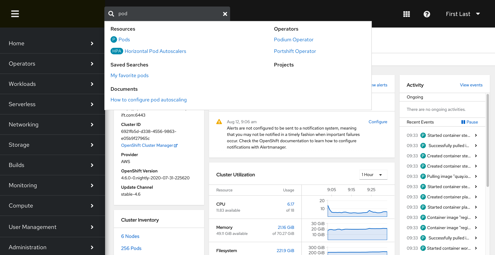
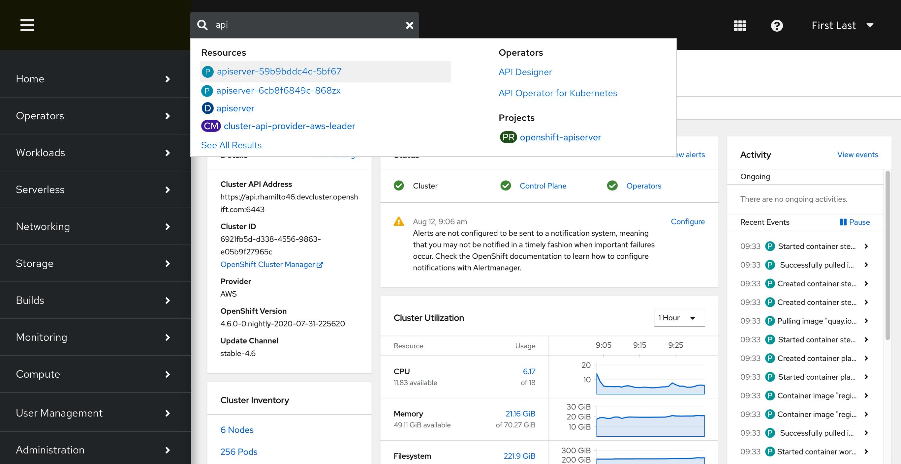
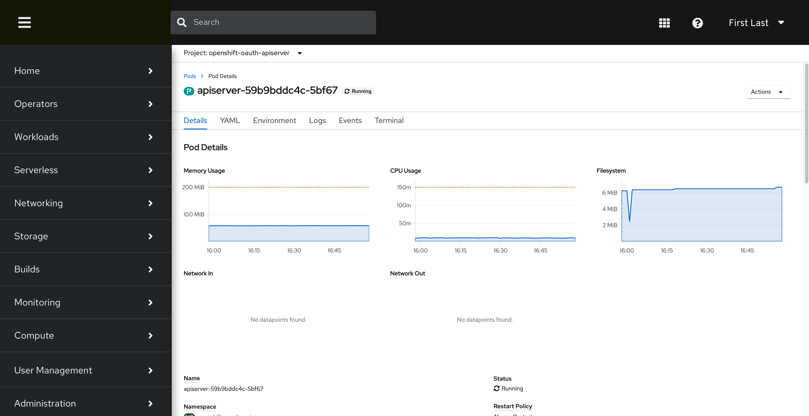
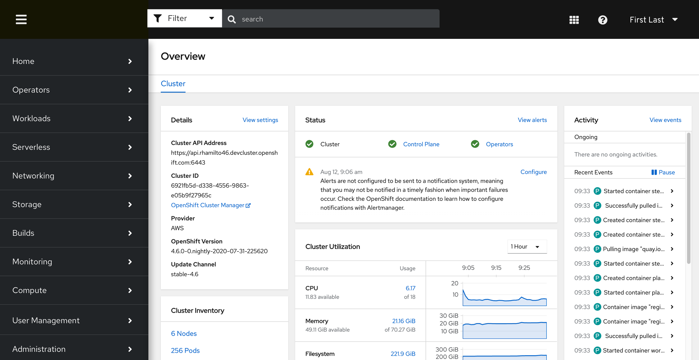
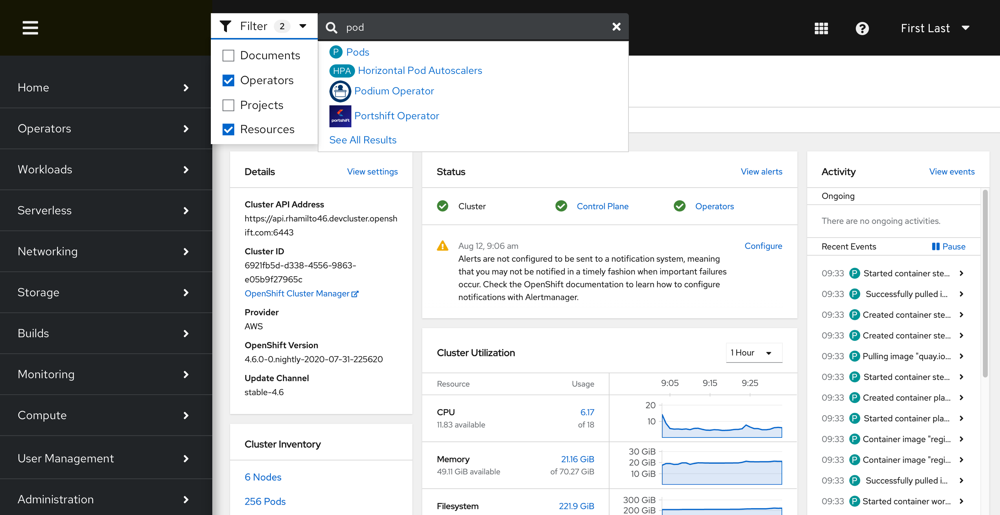

# Console Search Feature

Based on a competitive review of similar user interfaces for Kubernetes, a search feature is commonly available. This is something that could be added to the OpenShift Web Console.

Default state:

Ability to search on resource types

Ability to search on specific resources 

Directing to the details page of the selected resource's search result

Adding in a filter option to remove the categories within the search results, and allow users to narrow the search themselves

In the event the search query returns no results, users needs to be notified and possibly provided information on how to improve their search query

