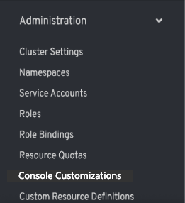
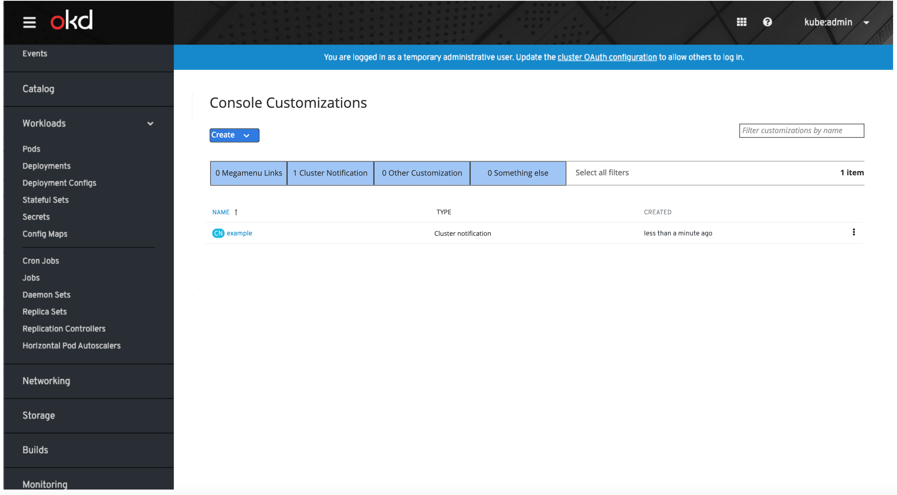
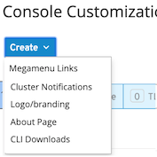
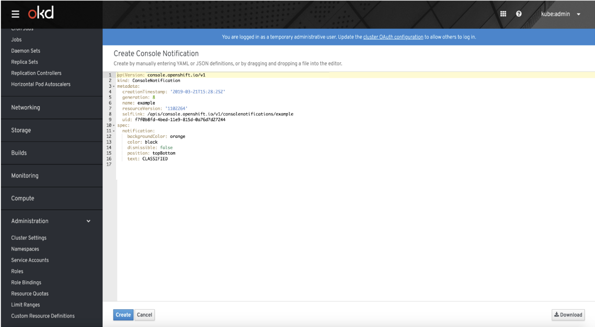
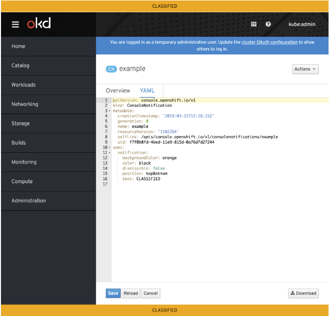

# Console Customizations

## Background
* Cluster admins will be given the ability to customize certain aspects of the web console for all cluster users.
* Some of the customizations include:
  * Adding links to the megamenu
  * Adding notifications above and/or below the console
  * Changing download links for CLI tools
  * Etc.
* The console will enable these customizations via CRDs.

## Design
* A **Console Customizations** navigation item should appear under the **Administration** main navigation section.

* The **Console Customizations** page should list out all instances of customizations with the columns `Name`, `Type`, and `Created`.
* The list of customizations should be filterable by name via text input, or by type via toggle filters.
* If no customizations exist, users will see the standard empty state.
* _Open question:_ Is filtering actually necessary?

* Users will create new customizations by selecting the desired customization from the **Create** dropdown selector.
* _Specific customization options TBD._

* After selecting the customization from the dropdown selector, users will be presented with example YAML for that customization which they can then edit.

* Once the user has edited the example YAML, the create button will add the customization.

* Users may edit or delete instances of customizations on the **Console Customizations** page.

### Multiple instances of customizations
* Whether or not users may have multiple instances of a customization will be determined on a per customization basis.
  * For some customizations, like customizing the branding, it does not make sense to allow more than one option.
  * While for others, such as console notifications, it may be reasonable to have more than one.
* Likewise, behavior and precedence will be determined per customization when there are multiple instances.
 
