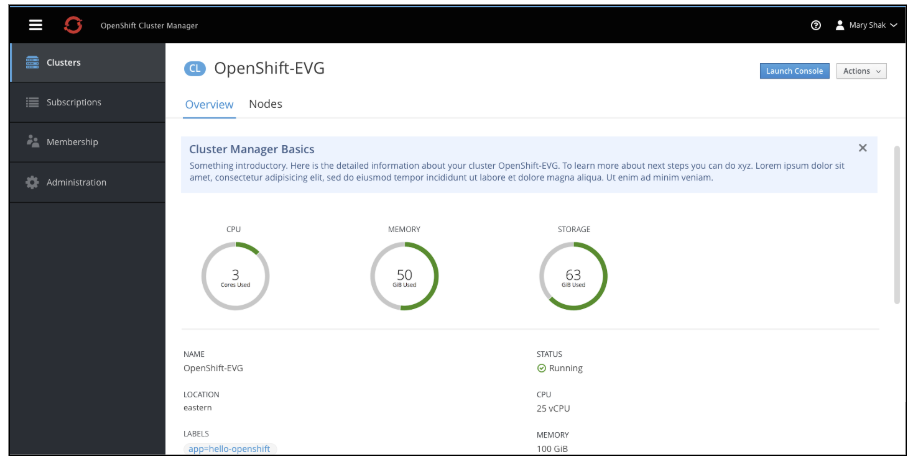
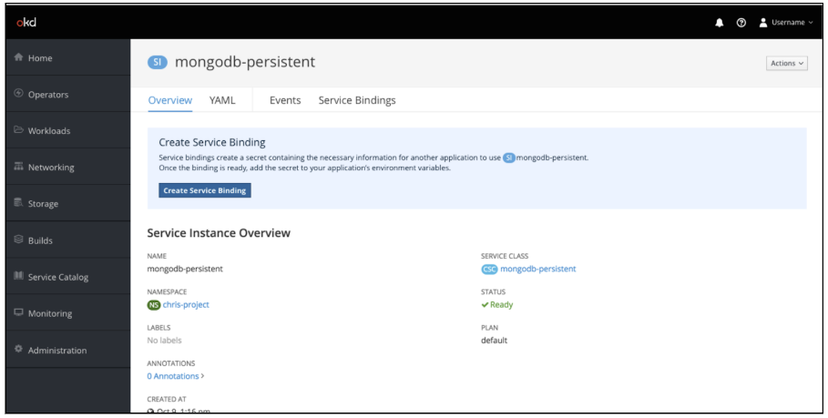
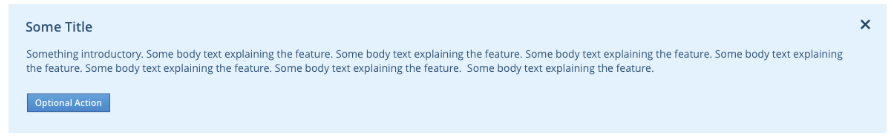
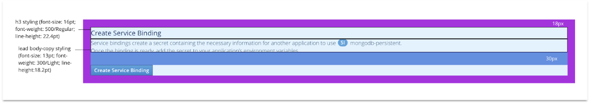
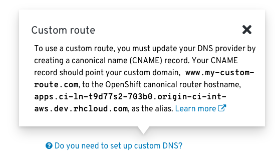
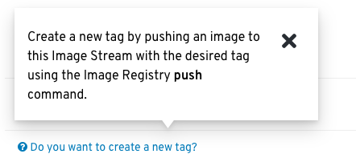

# Contextual Help
The OpenShift web console has a couple of unique ways of giving users help, in addition to standard patterns like Field Level Help. The purpose of this document is to provide information about the Hint Pattern and the Infopop pattern, as well as guidance as to when it's appropriate to use each pattern.

To provide contextual help about a status field (e.g. Error, Migrating, Cloning, etc.), the [Status Popover pattern](/web-console/4.0-designs/status/status.md#status-popover) should be used.

## General Guidelines
* Help should clarify or provide guidance on information/data already present in the UI.
  * Corollary: The data that users need to accomplish goals should be in the UI. Help patterns should not be the only means of getting necessary data.
  * Rule of Thumb: Is it possible for a knowledgeable user to accomplish the thing being described without help? Or is information/data in the help necessary? If the latter, then the missing information belongs in the UI; it should not only exist in the help.
* Use the Hint Pattern to elucidate obvious next steps.
  * If there’s something a user should do (that we cannot do for them), use the Hint pattern to describe or provide a shortcut (link, button) for taking that next step.
  * When the next step has been completed, users should not see the hint again for that resource.
* Use the Infopop pattern to provide information for things users may have to do, but which may not be obvious.
  * Use this pattern when we’re not sure when (or even if) a user may need the information.
  * This pattern is useful when users may need to do something outside of the product UI to accomplish a goal.
* Target help to intermediate users
  * The majority of our users will be intermediate users.
  * Being a beginner is not a permanent condition -- beginning users become intermediate users.
  * Intermediate and advanced users will understand basic concepts and functions.
* Onboarding and general information
  * **This document does not specifically address onboarding or general information.**
  * We should be looking at other ways to provide onboarding, or more general information to beginning users.
  * This information should be available to novice users, but should be out of the way of intermediate and advanced users.

## Hint Pattern
The hint pattern is similar to an informational inline notification, but with additional emphasis (blue highlight). The intention is to use this for specific use cases where we can anticipate the next step a user should take, or to introduce new features. The hint pattern involves a one-step reminder, explanation, or call to action.

### Potential Use cases
1. To provide contextual help on using **new features**
2. To provide hints on a flow/ the **next steps** a user should be thinking about.

#### New Features

#### Next Steps

### Design
#### General

* Hint area is shown in context of where it applies
  * This may be above the page title for cases where the hints apply to the entire page of the application.
  * This may be below a specific tab or area on a page for cases where the hints only apply to a portion.
* Hint area is highlighted in blue
* Hint must have a title (h3 style)
* Hint must have some body text (body-copy style)
* There can optionally be external links within the body text
* There can optionally be a primary action below the body text
* Title, body text, and primary action are left aligned
* For cases without a primary action, there should be an X in the top right corner to dismiss the message.

#### Colors
* Font: `pf-blue-600`
* Background: `pf-blue-50`
* Primary Action: Standard PatternFly button colors

#### Spacing

* `18px` border between content and Background
* `30px` space between the body text and primary button (when used)

## Infopop Pattern
The infopop pattern is a means of providing help on particular use cases in the UI. It is similar to Field Level Help, but rather than defining items in the UI, the infopop should instruct users how to use information/data that’s already shown in the UI to accomplish tasks which may not be obvious, or which may need to happen outside of the UI.

The [Status Popover pattern](/web-console/4.0-designs/status/status.md#status-popover) utilizes the Infopop pattern when a status field contains additional information that could be helpful to the user.

### Potential Use Cases

* Inform users about tasks that may need to be done outside of the UI.

* Provide guidance for non-obvious task

### Design
There are two aspects of the Infopop pattern: the prompt and the popover.

#### Prompt
* The prompt should be a question or statement that speaks to a specific customer use case, e.g. “Do you want to create a new tag?”
* The prompt should be styled as link text preceded by the PatternFly help icon (pf-icon-help).
* Clicking the prompt brings up a popover which points to the prompt.

#### Popover
* The popover should use PatternFly’s headless popover component.
* If it is helpful to include a title, then the simple popover component may be used.
* The content of the popover should be brief and instructive, informing users what information they need to accomplish the task without unnecessary background information.
* A link to more comprehensive documentation can optionally be included.
* The popover should not be the only source of data necessary to perform the task. In other words, an advanced user should be able to accomplish the task without needing to look at the popover.
