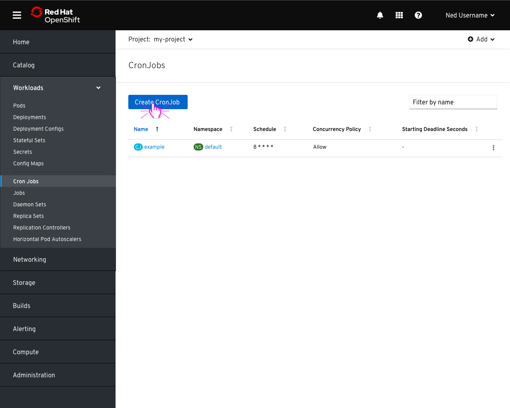
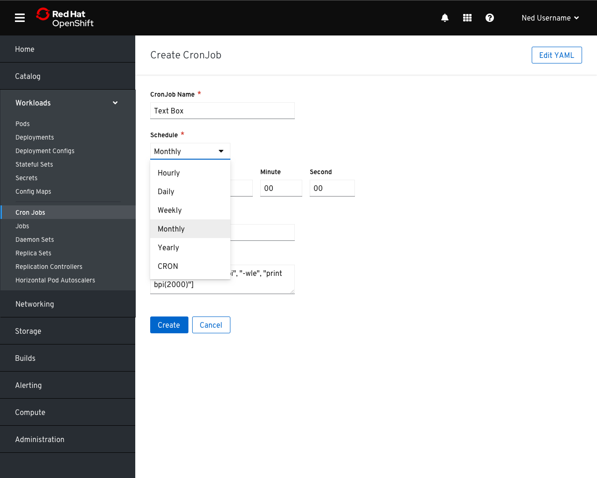
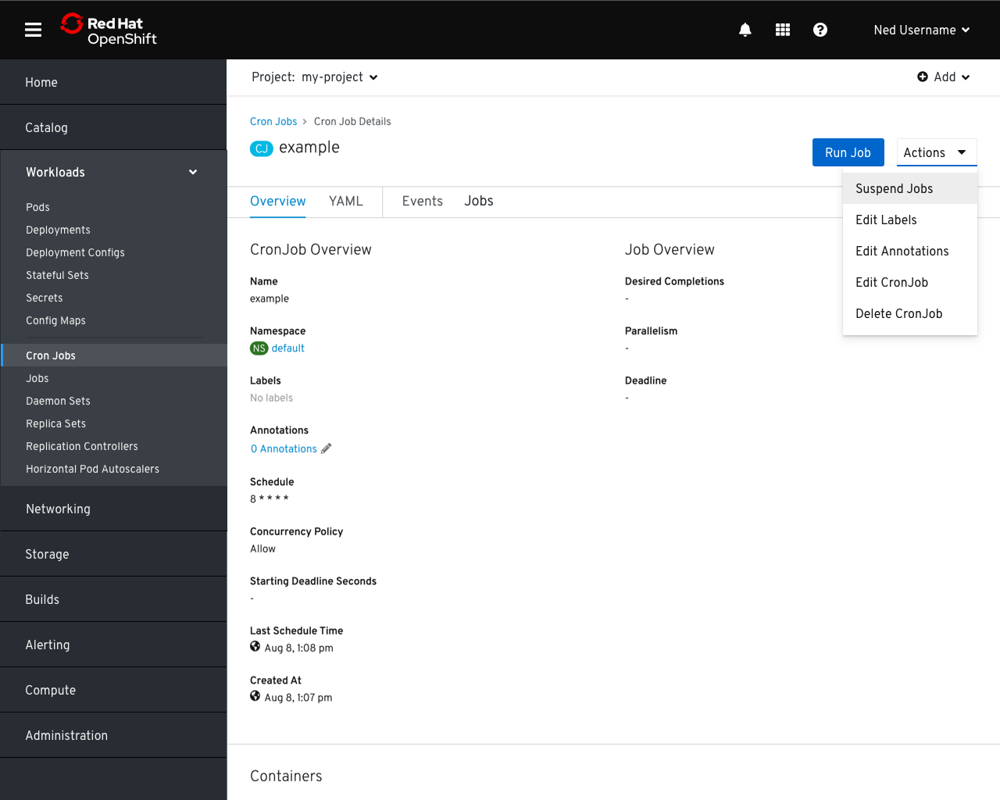
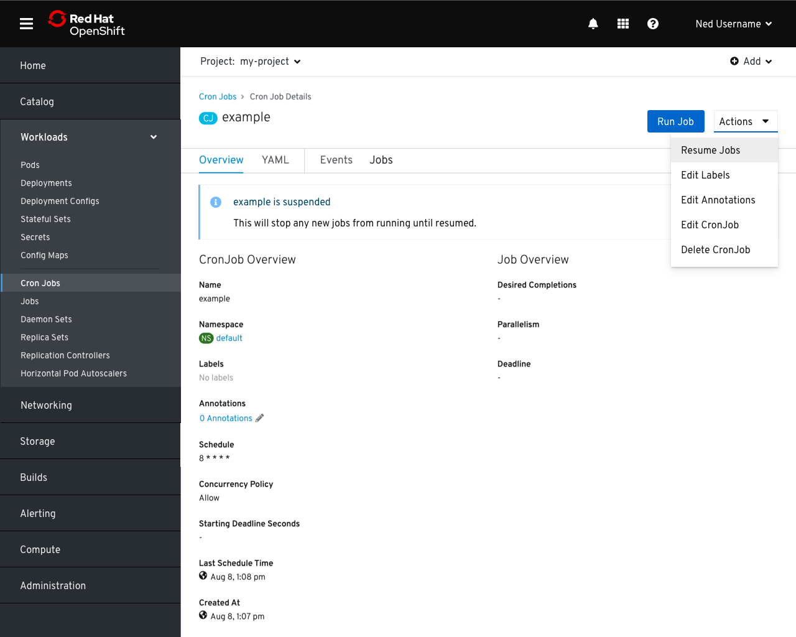
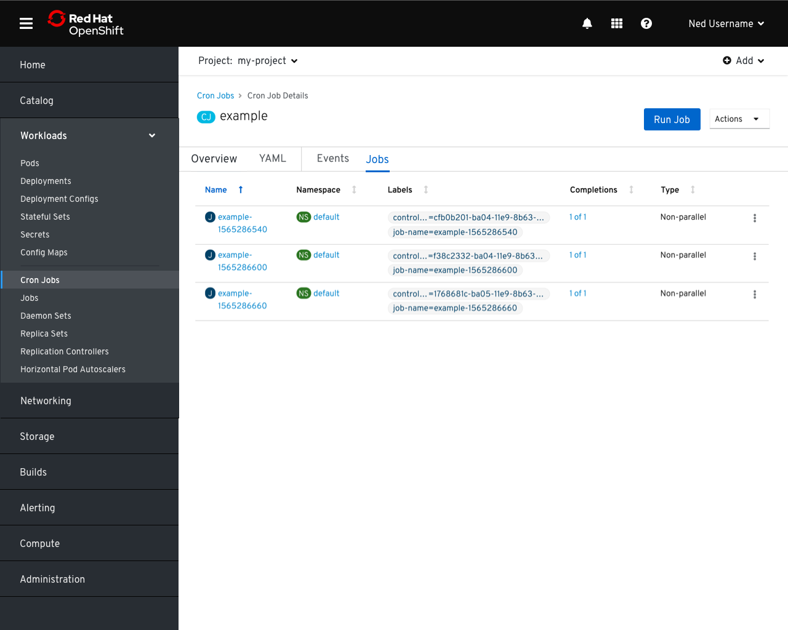

# Cron Jobs

## Create Cron Job

- Clicking the `Create Cron Job` button launches the creation form.

- Users are prompted to enter a name for the Cron Job, a schedule, and an image and command to run.
- By default, users are presented with a cron expression field and a link to documentation explaining the syntax.
- For more advanced use cases, clicking `Edit YAML` takes the user to an editor to manually configure the cronjob.

- Alternatively, users may select a period which presents the relevant fields for stating when the report should be run

## Suspend Cron Job

- A cron job can be run immediately by clicking the `Run Job` button.
- Jobs can also be temporarily suspended by selecting `Suspend Jobs` from the actions menu.

- When cron job has been suspended, a banner appears at the top of the page explaining the state and proving a button to resume normal activity.

- The job schedule may also be resumed from the `Actions` menu.

## Jobs List

- The `Jobs` tab will contain a list of the jobs created by the selected cron job.
