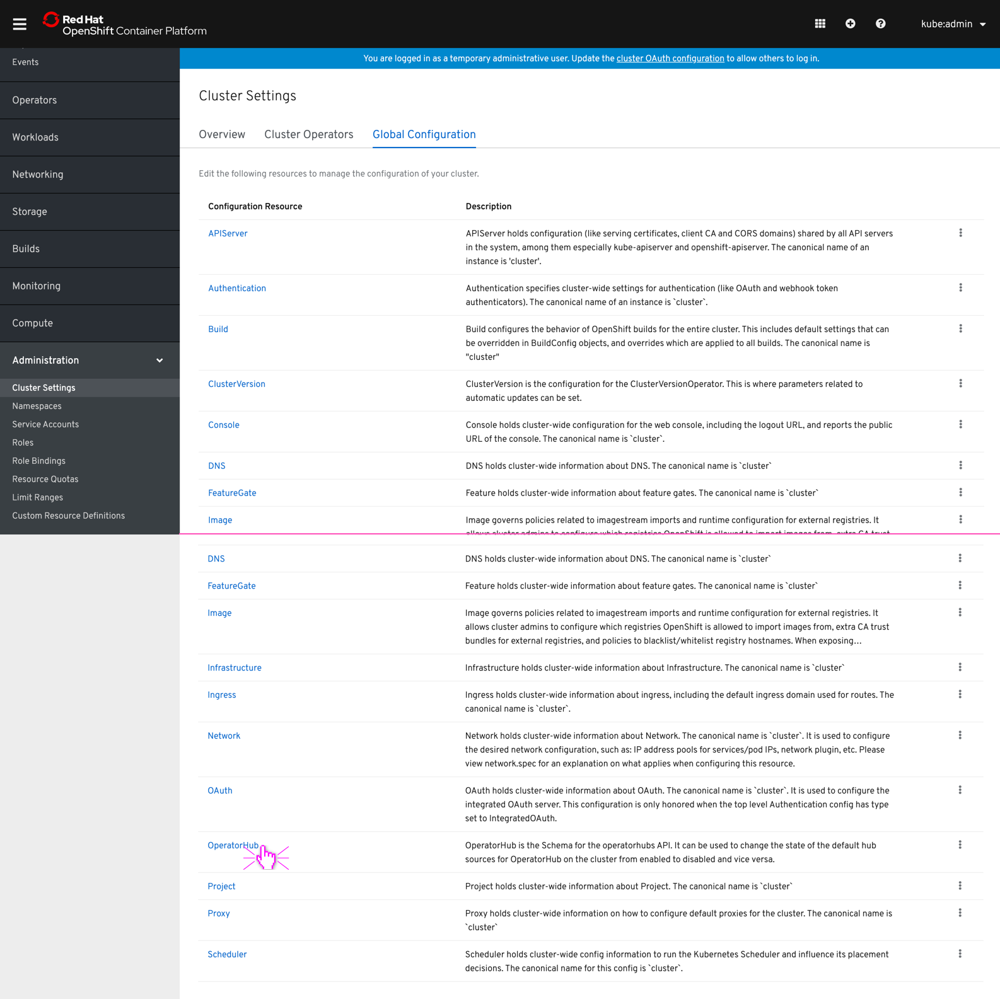
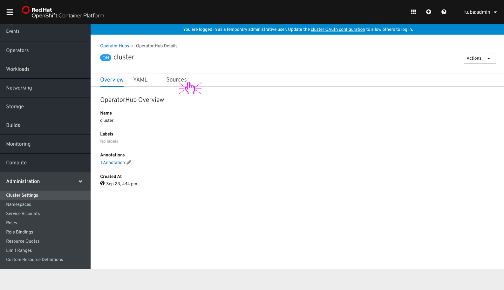
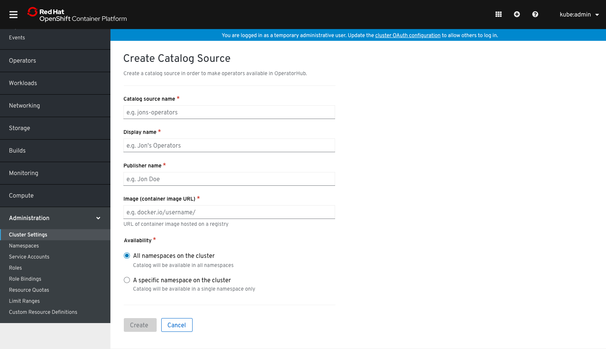
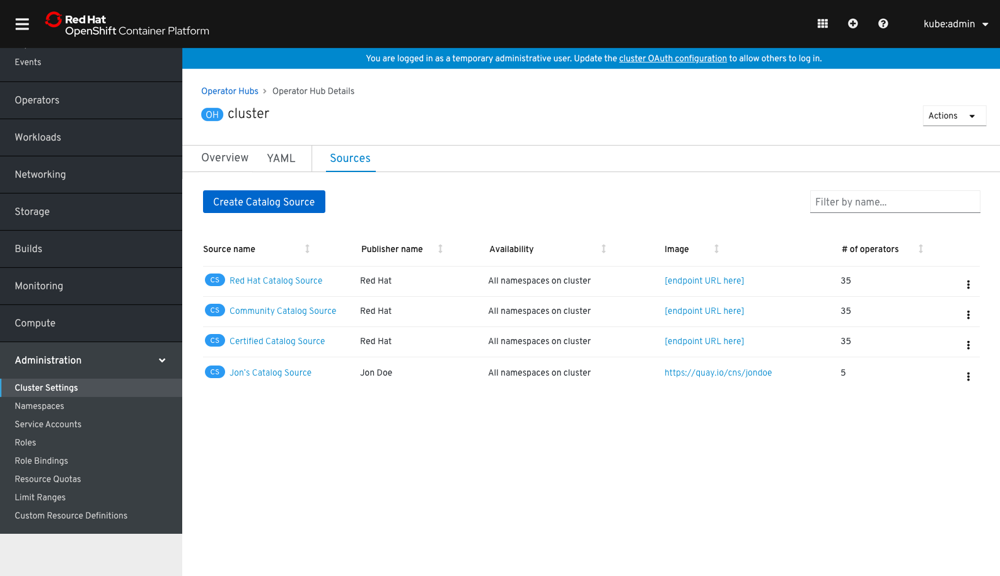
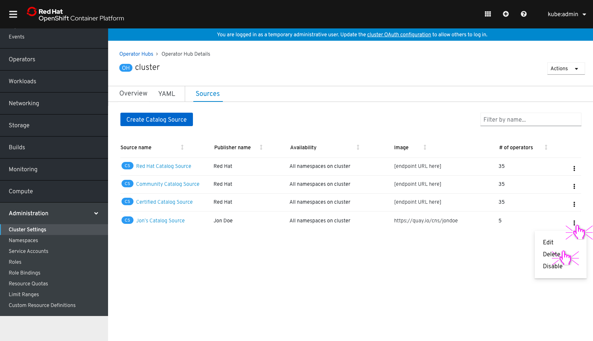
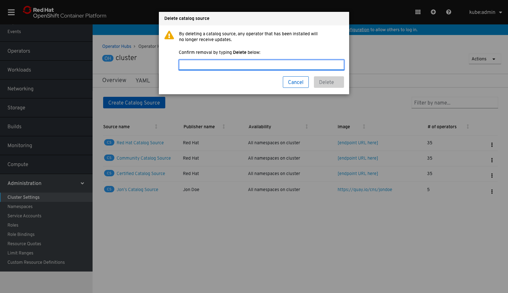
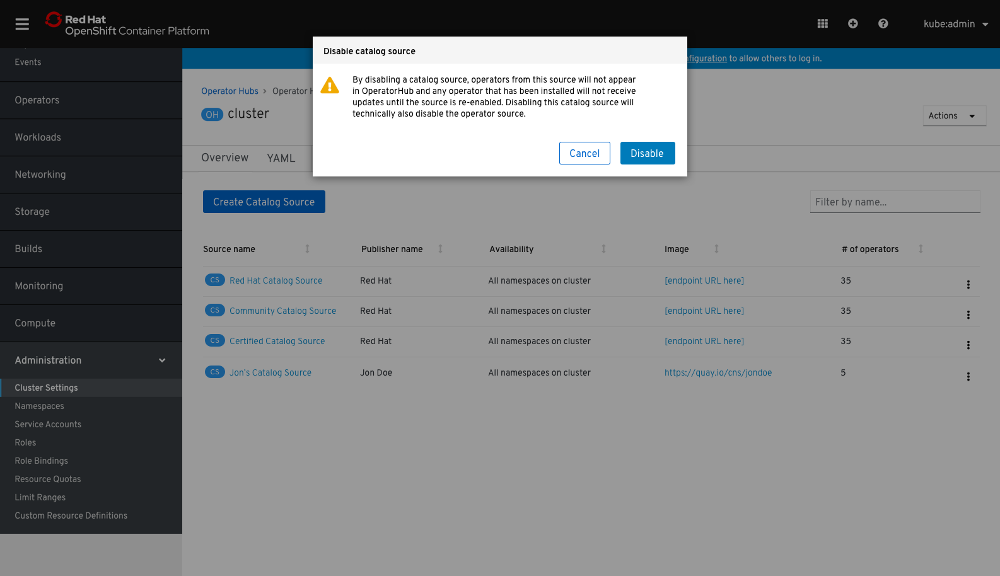
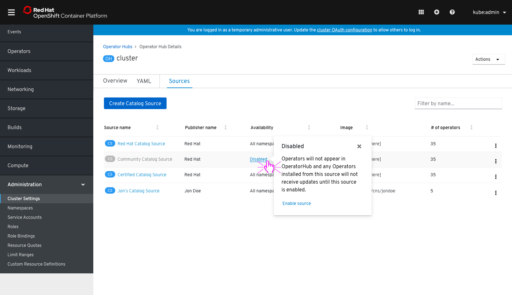
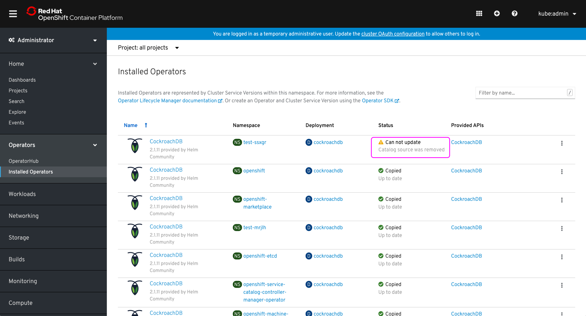
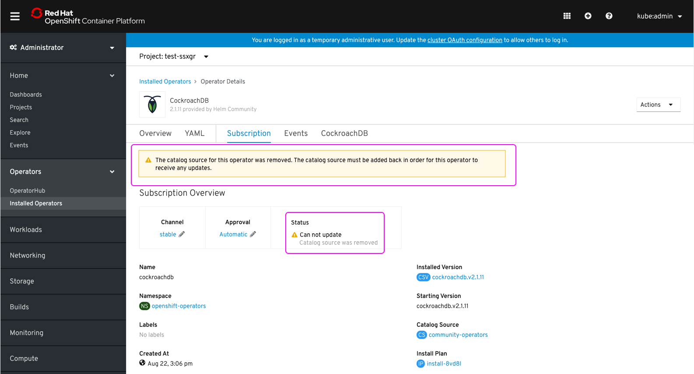

# Custom OperatorHub Catalogs

Admins can create custom catalogs in order to give admin console users the ability to add operators from other sources, beyond the default OperatorHub catalog sources.

## Global Configuration

OperatorHub sources are found through: Administation > cluster settings > global configuration > OperatorHub / sources tab.

## Sources

In the OperatorHub configuration, users can see the current default sources that are feeding into OperatorHub. These sources populate OperatorHub and keep installed operators updated.

If users "Create Catalog Source" they will see a form to fill out details.

After the form is filled out and users select "create", they will see the newly created catalog source in the list.

Once a new catalog source is created, admin users can see the operators from the catalog source from within OperatorHub.

## Actions

Custom catalog sources can be edited, deleted, or disabled from the kebab menu in the list.

If users delete a custom catalog source, they must first confirm the deletion by typing "delete". The deletion confirmation step will also inform users that if a source is deleted, any operators already installed from the source will no longer receive updates.

For default operator sources, users cannot delete but only disable (and then re-enable if disabled).

If users disable a default catalog source, the disable confirmation step will inform users that if a source is disabled, any operators already installed from the source will no longer receive updates.

The default catalog source will now show the "availability" as "disabled" and users can re-enable through clicking the kebab menu, then selecting "enable."

Users can also enable the catalog source by clicking the "Disabled" link, and seeing the popover that shows additional information and an action to "Enable source."

## Operator status for deleted catalog sources

On the installed operators, if a source has been deleted or disabled, the status will indicate the operator cannot receive updates.

The details for the subscription will also indicate why the operator cannot receive updates.

