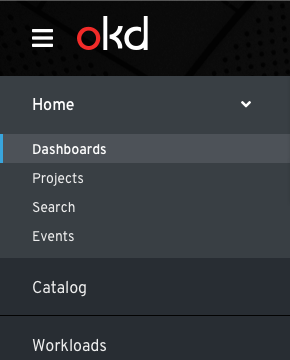
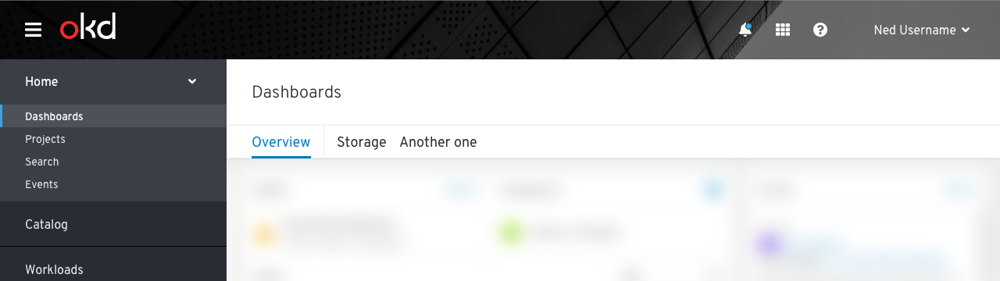
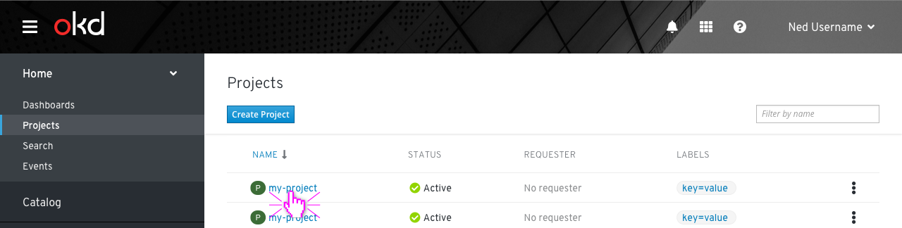
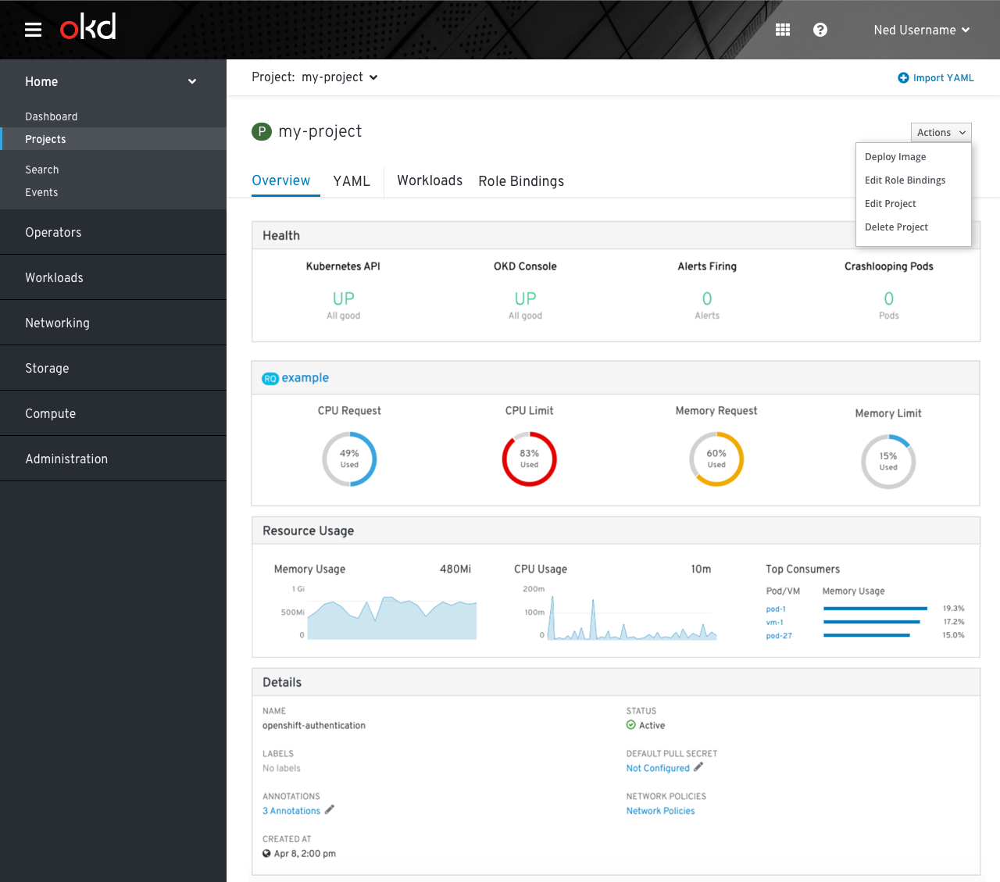
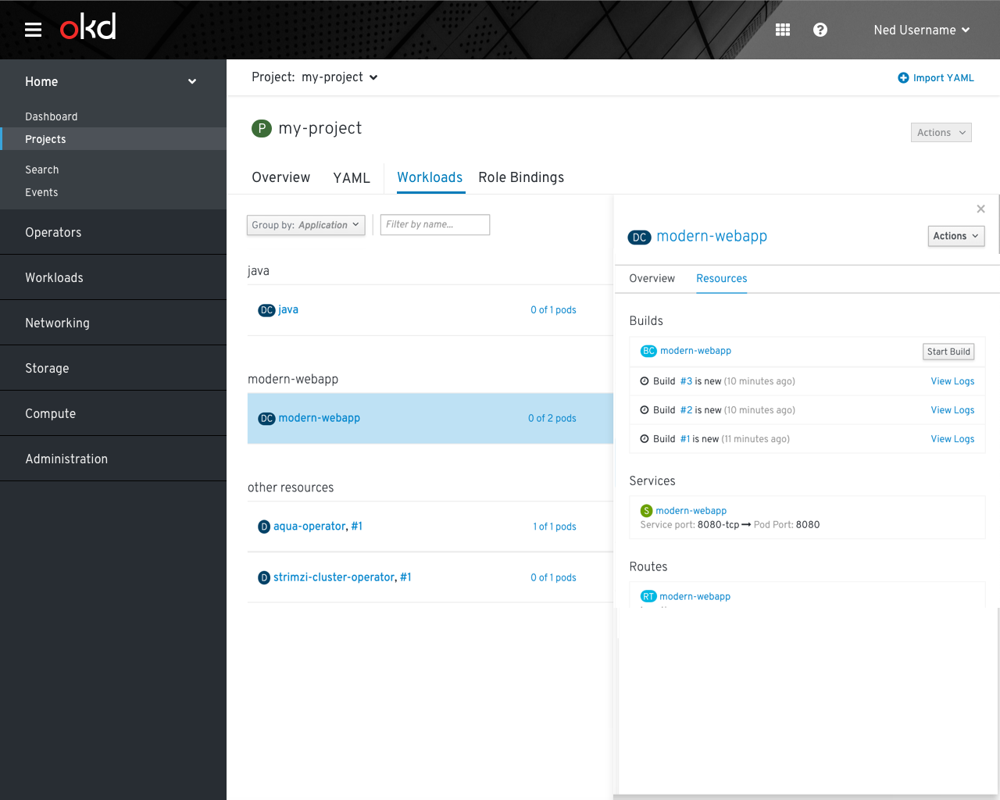
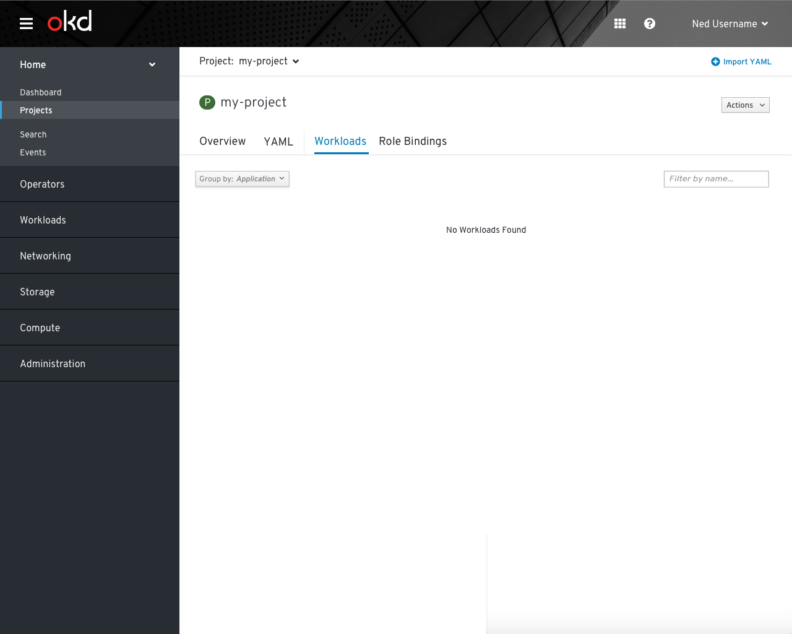

# Dashboards

## Dashboard Organization

### Dashboard-related navigation changes

- The `Status` navigation item will be removed and replaced with `Dashboards`.
- If technically feasible, `Dashboards` should be the landing page of OpenShift and should be the first navigation item, followed by `Projects`. If not, the order should remain unchanged.
- The status page for "All Projects" will be removed and replaced with the new cluster scoped overview dashboard
- Project specific status pages will become tabs of a detail view for each project. See "Object scoped dashboards" below.

### Cluster scoped dashboards

#### Overview dashboard
- The `Overview` dashboard is the primary tab on the dashboards page and should provide high-level information about the cluster and its components. Specific notes on the content of this dashboard are found elsewhere.

#### Specialized dashboards
- Additional dashboard tabs may be added for specific parts of OpenShift or potentially by Operators. These should be placed to the right of the `Overview` dashboard tab and can be organized as necessary for the relevant information

### Object scoped dashboards
- The `Overview` tab on object details pages should primarily be used to illustrate the YAML of the object in a visual way. If applicable, a few select charts with important metrics may be included on the page.
- If the metrics charts would take up more than a full row on a desktop-sized screen, a separate `Dashboard` tab should be added and any charts should be placed there instead of on the `Overview` tab.

#### Projects

- The kebab menu should include the following actions: Deploy Image, Edit Role Bindings, Edit Project, and Delete Project
- `Deploy Image` opens the deploy image form full page. Upon completion of this form, users should be directed to the workloads tab of the project with the newly deployed image.
- `Edit Role Bindings` opens the project details with the Role Bindings tab selected.
- `Edit Project`, opens the project details with the YAML tab selected.
- `Delete Project` opens the delete confirmation modal.
- The project details view should be accessible by clicking on a project in the project list.

- The previous `Status` page included Dashboard and Resources views which will move into the project details area, as separate tabs.
- Clicking on a project from the list view will open project details with the `Overview` tab displayed by default. The overview dashboard will include sections for the general health, resource quotas, overall resource usage, and project details.
- The actions available in the actions dropdown should match those shown in the kebab: Deploy Image, Edit Role Bindings, Edit Project, and Delete Project.
- The project bar should be visible on the project details page for users to switch to a different project as desired. The `Import YAML` action will be shown on the right side of the projects bar so users can quickly add YAML at any point.

- A new `Workloads` tab should be shown after the YAML tab and this view should use the old Resources view content including the details panel.
- The Project-level Actions dropdown should be **disabled** on the workloads tab when the details panel is open to be sure not to conflict with the resource-level actions inside of a project. 

- When there are no resources in a project yet, there should be a standard empty state for this tab.

### Future considerations
- As the capabilities of dashboards in OpenShift are improved and more types of dashboards appear, we will need to consider methods for switching between many options and possibly saving common options.
