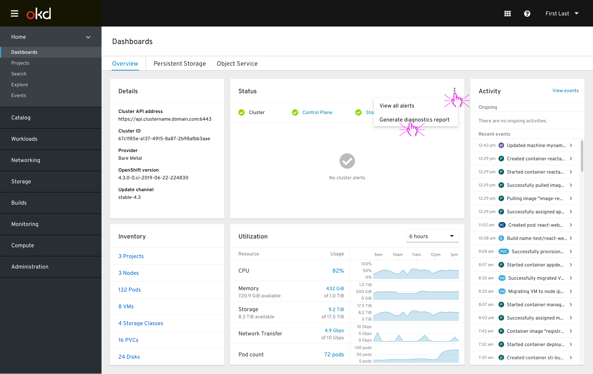
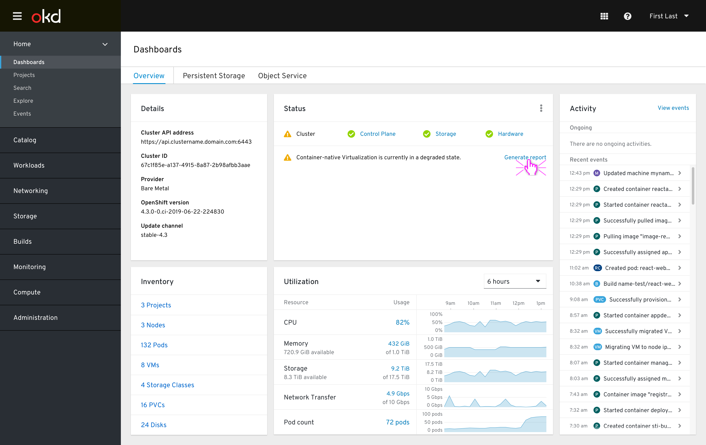
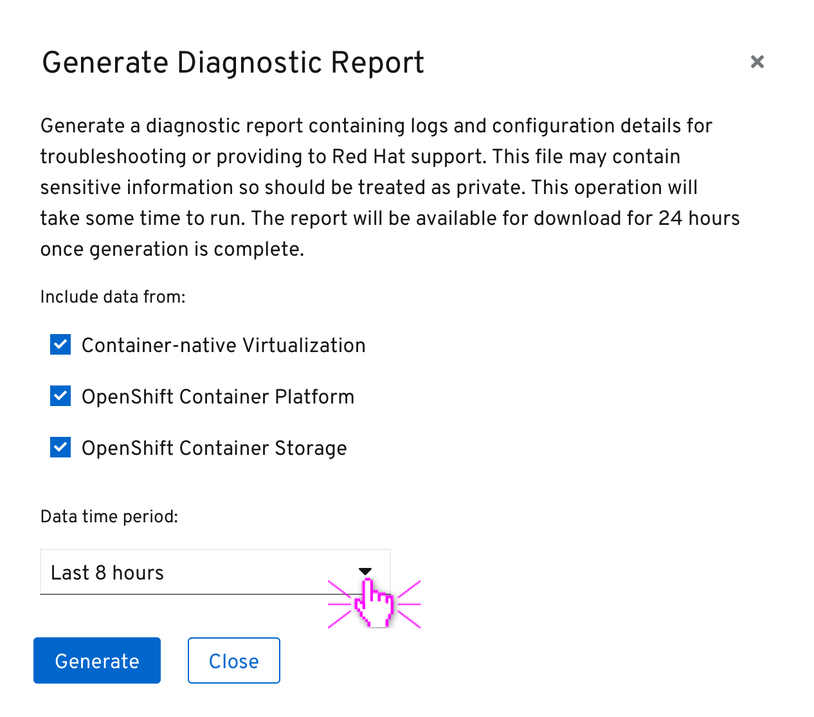
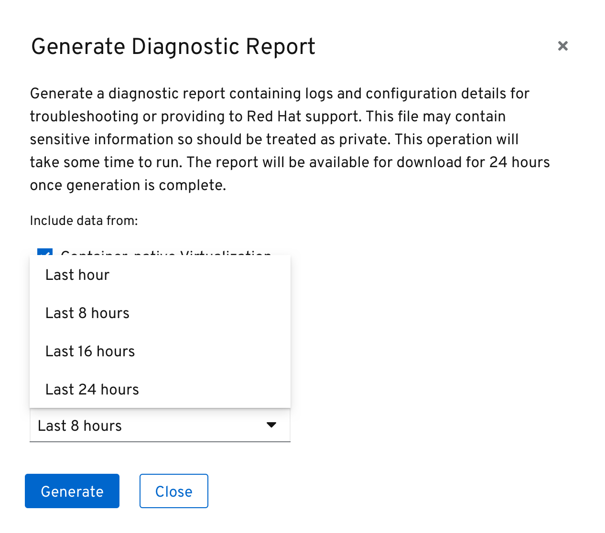
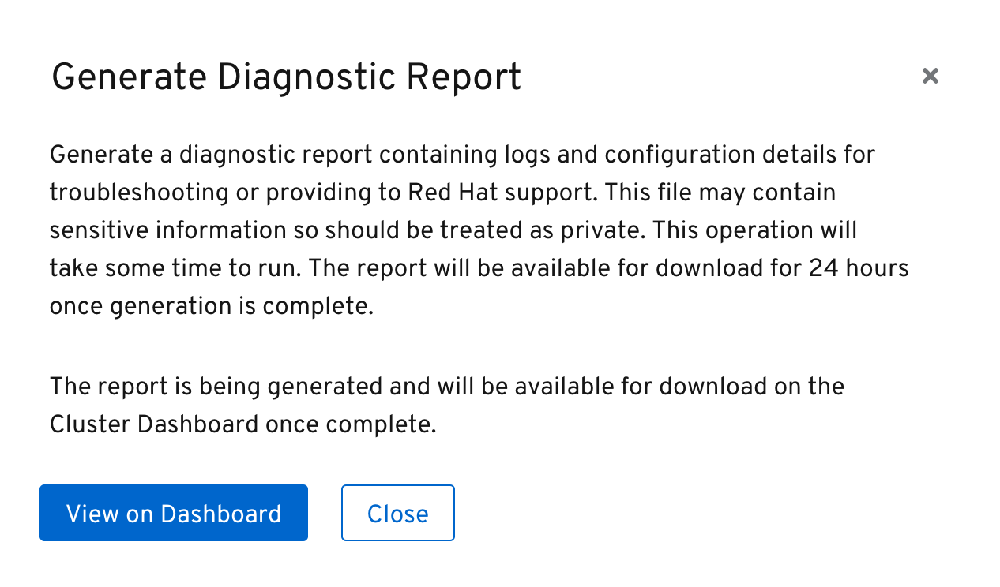
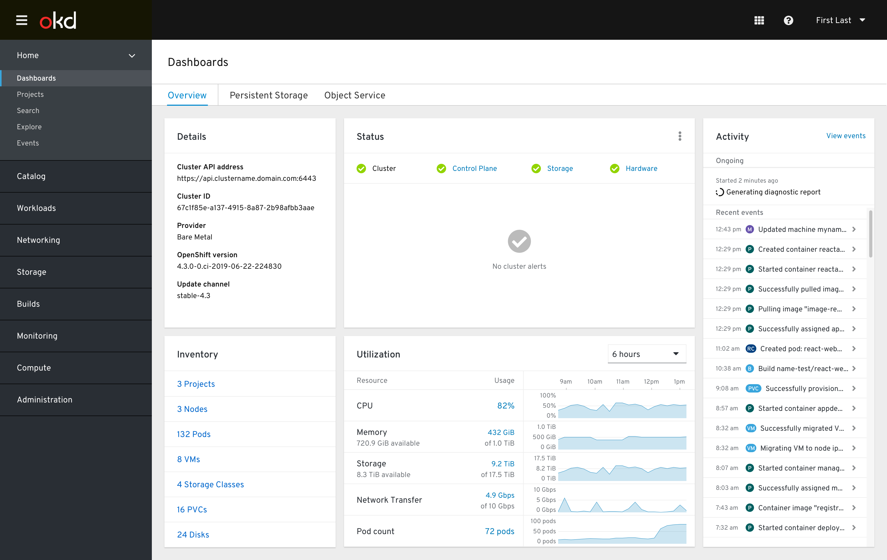

# Generating Diagnostic Report

Users can download a cluster diagnostic report based on must-gather tool for upload to Red Hat Support or their own diagnostics.

## Accessing 'Generate Report' actions

There are several ways the user can access the `Generate (diagnostics) report` action.

### Via the masthead help menu

### Via the cluster dashboard status card kebab menu

### Via a cluster dashboard status card message action

- In the future, the cluster dashboard will support warning messages to notify the user that CNV or OCS are degraded. From these messages the user will be able to `Generate report` using the action link within the message.
- This access point is unique in that dialog's form will default to only include data for the relevant component. `Container-native Virtualization` would be the only component checked in this case, for example.

## 'Generate Diagnostic Report' dialog

- The user can select which components and what time period of information should be included in the report and `Generate` it. The default state when launched from masthead help or status card kebab would be all components selected over an 8 hour time period.

- Once generation has begun, the user can `Close` the dialog to return to the context they launched it from, or `View on Dashboard` to immediately be taken to the cluster dashboard.

## Report generation

### Generation in progress

- An ongoing activity appears that conveys the generation is in progress.

### Generation success

- Upon successful generation of the report, an informational status message appears with a `Download report` link that begins the download process in the user's browser.
- This message should be of the ‘pinned’ type so that it is always visible above any firing alerts, which could be likely as that would be why the user is generating the report.
- The user may `Delete` the report and message via the message kebab menu. It will otherwise be automatically deleted and the message cleared after 24 hours from generation.

### Generation failure

- If the report generation fails, a pinned-type message appears with a `Retry` link to restart generation.
- User may `Clear` the failure message via the kebab or this message will automatically be removed after 12 hours.

## Out of scope for 4.3
- Narrowing report generation by Project or Operator
- Only include non-healthy components in report
- Generate and immediately attach to (existing or new) support case
- Option to turn on automatic case open for certain number of severe alerts and attach report
- Some sort of method that doesn’t involve user downloading/uploading file from local machine, somehow file goes straight to support

## Notes
- This design slightly bends the dashboard paradigm in that makes use of the cluster dashboard exclusively to view progress of generation and then download the diagnostic report. Future designs should be cautious not to overuse the dashboards for other non-monitoring features or core dashboard tasks like viewing cluster statuses or activities may suffer.
- An exclusive "Diagnostic Reports" page containing the list of generating and generated reports was considered but determined to be a future enhancement for now, until it is determined how many diagnostic reports are typically present at one time or if the generated report retention time needs to be increased.