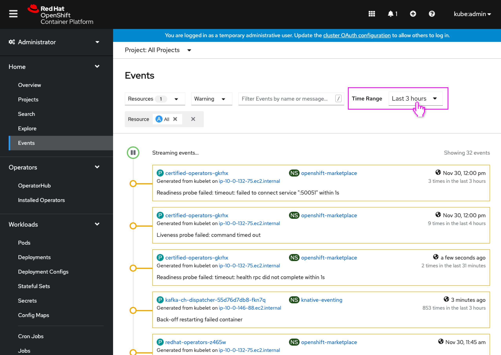
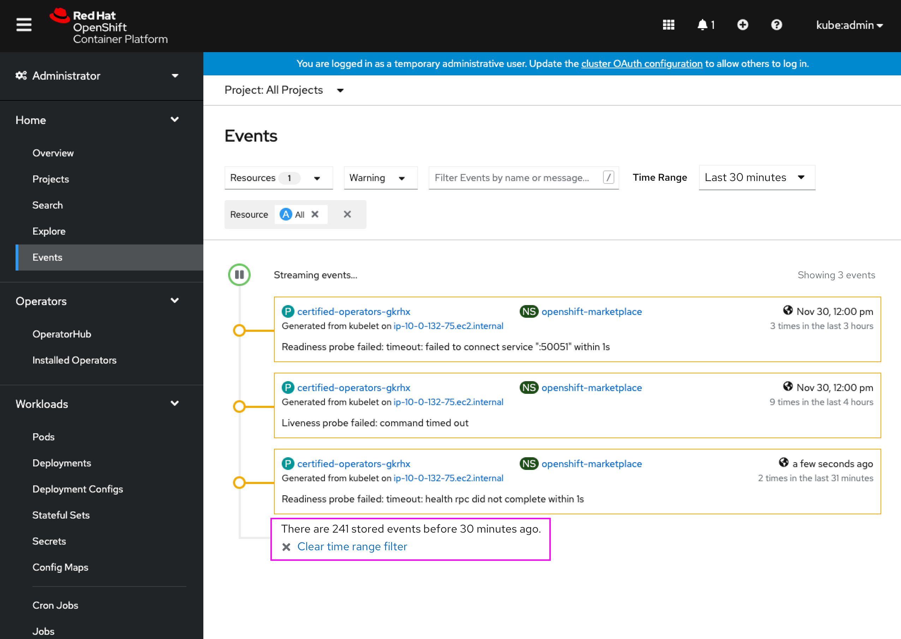
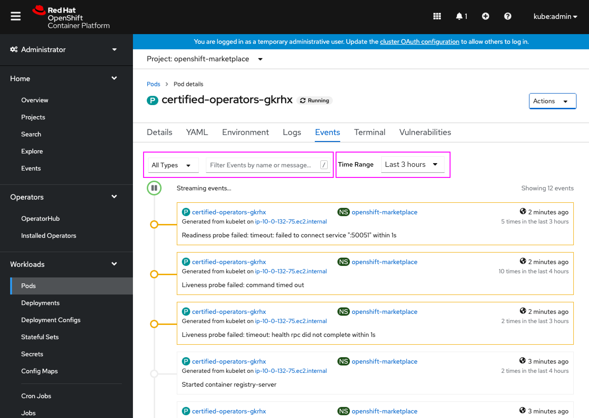

# Filter events by time range

Currently when viewing events, all events are shown from an extended previous time period. Some of these events may have occurred up to 3 hours ago.

This design allows for a way to filter this events list by a time range (example: Last 30 minutes) to help with finding the latest events, perhaps for troubleshooting.

## Events page

- A new dropdown filter allows the user to select the time range of events to show.
- By default this filter would be “Last 3 hours” since that is the max time frame of events that is currently shown.

- Range values include 5, 10, 15, 30 mins and 1, 2 and 3 hours.

- The list of events is updated to only show events that have occurred in that time range (even if they also have occurrences outside of that time range.)
- The bottom of the list conveys how many events occurred outside of that range. In this case the count of events that have occurred 30 mins - 3 hours ago.
- There is a link button to clear the time range filter.

## Events tabs in resources

- This same filtering interaction would also appear on individual resource’s events pages.
- Individual resource events pages would also receive the Type and Name/Message filter.