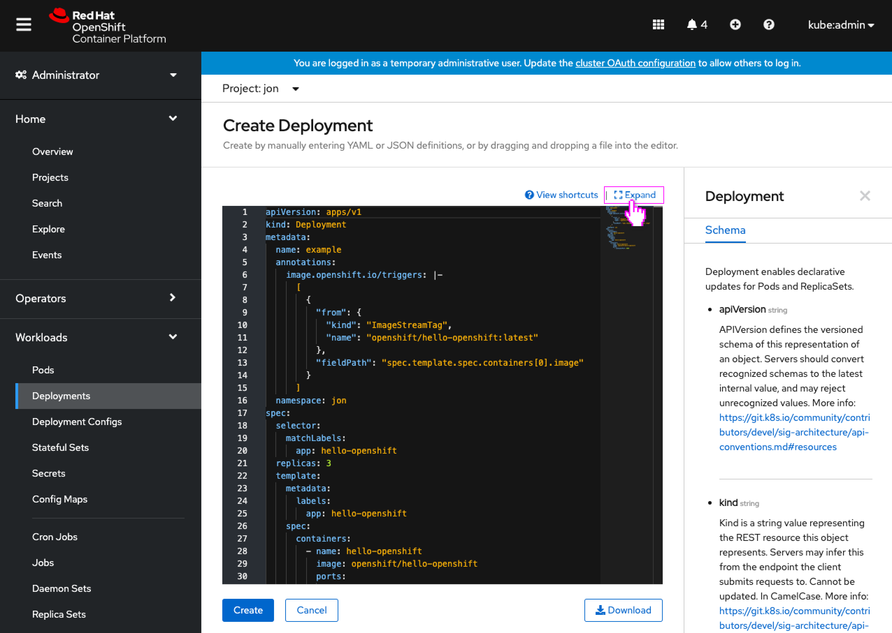
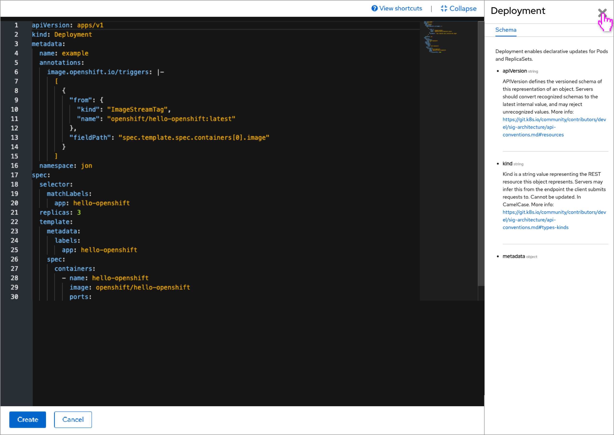
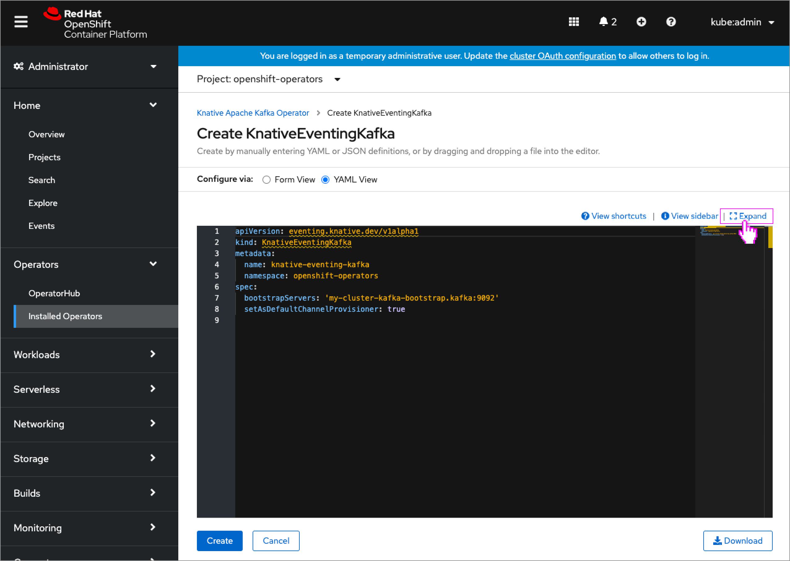
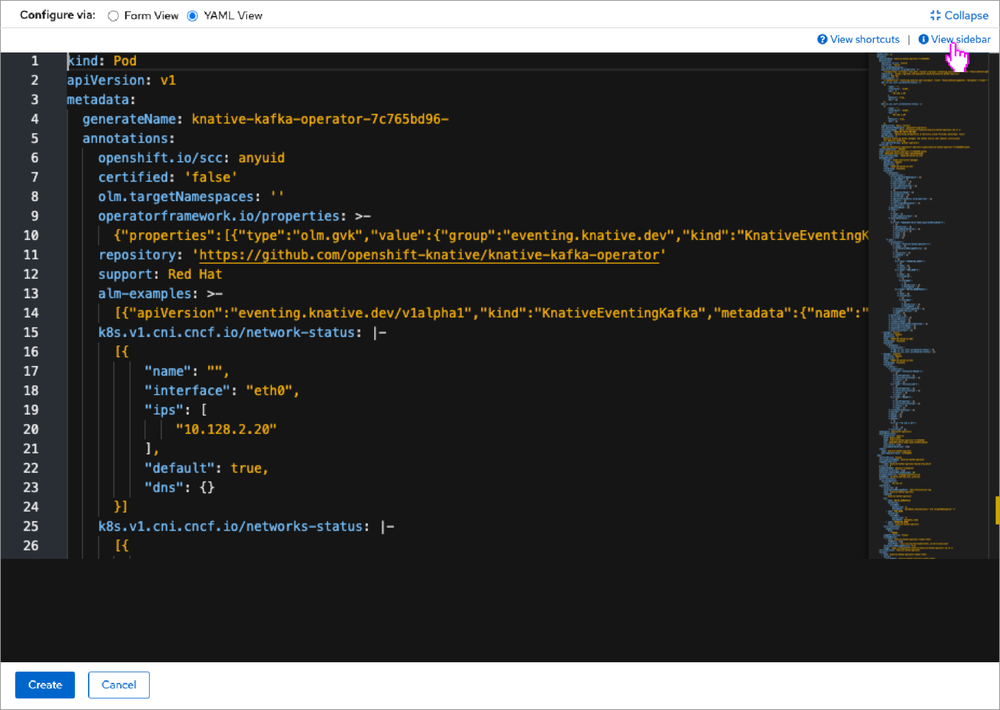
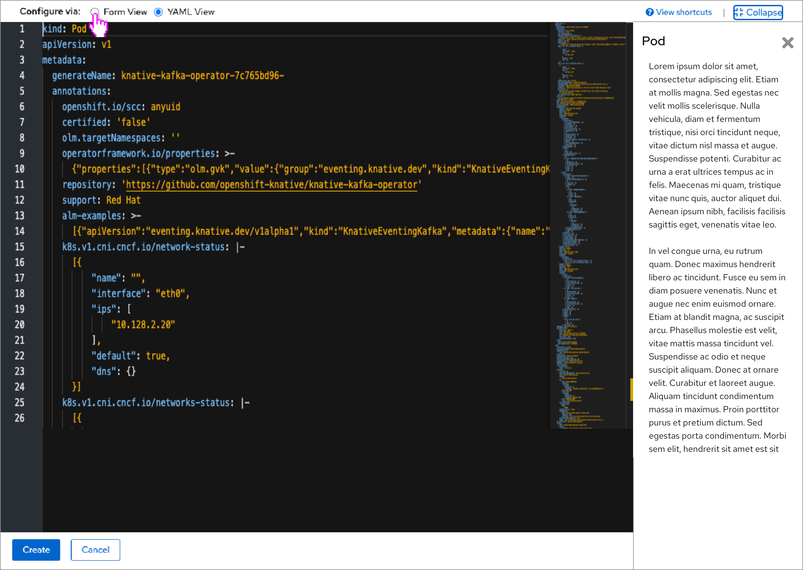
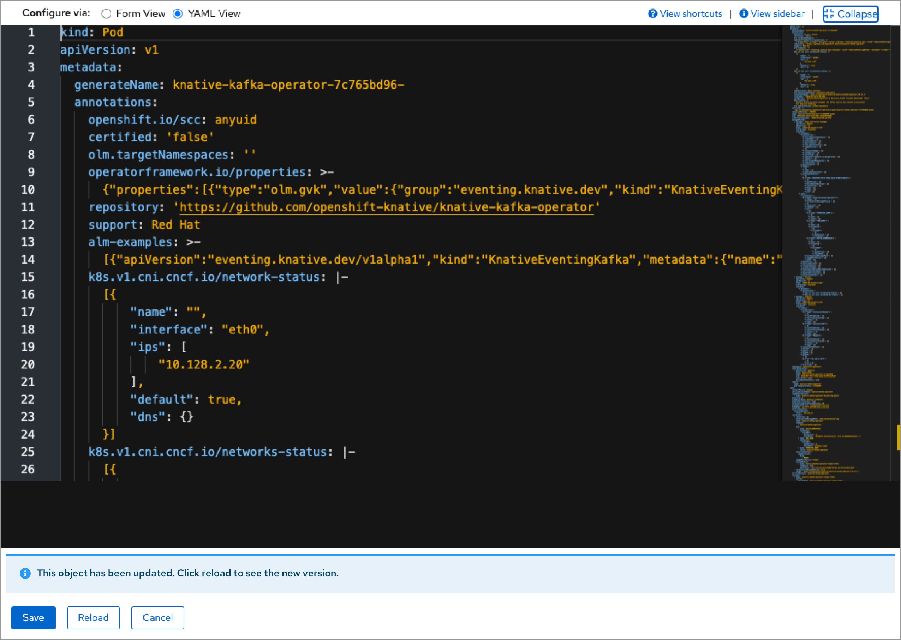
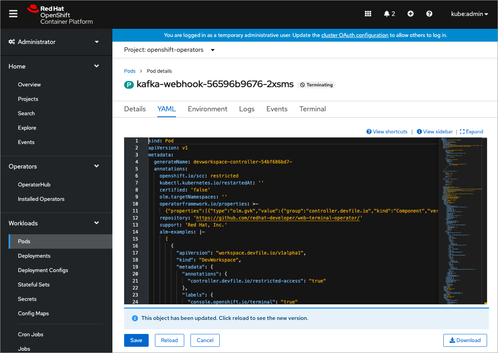

# Allow YAML (and form) editors to expand to full screen

It would be useful to allow users to expand the YAML editor to take up the entire browser window (similar to logs and terminal) so that they can see more of the resource's YAML at one time. At times, the navigation, headers, and banners can take up nearly a 1/3rd of the screen and somewhat compress the editor's space.

Since more resources are now also including a form view, it would also be useful to allow that switching interaction to also be available in the full screen mode. Many resources' forms (especially operands/operator-backed services) can be rather long and wide, so the additional space can be helpful.

An additional solution to the compressed YAML/form editor size could be the reduction in height for any inline alerts that appear beneath the editors. Today it is common to see an info alert that 'The object has been updated,' especially when viewing a running resource. This alert can be reduced in height from two lines of text to one, which would benefit both the full screen editors as well as particularlly the collapsed.

## Expanding editors to full screen

### Stand alone YAML editors

- When any YAML editor appears, it now also includes an **Expand** link button to allow the user to view the YAML full screen.
- This expand link would appear just above the editor, as it does for Logs and Terminal. 

- The YAML appears filling the browser window, with a bar at the top containing **View shortcuts** and **View sidebar** links (when present) and also the **Collapse** link button.
- The bottom bar would contain the **Save/Create** and **Cancel** buttons, and also the **Reload** button (when present.)
- If the sidebar was open when the editor was expanded, it would remain open in the expanded view.

- The user can close the sidebar in the expanded view.

### Editors with form/YAML switching

- Editors that support form/YAML switching will have their **Expand** link button appear to the right of the switching control, as the expand action will apply to the entire set of editors (including perhaps a split simultaneous form/YAML editor someday). This location is also better suited for the collapsed form view (shown below,) rather than having that link button in the form area.

- The YAML appears filling the browser window, with a bar at the top containing the form/YAML switcher and the **Collapse** link button to the right of it, and **View shortcuts** and **View sidebar** links beneath (when present).
- The bottom bar would also contain the **Save/Create** and **Cancel** buttons, and also the **Reload** button (when present.)

- The sidebar would also be supported to show API information and samples.

- The user can switch to the form editor as well, to see the form full screen.
- This would be particularly useful for resources with long or wide forms, like operands/operator-backed services.

- The form view of the form/YAML switching interaction would also include an **Expand** link button that would take the user directly to the expanded form view.
- Other forms that appear outsde of form/YAML switching interactions would not recieve an expand action (which is another reason to include the **Expand** link button near the switching control).

## Updated resources inline alerts

- The ‘object has been updated’ info alert should still appear even when the YAML editor (or form editor) is expanded.
- Ideally the contents of the alert should be one line (only a title) to keep its height as small as possible, to leave room for the editors.

- The contents of the alert should be updated in all occurrences of the info alert, including when it is not expanded.
- The collapsed use case would particularly benefit from the reduced height alert, as space is more constrained.