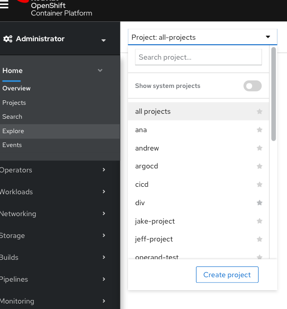
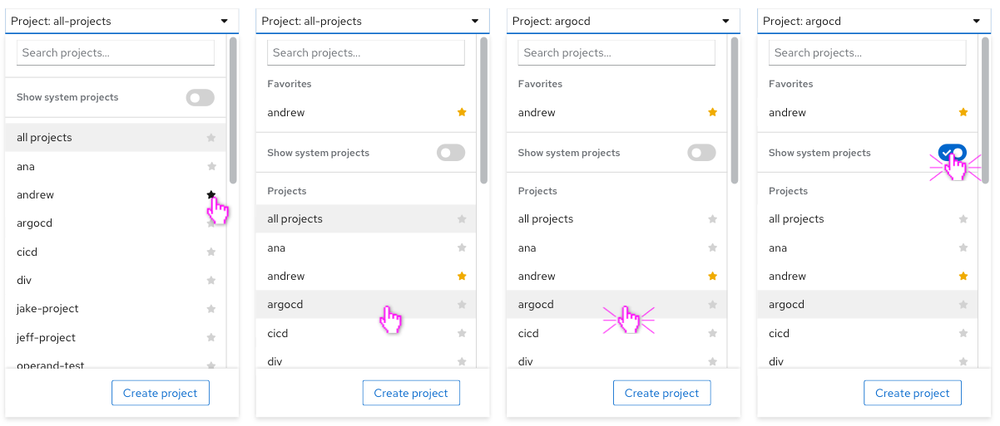
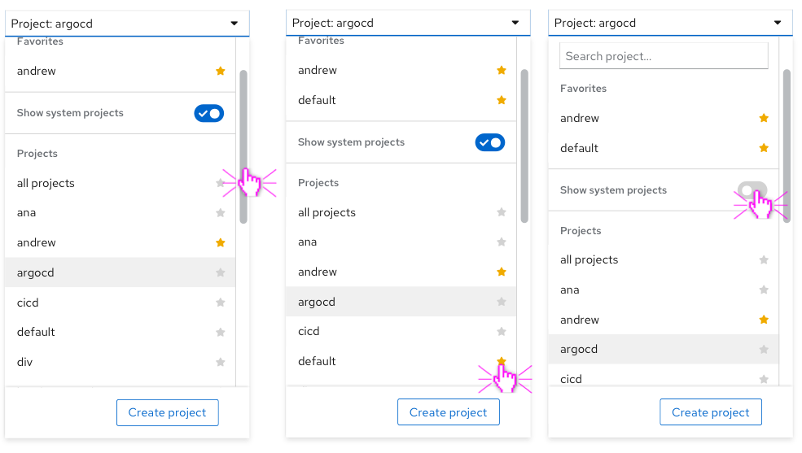
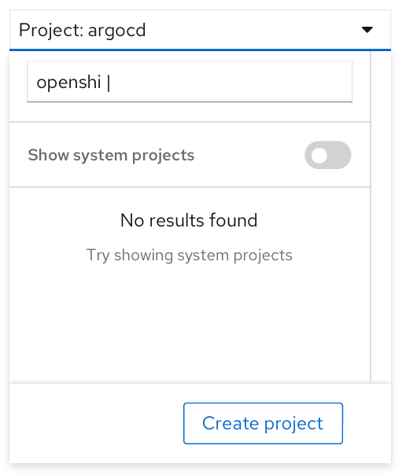
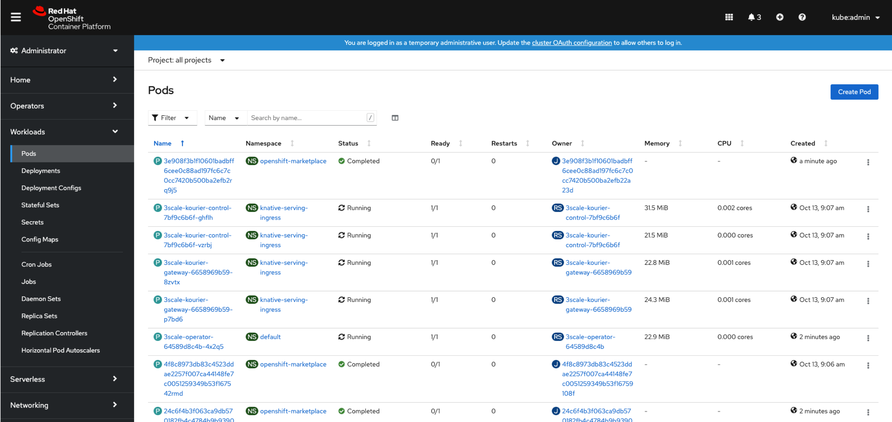
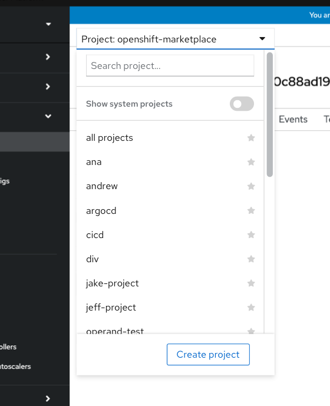
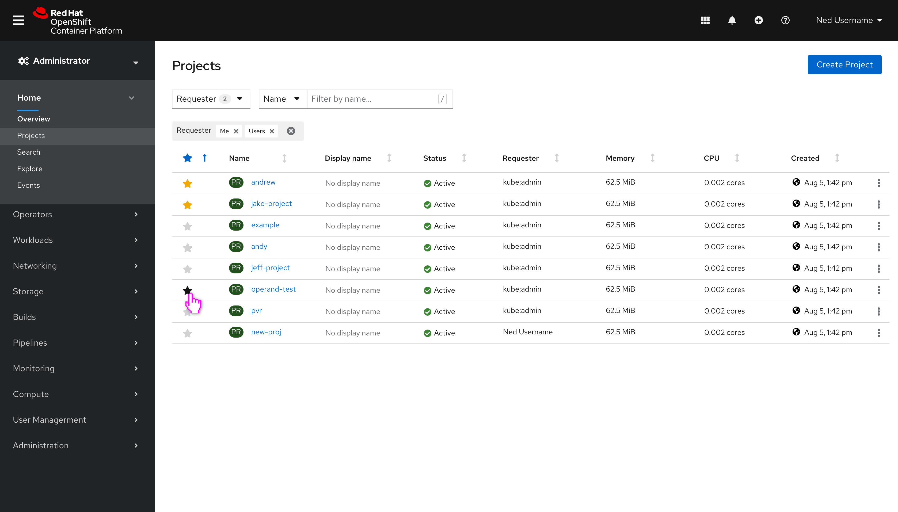
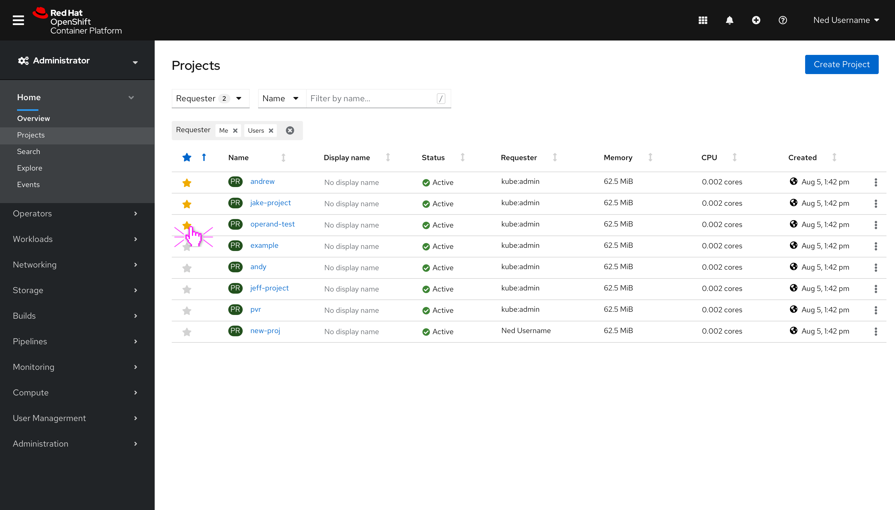

# Favoriting and hiding system projects

## Introduction
Today, our project selector includes favoriting and setting default projects. PatternFly now has a favoriting component for both select menus and tables that we want to replace OpenShift's favoriting with. In addition, there are often many system projects in the project selector/project list view, which are unnecessary for most users. The following documentation explains how we will combine the effort of hiding system projects and favoriting. The design will be broken down into sections:
1. [Favoriting and hiding system projects within the project selector](#Favoriting-and-hiding-system-projects-in-the-project-selector)
2. [Favoriting and hiding system projects within the projects and namepsaces list views](#Favoriting-and-hiding-system-projects-in projects-and namespaces)

## Favoriting and hiding system projects in the project selector
The project selector will be replaced by PatternFly select with favorites so that it can make use of the newest PF favoriting functionality. We will remove the ability to default a project. A switch will be added to be able to hide and show system projects. The switch will be off by default, hiding system projects. A selected project will be reflected within the toggle and obtain a gray background within the menu (same as today). Lastly, we will move the Create project action to a footer within the menu so that the action is more obvious.

When favoriting a project, the user can hover over a star and select it, which will duplicate the menu item so that the favorited item is at the top of the menu, in the “favorites” section, as well as within the “projects” section.

 Interacting with the switch will only affect the projects listed within the “project” section.

The search bar can be used to search for a project. Assuming the switch is off, hiding system projects, if the inputted string does not match any projects, then we will show this empty state that suggests showing system projects.

### Project selector edge cases

Assuming the switch is hiding system projects, if a user were to navigate to a resource page that exists in a system project, the project selector will still reflect the project name in the toggle but the project will not be listed within the menu.

For example, if the user were to select the first pod listed in the openshift-marketplace namespace, they would be brought to the pod’s page where the project selector would reflect the project, even though it is a system project.

## Favoriting and hiding system projects in projects and namespaces

On the projects list view and namespaces list view pages, we will include a favorites column to be able to sort by favorites and customize favorites. We will also pre-filter the view so that it is only showing projects requested by “me” and “users”, which ultimately hides system projects.

The requester filter will include an option to also show system projects, which the user can select if desired.

Assuming filters have been applied (from either the requester filter or the name/label filter) and the user were to search by name for a project, and their input does not have any results, we will surface an empty state that suggests they clear filters.

The favorites column is sortable, and selecting the star with sort by favorites, pushing all the favorited projects to the top of the list.

The user can still favorite projects in the table by hovering over a star and selecting it.

The selected project would float to the top since the table is currently sorting by favorites.

