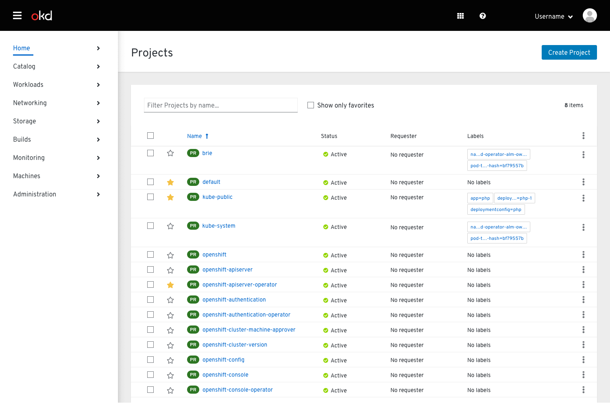
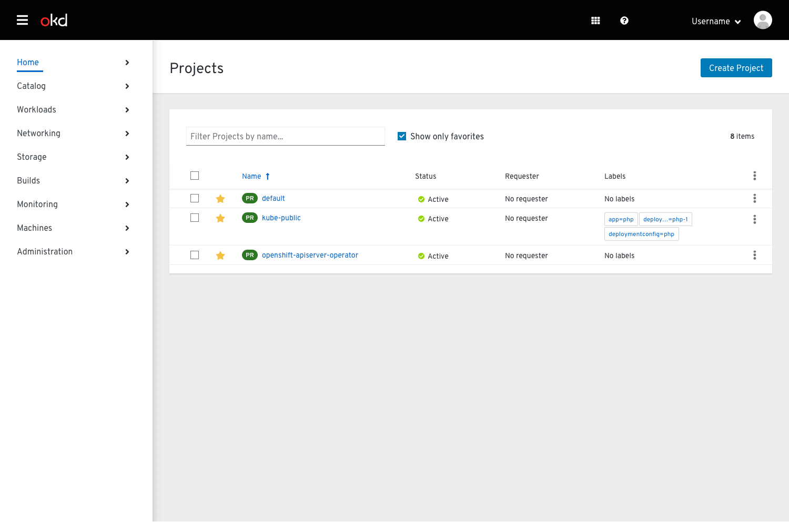
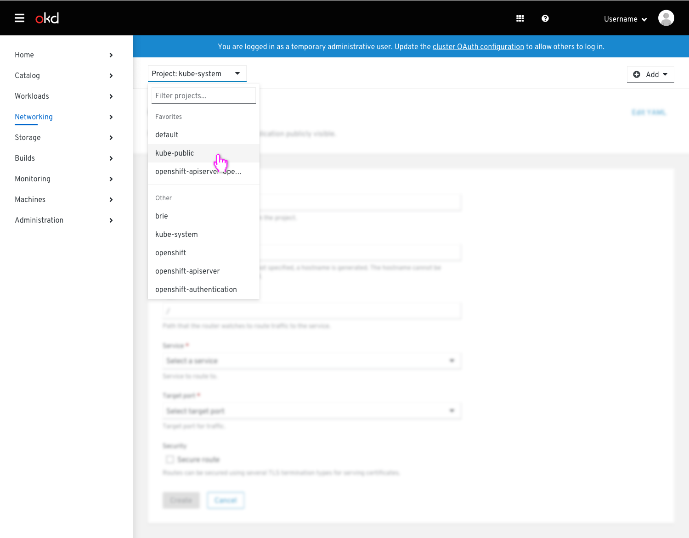
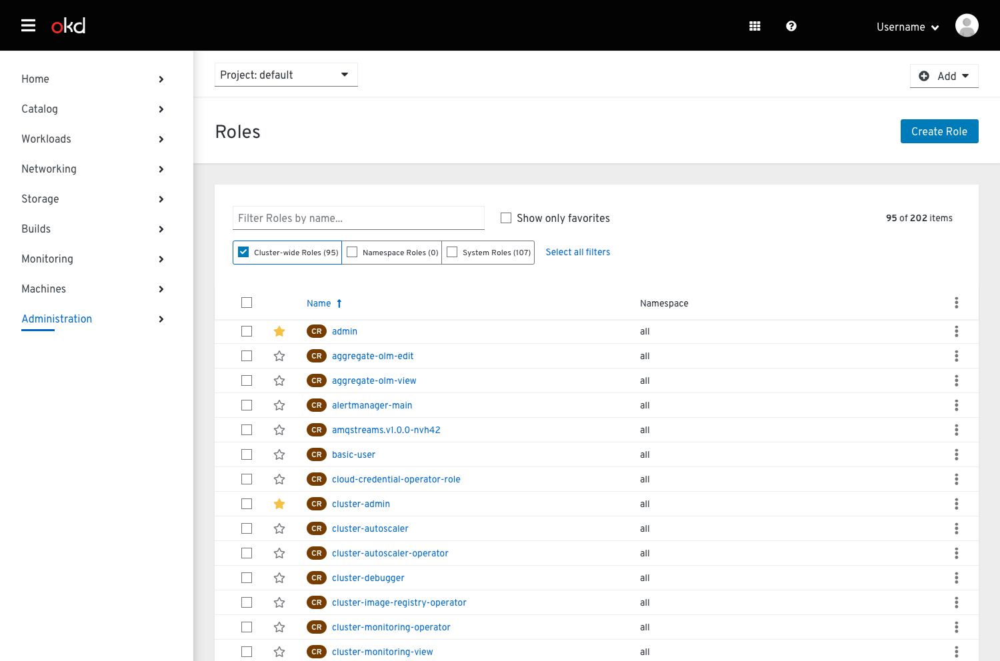
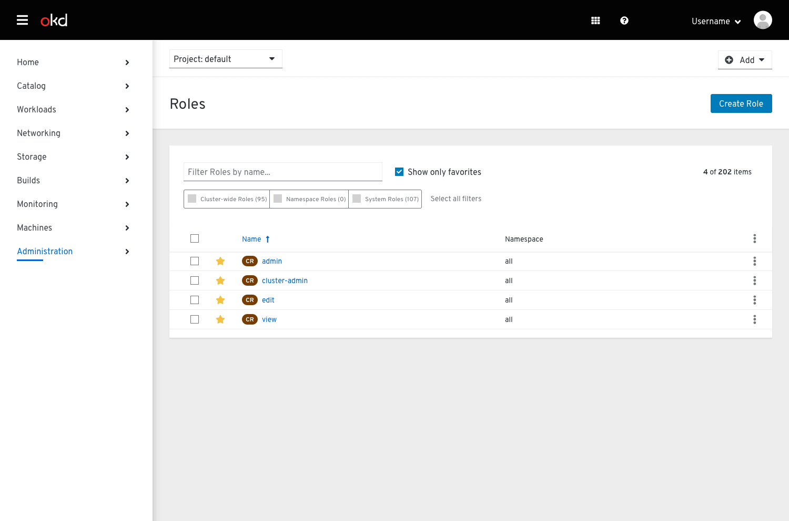

# Favoriting

## Projects list

* Users may set their favorite projects by clicking the star toggle at the beginning of a row.
* The project will not change positions in the list when the star is toggled on or off.

* Users may view only their favorite projects by checking the "Show only favorites" checkbox next to the textbox filter.

### Project selector

* Project favorites will be reflected in the project dropdown, but cannot be edited there.
* Dropdown sections and a horizontal separator will be used to visually distinguish favorite projects and all other projects.

## Roles list

* The roles list will load with several roles automatically favorited. These roles are commonly used and pre-favorited to bring them to the attention of the user.
* Users may set additional favorite roles by clicking the star toggle at the beginning of a row.
* The role will not change positions in the list when the star is toggled on or off.

* Users may view only their favorite roles by checking the "Show only favorites" checkbox next to the textbox filter.
* When the checkbox is selected, the toggle filters will be disabled to avoid conflicting filtering behavior.
* When the checkbox is deselected, the toggle filters should return to their previous states before the checkbox was selected.
