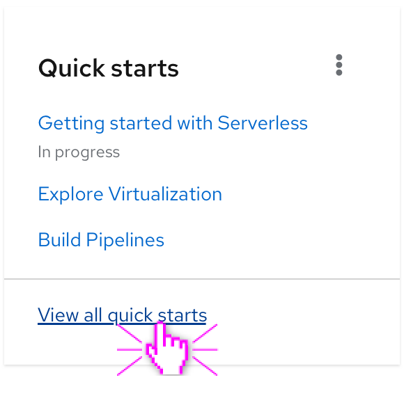
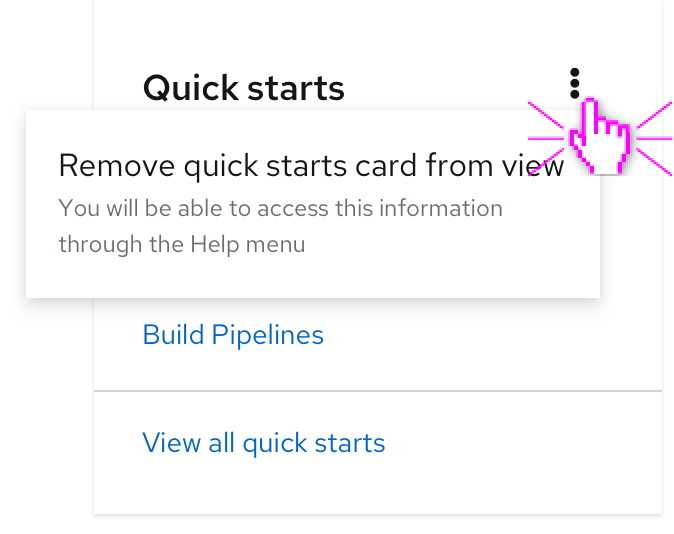

# Getting started short-term enhancements

The short-term enhancement to the getting started experience will add a quick starts card to the Cluster Overview dashboard that lists existing quick starts. This card will be dynamically updated as new quick starts are added. There will be 5 max shown at once and the newest additions will be added to the top of the list. 

The card includes a link to view all quick starts, which would navigate the user to the existing Quick Starts page in the Help menu.

The user may remove the card by clicking on the kebab. The menu item that drops down explains to the user that the quick starts will be accessible from the Help menu. When the card is removed, the Events card will move up so it is top-aligned with the cards in the top row.

Assuming the user removes the card, this action will be saved in storage and will not show up in the Cluster Overview again. It is expected that the user has permission to take all quick starts listed in this card.