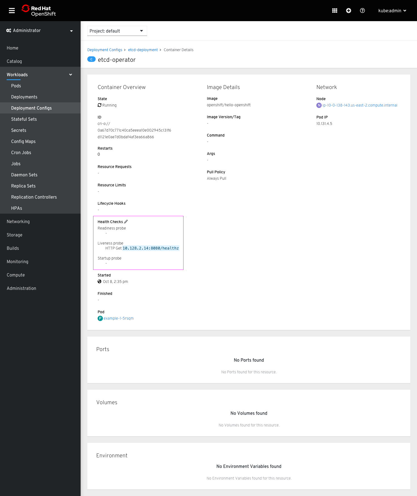
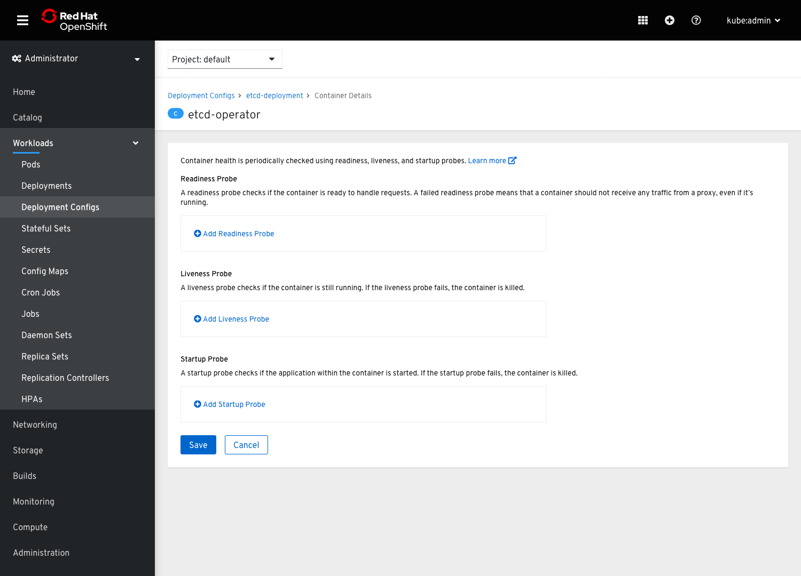
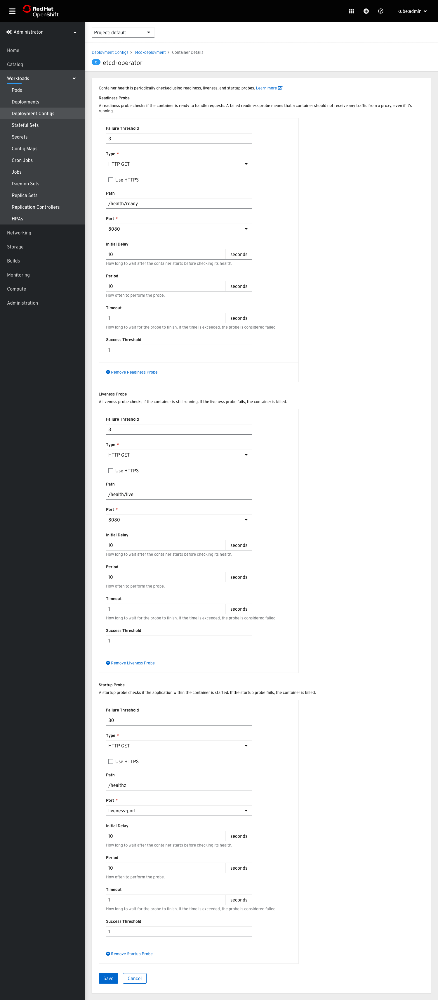
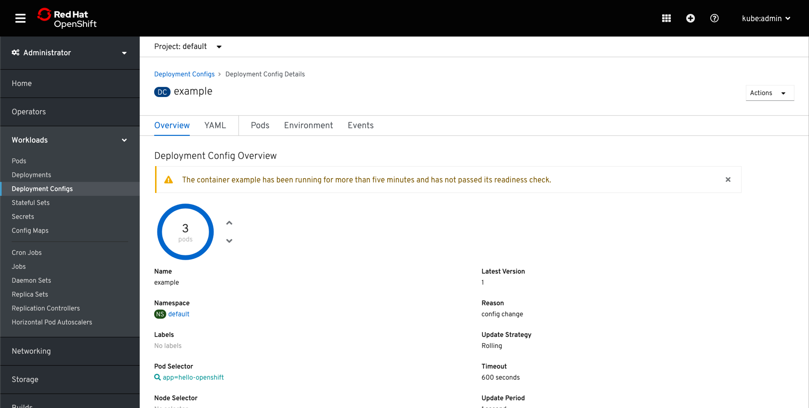
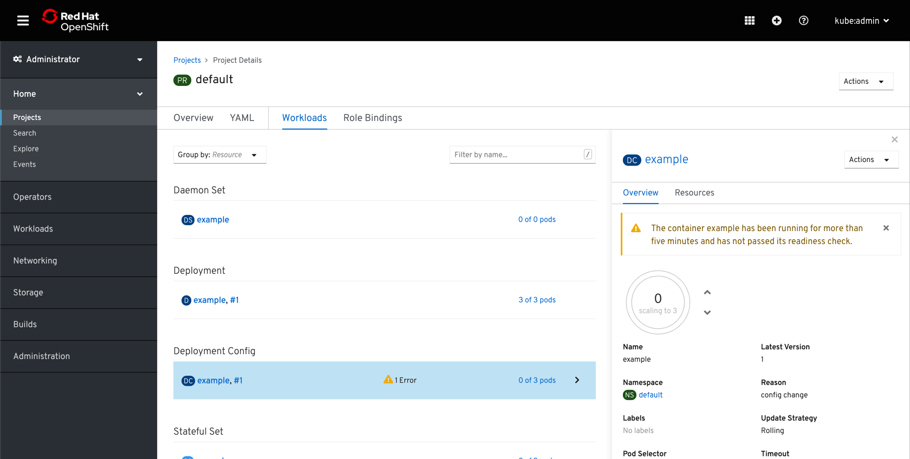

# Health Checks

Health checks allow users to monitor various container states. The following design adds the ability to create and edit health checks via forms.

## Design

To access health checks, users can drill down into a container from the containers list on any resource overview tab.

On the container details page, there will be an editable Health Checks section. There are 3 types of probes users can add; each probe will be listed in the section so that users can quickly see any probes they have created or see which ones they still need to create.

The health check form allows users to add a single probe of each type. Users can add any combination of probes they wish. Probes can be removed by clicking "Remove [Probe Type]".

The form fields for each probe type are the same.

Note that probe forms will be read-only for some resources, similar to environments. In these cases, an inline alert will redirect users to the parent resource.

Failing health checks will show up in the events log. They will also cause an inline alert to show on the overview tab of the related resource and in the side panel view on the Workloads tab.

