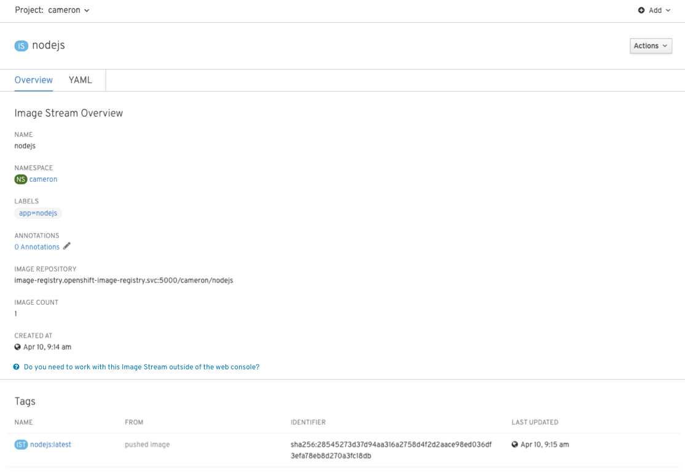
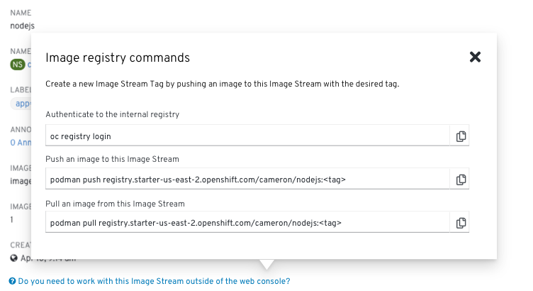
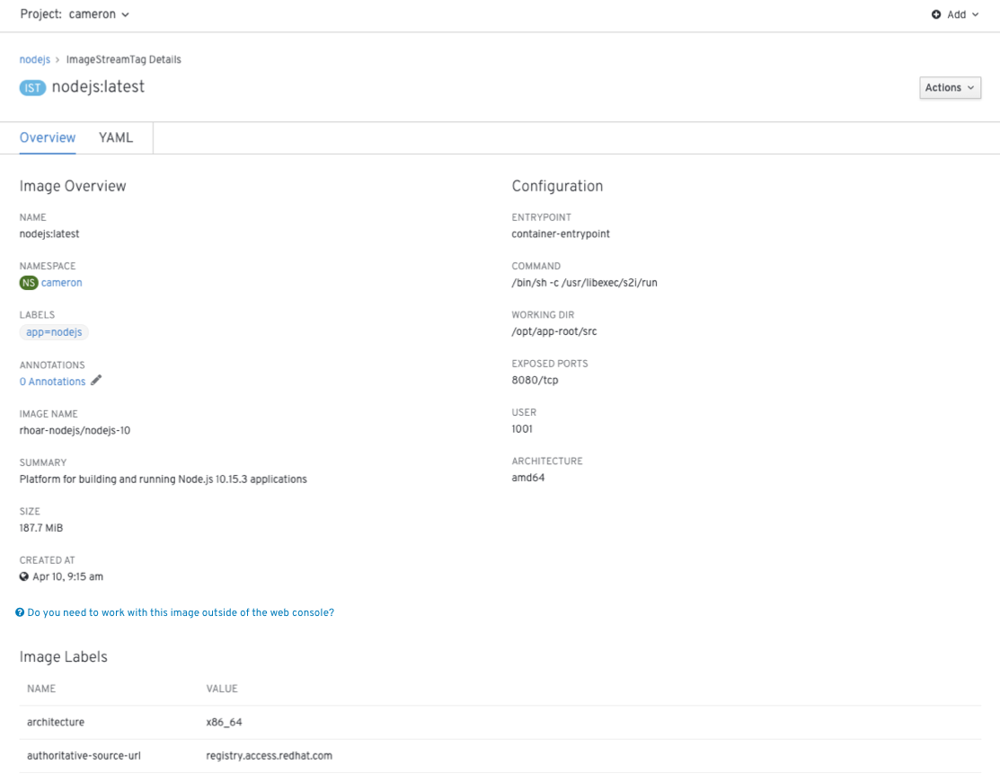
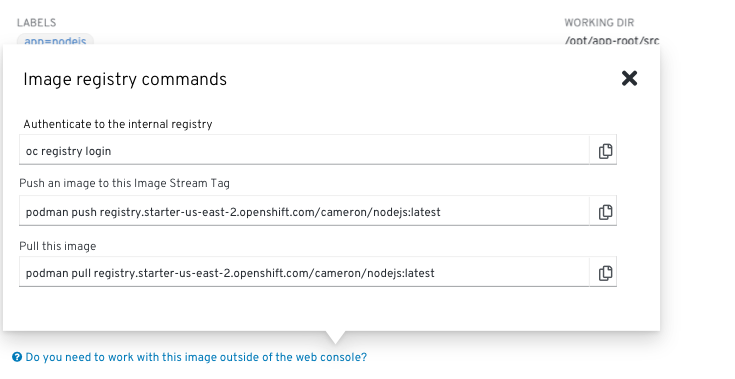

# Image Commands

## Background
* Users may need to interact with the OpenShift internal registry directly via the CLI. For example, user may wish to pull an image to debug it locally, or they may want to push an image to create a new Image Stream Tag.
* Previously, the 3.x console gave users sample CLI commands for interacting with images in OpenShift's internal image registry on Image Stream pages.
* OpenShift Online also included generic CLI commands on the About page.
* These commands are useful because they include the location of the internal registry and it is not clear that this information is available elsewhere in the web console.
* This design makes the commands for interacting with the internal registry available to users through Image Stream and Image Stream Tag pages.

## Design

### Image Stream Pages

* Add the help prompt "Do you need to work with this Image Stream outside of the web console?" underneath the **Image Stream Overview** section.

* Clicking the help prompt will bring up a popover with commands for:
  * Authenticating to the internal registry
  * Pushing an image to the image stream
  * Pulling an image from the image stream
* Users should be able to copy the commands to the clipboard.
* The push and pull commands for the Image Stream should be generic, that is, they should not reference a specific Image Stream Tag. Instead, the tag portion that a user should edit for a specific tag should be indicated `<tag>`.
* The popover should also inform users that they can create a new Image Stream Tag by pushing a new image to this Image Stream.

### Image Stream Tag Pages

* Add the help prompt "Do you need to work with this image outside of the web console?" underneath the **Image Overview** section.

* Clicking the help prompt will bring up a popover with commands for:
  * Authenticating to the internal registry
  * Pushing an image to this image stream tag
  * Pulling the image
* Users should be able to copy the commands to the clipboard.
* The push and pull commands for the Image Stream should be specific to the image stream tag, not generic as with the Image Stream pages.
