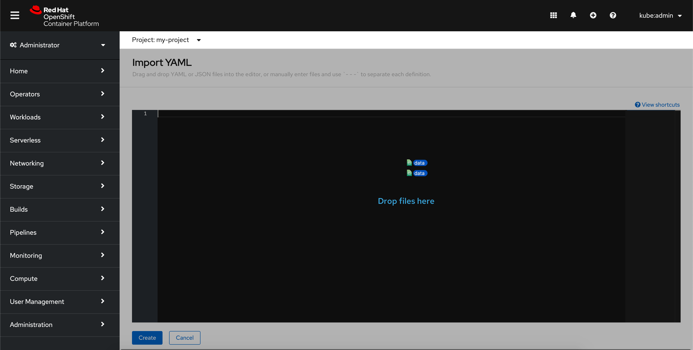
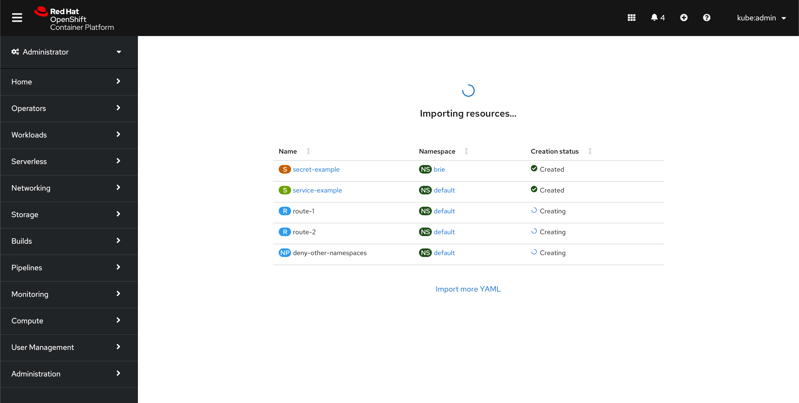
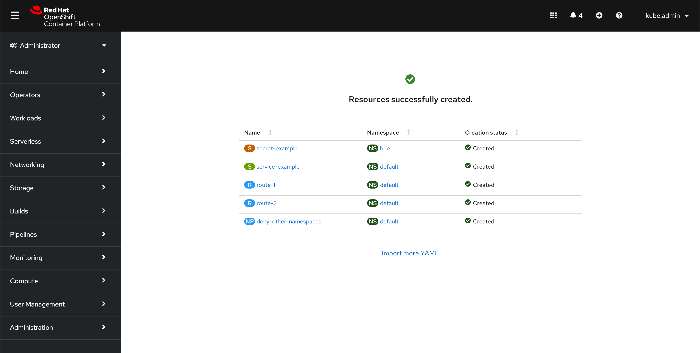
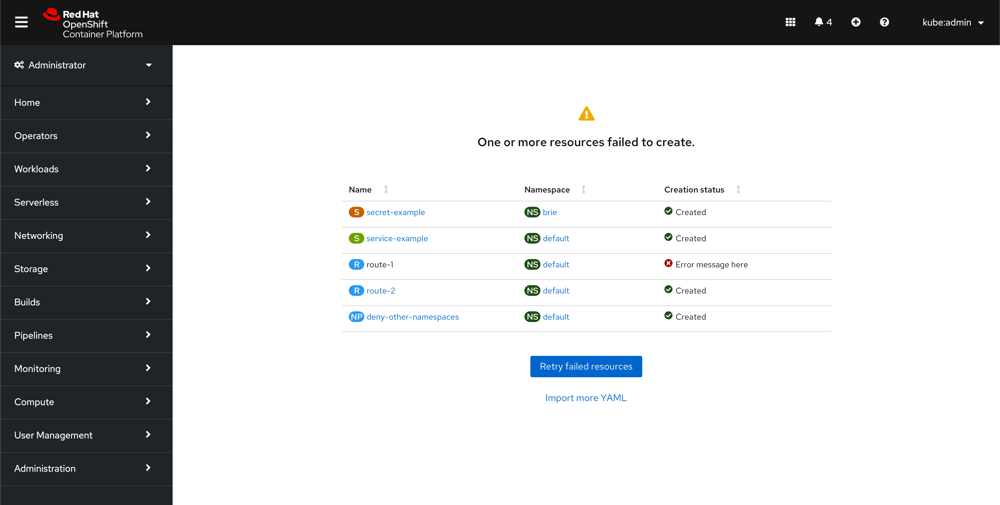

# Import YAML for multiple resources
This design details how users can import multiple resources using the **Import YAML** page.

## Design

The **Import YAML** page will still be accessible from the masthead. There are three ways a user can create multiple resources on this page. The instructions on the page should be updated to clarify how users can import YAML: *Drag and drop YAML or JSON files into the editor, or manually enter files and use `- - -` to separate each definition.*

1) Users can manually enter multiple definitions in the editor, using `- - -` to delineate them.
2) Users can drag and drop a single YAML with multiple resources defined and separated with `- - -`.
3) Users can drag and drop multiple files into the YAML area at once.

All methods will show the definitions in the editor for the user to view / edit before creating.

After the user clicks **Create**, the console will do a dry run of resource creation to find potential errors before beginning to actually create the resources. If errors are found, the user will be notified by an inline alert on the **Import YAML** page beneath the editor. If the dry run is completed without any issues, the resources will begin to be created and the user will be redirected to the **Creating resources** page.

The **Creating resources** page will show a table with all the resources the user is creating. The table will display the resource name, namespace, and creation status. When the resources are successfully created, they should turn into a blue link that redirects users to the resource's details page.

Resource creation should be nearly instantaneous, so users will likely not get a chance to navigate away in the middle of the creation process. However, if they do, the resource creation should continue in the background.

Because of the dry run, there typically should not be any errors on this page, and the resources should successfully create.

In the rare case an error occurs at this stage of the resource creation, failures can be shown in the **Creation status** column with the error message.

Users can click **Retry failed resources** to return to the **Import YAML** page with the failed resources' definitions in the editor.
