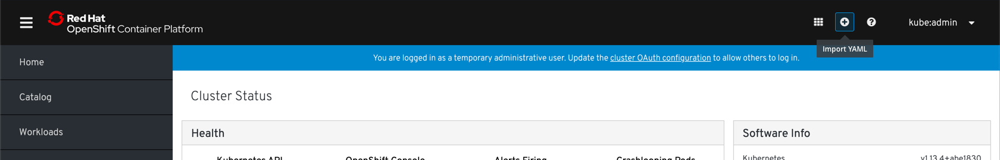
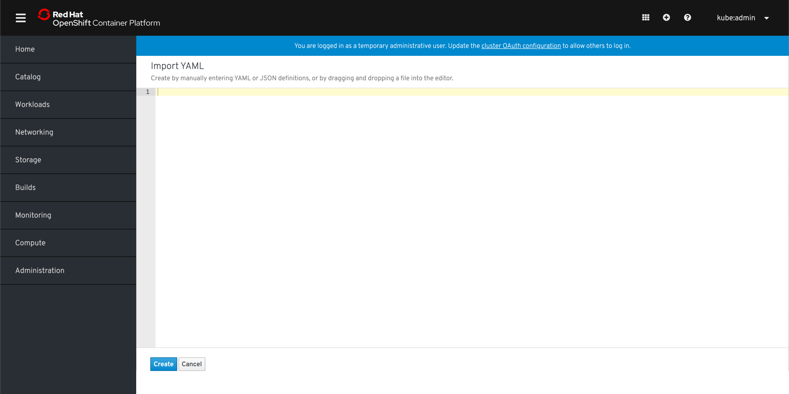

# Import YAML

## Masthead

* The Import YAML action will be accessible from the masthead using the plus icon.
* A tooltip will be available on hover and will read "Import YAML".

## Editor

* Import YAML will be accessible from non-namespaced pages and therefore will not show the project selector bar.
  * If the YAML does not define a namespace for a resource that should be namespaced, the editor will return a validation error until the user updates the YAML.
* If the user clicks 'Cancel' from this page, they will be returned to the page they were previously on.
