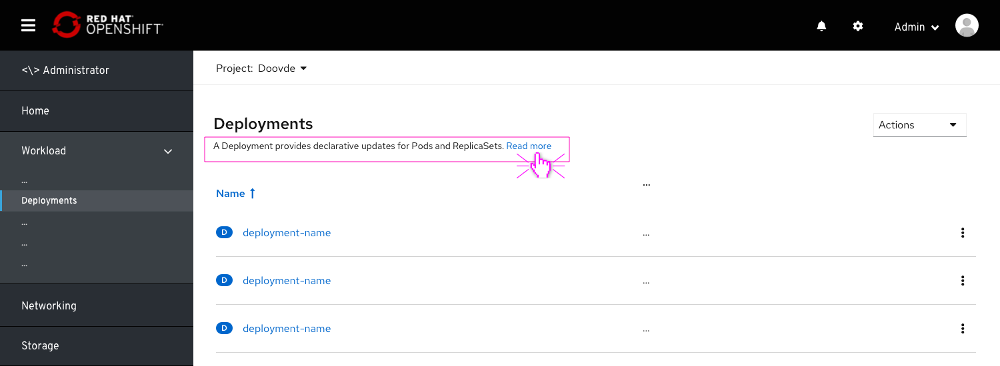
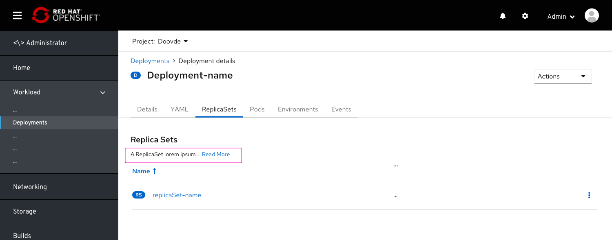
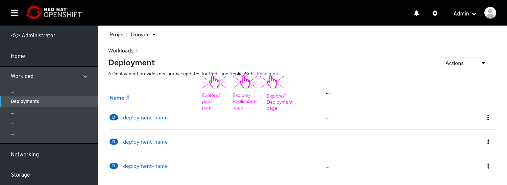
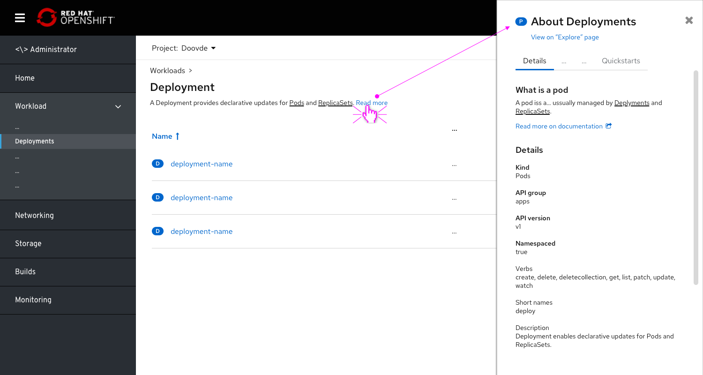

# Adding resource description for resource lists

Content from the Explore page can be surfaced by placing resource descriptions within context.
Resources lists can be enhanced by adding resource descriptions, pulled from the "Explore" page.
This can save the user some time as well as exposing the user to further content that was somewhat hidden.

## Resource list page

* Pulling the resource description from the Explore page and placing it below the list (table) title.
* Adding a "Read more" link to the full Explore/resource page.
* This description preview should be no more than [120] characters. After that, the text should be broken with "...Read more"

## Resource list tab

* These descriptions can be placed within any list dedicated to a specific resource.

## Future enhancements

* Adding Hyperlinks within the description body can further enhance the discovery and exploration of the "explore content".
* Each Hyperlink can look for that resource's Explore/details page.

* This experience can be further enhanced by linking "learn more" and hyperlinks within the body to an Explore "squeeze page", placed within a side panel.
