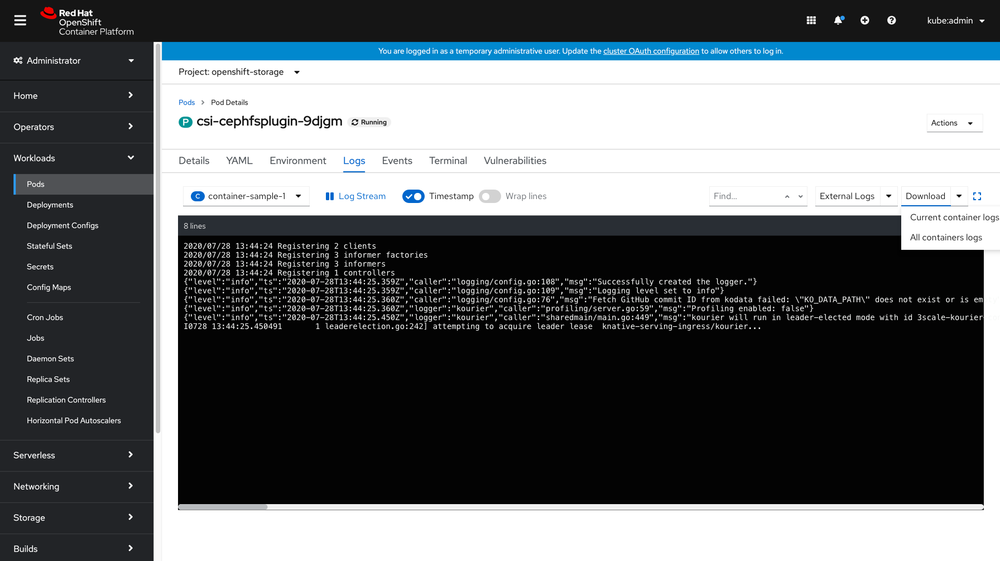
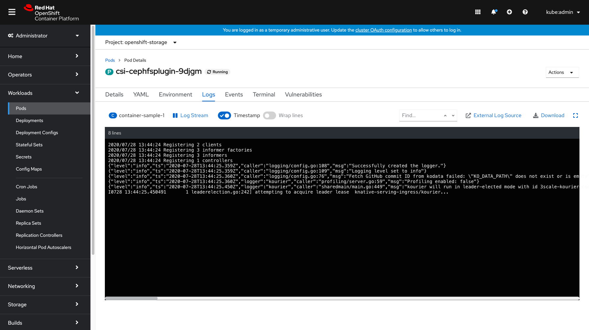
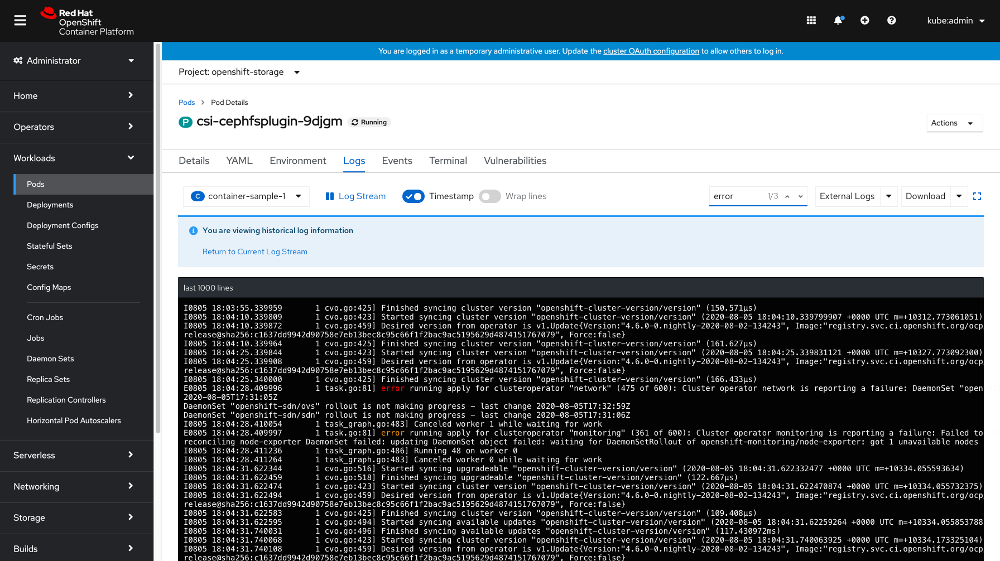
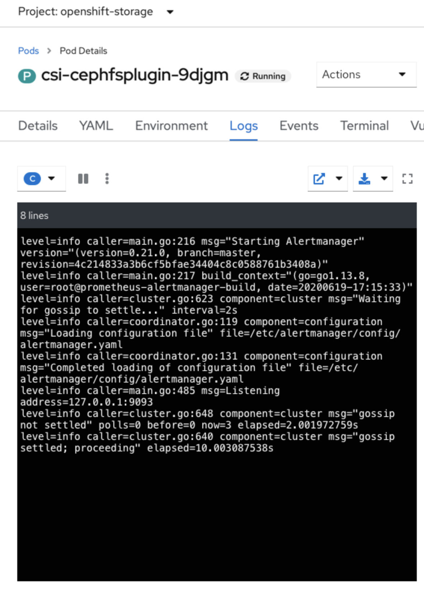
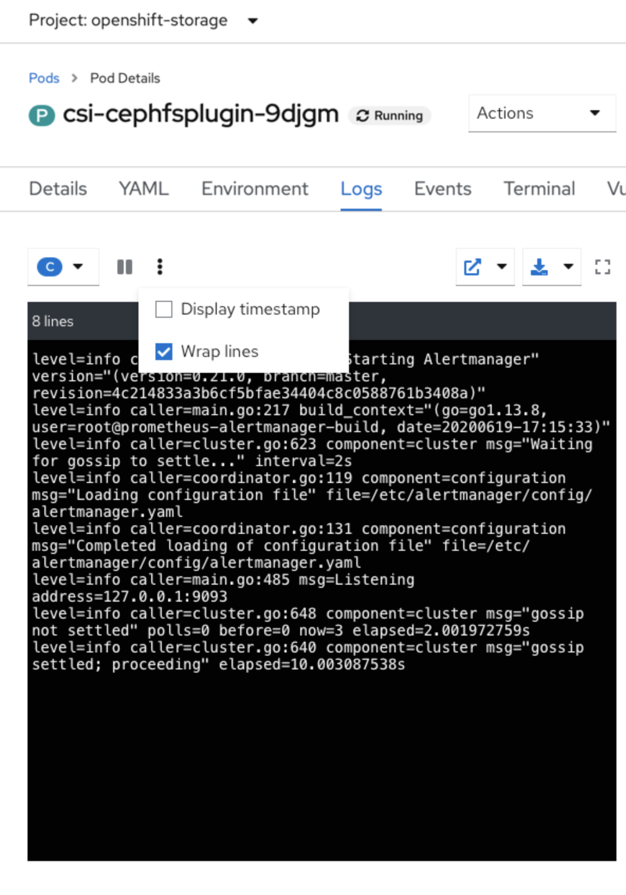

# Log toolbar updates

Outcomes:
A new log viewer toolbar design using native PatternFly components and appropriate wrapping/collapsing behavior for various screen sizes
Support for Wrap lines and Toggle timestamps
Support for the Download All button that appears in the Pipelines log viewer
Support for at least 1 `ConsoleExternalLogLink` resource that the user may have added
Confirm if this is this relevant for the Pods  Logs page, or just for the Pipelines page
Incorporate a find or search feature 
Design for the possibility of allowing customers to view more than 1000 lines of data in the future

Proposed default state:
Add a download split button dropdown (or single button if there is only one container) 
Move to the top right, as opposed to a Download button on the bottom right as seen in the Pipelines YAML current design
Add an external logs split button dropdown (or a single button if there is only one external log link enabled - this is most common)
Add in toggles for displaying timestamp and wrap lines 
Change the pause and play logstream button to match Patternfly requirements
Change “[ ] Expand” in top right corner to just a “[ ]” icon

When only one container is associated, the container dropdown will switch to just the container name on the left, and the download split button dropdown will change to a single Download link. If only one external log source is associated, this will show as a single link as well. 

In the future - if the ability to view more than 1000 lines is available within the console the user will need to be notified if they are viewing historical log information. Below is an alert that can be displayed to notify the user and let them navigate back to the current log stream logs. Based on discussions, the idea of an "infinite scroll" was suggested for viewing logs past the 1000 lines mark to show all info as a continuous stream vs having some sort of control like a dropdown or date/time picker to navigate to older log lines.

## Compressed Toolbar

With the addition of new components in the toolbar comes the challenge of creating a clean and unified looking compressed-state for the toolbar.

Proposing the following changes when the screen is compressed:
Change all split button dropdowns to just an icon within the component - no text
Change the pause and play log stream to just a pause icon or play icon
Change the timestamp and wraplines toggles to checkboxes, found under the kebab menu

Kebab menu expanded

