# Machines

## Navigation
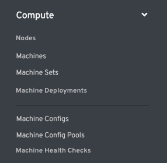
- The various machine resources will live under the `Compute` navigation item
- [Nodes](http://openshift.github.io/openshift-origin-design/web-console/future-openshift/nodes/nodes) are listed first in this section, followed by [Machines](#machines), [Machine Sets](#machine-sets), [Machine Deployments](#machine-deployments), [Machine Configs](#machine-configs), [Machine Config Pools](#machine-config-pools), and [Machine Health Checks](#machine-health-checks). In the future, Hosts may be added to this section as well.
- There is a horizontal separator between Machine Deployments and Machine Configs to separate the configuration items from the other resources.
- The same separator should be used in the `Workloads` navigation area to separate secrets and config maps as configuration items.

## Machines

- The machine list view should include machine name, namespace, node name, region, and availability zone.

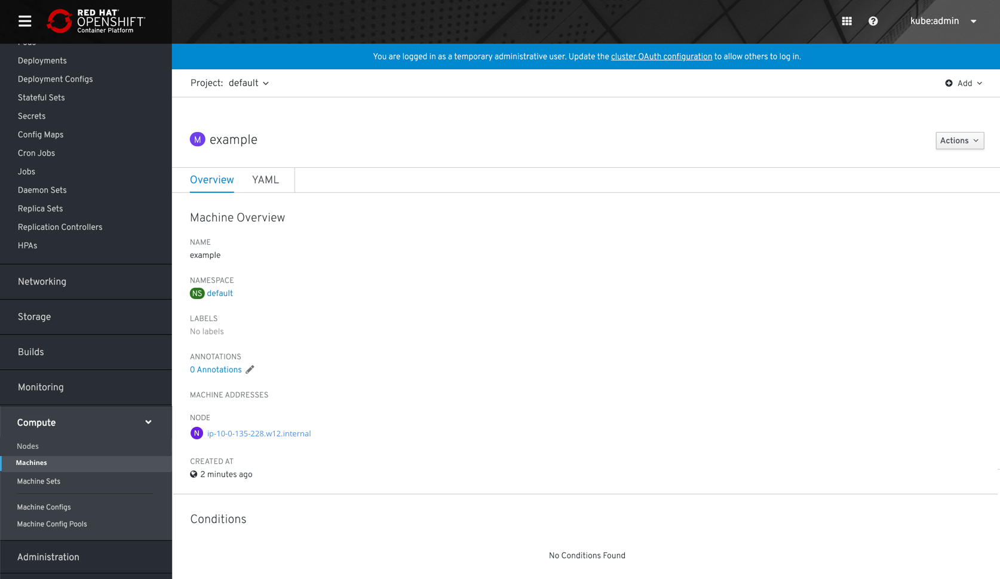
- The machine detail pages should match the format of other detail pages with the addition of a link to the corresponding node.
- The Conditions will be listed below a horizontal separator if they exist.

## Machine Sets
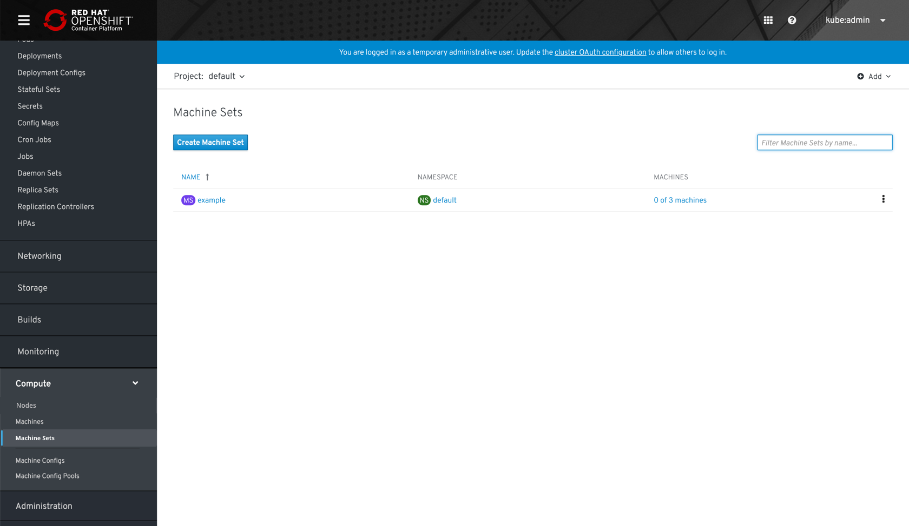
- The machine sets list view should include machine set name, namespace, and a link to the corresponding machines, similar to how we display pods (0 of 3).

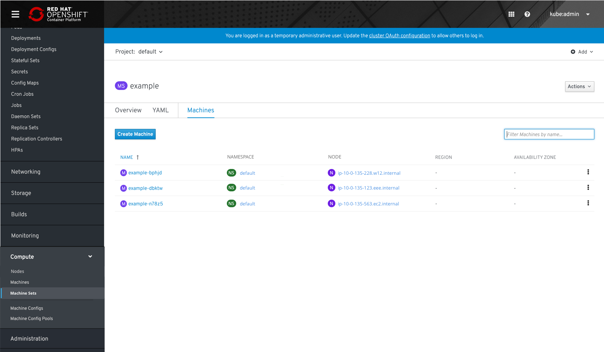
- Clicking the `0 of 3 machines` link will bring users to the machines tab of the detail page, which has a filtered view of machines.

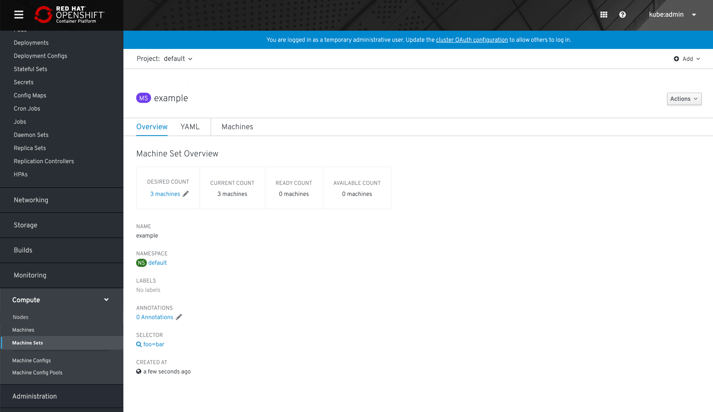
- The overview tab will match the format of other detail pages with the addition of the machine detail box at the top of the page.
- Users can scale the number of machines by clicking the edit action in the box.

## Machine Deployments
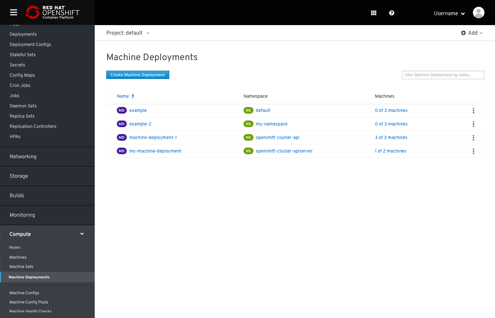
- The machine deployments list view should include machine deployment name, namespace, and a link to the corresponding machines, similar to how we display pods (0 of 3).

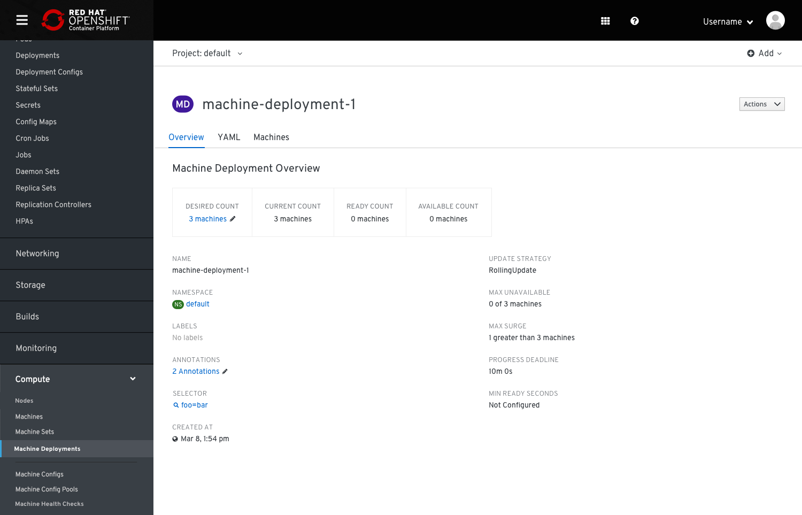
- The overview tab will match the format of other detail pages with the addition of the machine detail box at the top of the page.
- Users can scale the number of machines by clicking the edit action in the box.

## Machine Configs
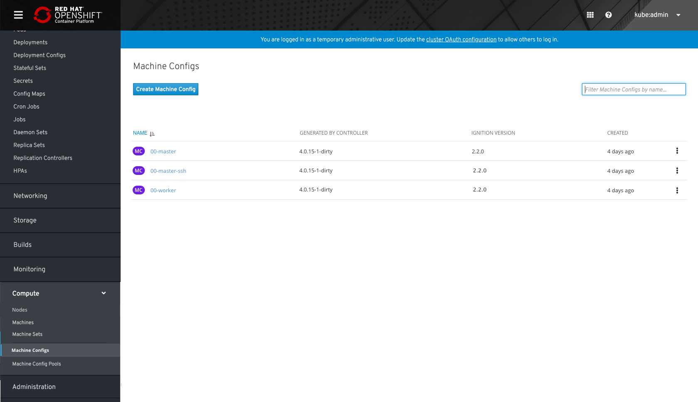
- The machine config list view should include name, generated by controller, ignition version, and created date.

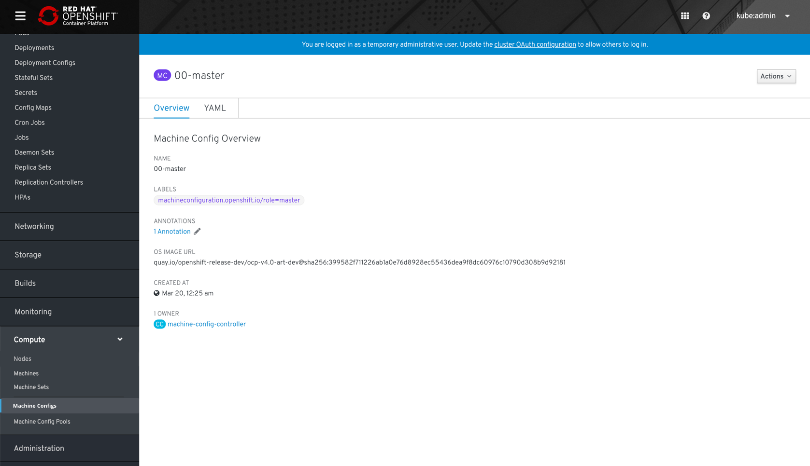
- The OS image URL should be shown on the detail page below annotations.
- The rest of the detail page should match the standard format used elsewhere.

## Machine Config Pools
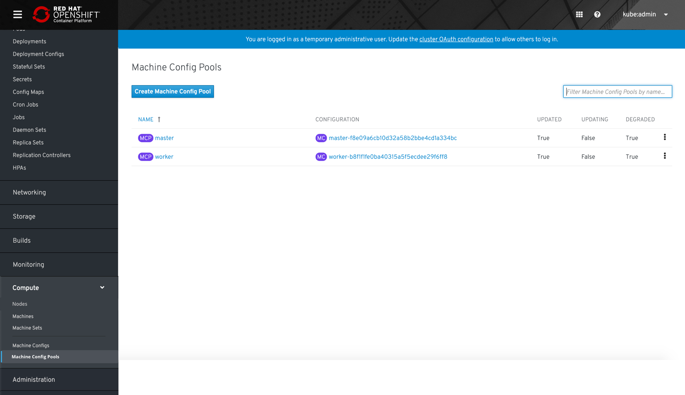
- The machine config pools list view should include the name, configuration, and the various statuses of updated, updating, degraded.
- If possible, the statuses should be combined into a single column.

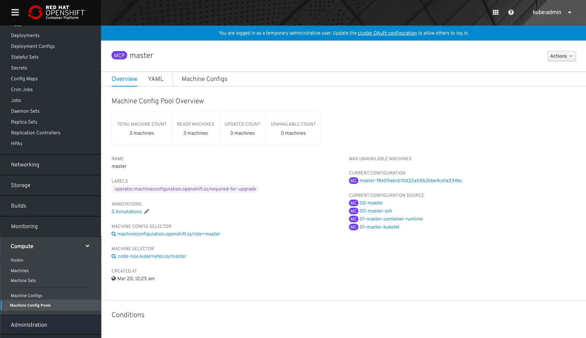
- The machine config pool details page should include a link to all associated machine configs, as well as a filtered view of them on the machine configs tab.
- The same detail box used at the top of the machine set detail pages should be used here, without the ability to edit.

## Machine Health Checks
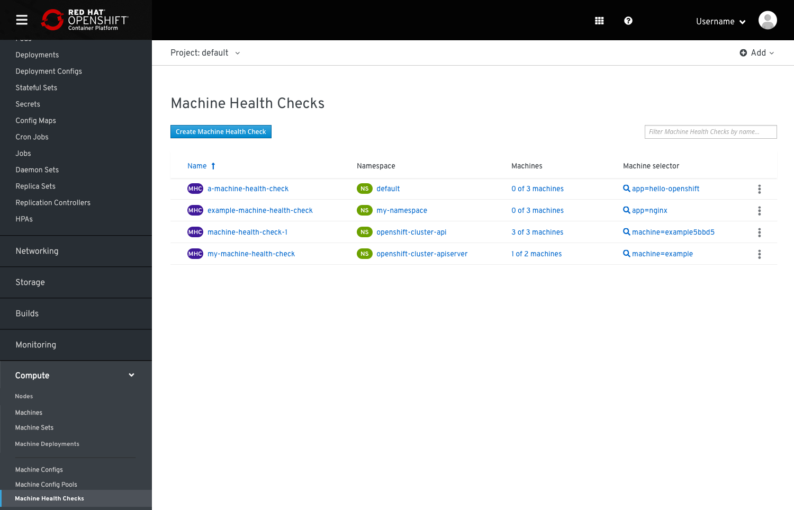
- The machine health checks list view should include machine health check name, namespace, a link to the corresponding machines, similar to how we display pods (0 of 3), and machine selector.

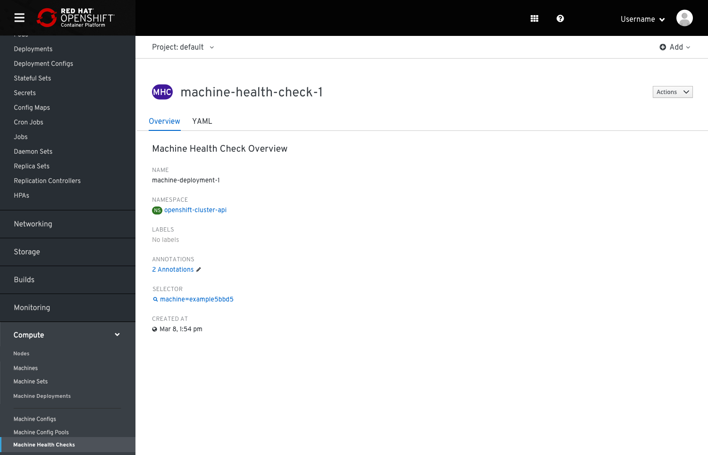
- The overview tab will match the format of other detail pages.
