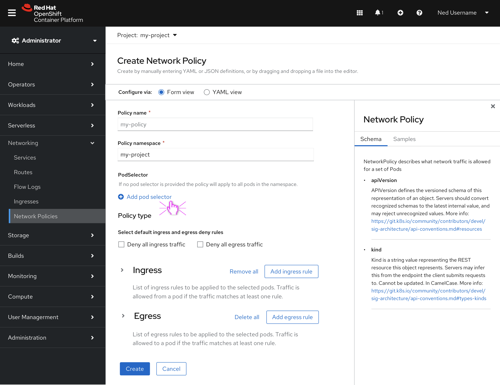
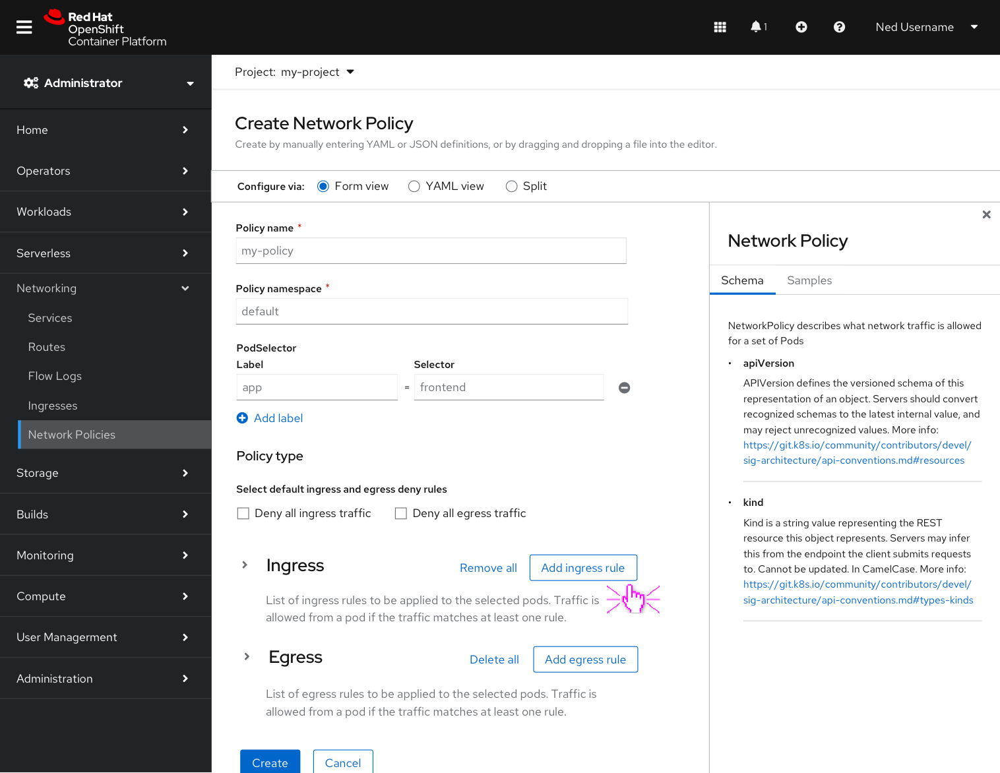
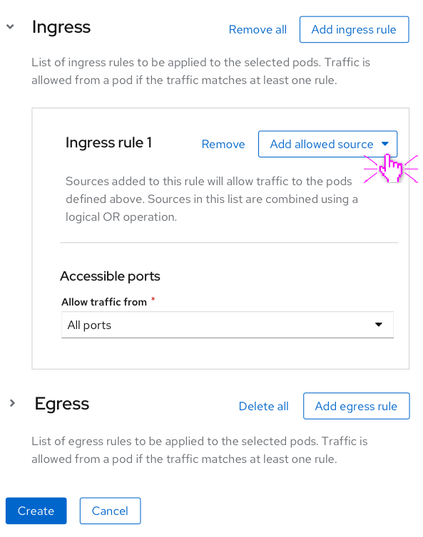
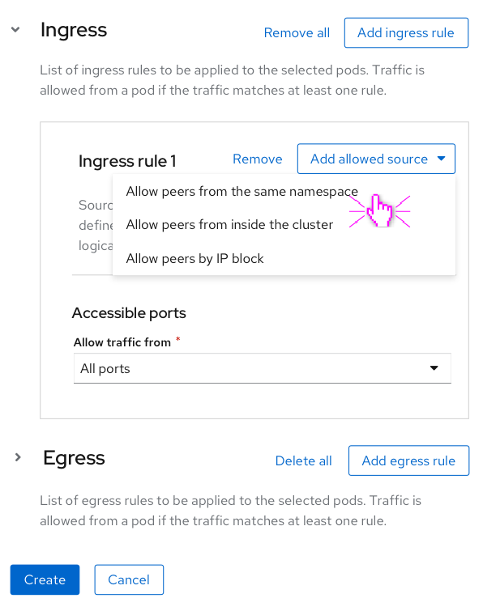
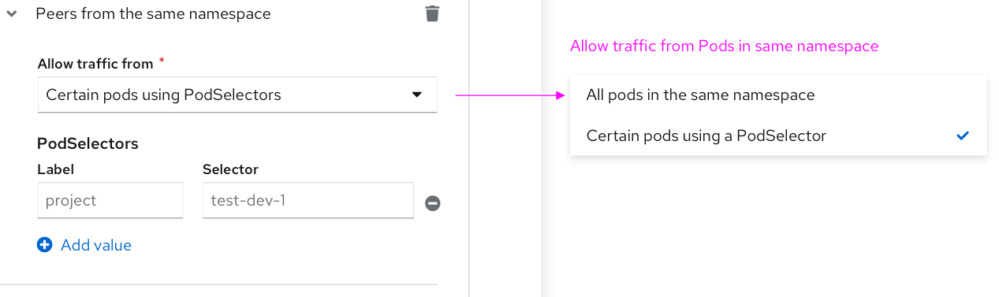
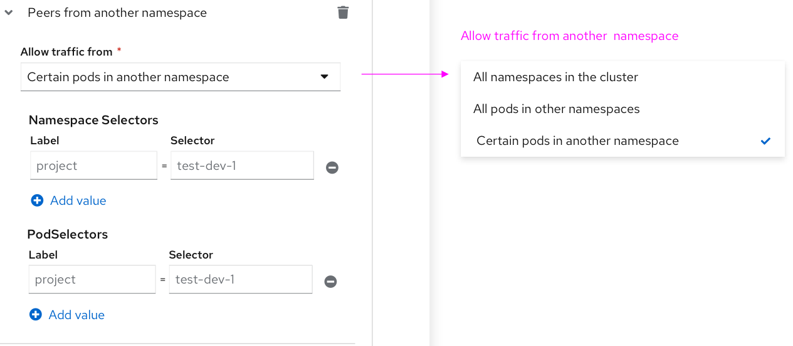
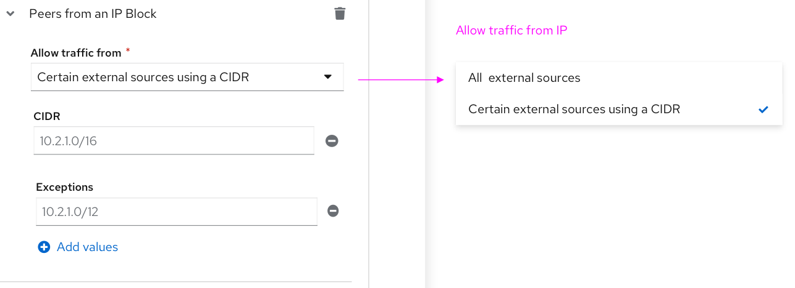
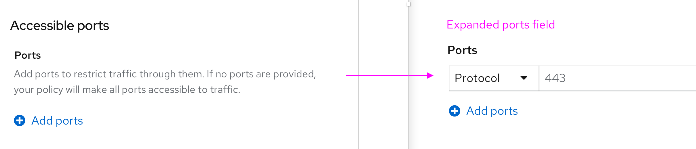
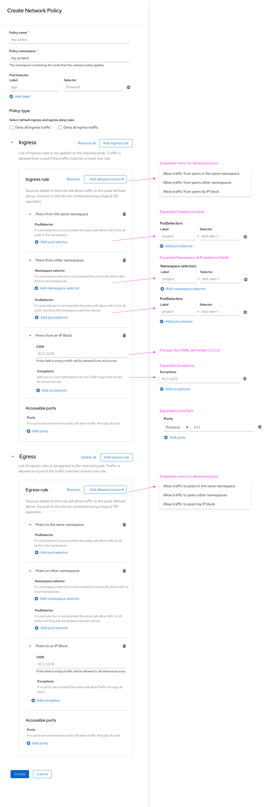

# Network policy form

## Background
Setting Network policies is a critical part of the security of applications on a cluster. In OCP 4.7 the only way to manage Network policy in the console is to edit the yaml of these resources. It's a common and important enough operation that we should make this easier for administrators to work with.

## Goal

Add the ability to create/update/delete NetworkPolicy resources through the OpenShift console in a way that is easier than directly editing the yaml representation of these resources.

## Designs for 4.9 release

This initial concept is a form based solution that compliments the current YAML editor. This allows users to switch between the form and YAML views so they may better understand the YAML output.

### Create Network Policy introduction

* The policy will pre-fill the namespace based on the Project selector at the top.
* The PodSelector uses key-value pairs. if no values are added, the Policy applies to all pods in the above namespace.

The Create Network Policy form is designed to display only the fields that are needed for a specific task.

In the Policy type section the user can select the "deny all ingress traffic" and/or "deny all egress traffic" checkbox(es) to quickly create a Deny all policy. Clicking these checkboxes should remove the ingress/egress sections below and the user can simply click create (primary button).

### Adding ingress/egress rules

Users have the option to add multiple Ingress/Egress rules that allow traffic from/to any number of Peers.  

**Note:** The ingress and egress sections are collapsable to reduce scrolling. The "remove all" next to the "Add ingress rule" button will surface a modal to confirm that the user wants to delete all ingress rules.

The ingress/egress rules are blocked into three categories of allowed peers:
* Allowing peers from/to the same namespace

* Allowing peers from/to inside the cluster

* Allowing peers from/to an IP block.  

**Note:** Fields in the Peer sections above have helper text that explains interactions and how to achieve the desired outcome of the Network Policy.  

### Ingress/egress traffic over specified ports

Each ingress/egress rule has an Accessible Ports section. Users can add multiple ports if needed. The default behaviour when a rule is created is to allow traffic from all ports.

### Full view of policy fields

The screenshot below shows all ingress and egress options in one view.

