# OAuth Global Configuration

- Users may be logged in as temporary administrators until they set up identity providers.
- When this is the case, a blue banner will appear at the top of all pages with a link to the OAuth configuration page, where users can take the necessary action to add an identity provider (IDP).

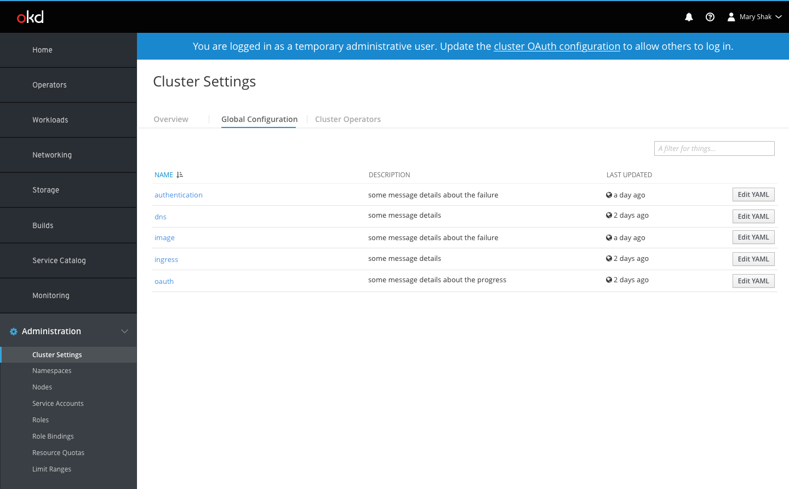

- Users can also get to the OAuth configuration page from the [Global Configuration](http://openshift.github.io/openshift-origin-design/web-console/4.0-designs/global-config/global-config) tab on the [Cluster Settings](http://openshift.github.io/openshift-origin-design/web-console/4.0-designs/cluster-settings/cluster-settings) page.

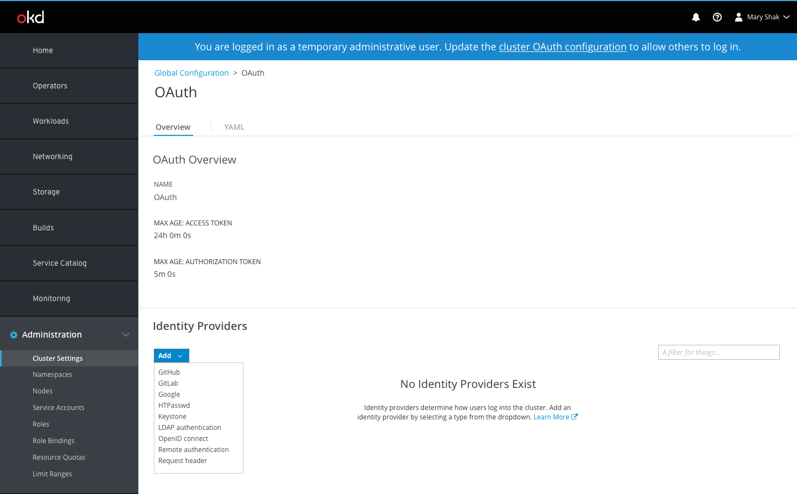

- General OAuth details are displayed at the top of the Overview tab while the identity providers section is displayed underneath.
- If no identity providers exist, there is an empty state to define what they are and provide a link to documentation.
- The primary `Add` action button provides options to create one of the various IDP types.
- Selecting an IDP type will open a full page form for the user to provide the relevant configuration details.
- Each IDP type will have different fields in the form pertaining specifically to that type. See [IDP forms](/#IDP-Forms) below for details.

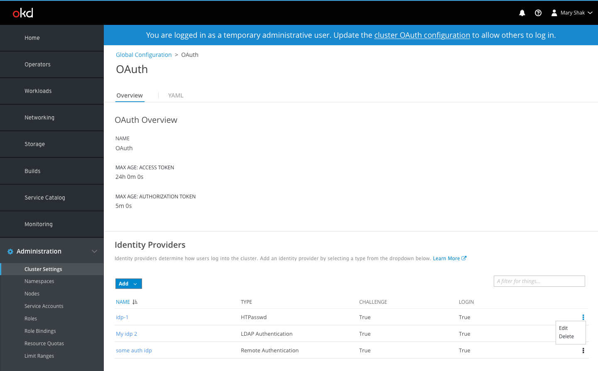

- Once complete, the IDP will be added to the details page in a list view.
- Users can create multiple IDPs of different or of the same type.
- Display name will be used to differentiate between IDPs of the same type.
- All IDPs will appear in the list with the name, type, challenge, and login columns displayed.
- When Edit and Delete actions become available, they will be displayed in the kebab menu on the right side of the list.

## IDP Forms
- Each form will have a short description of the IDP the users have chosen to add.
- Where appropriate, section headers may be used to divide the form into sub sections.

### Basic
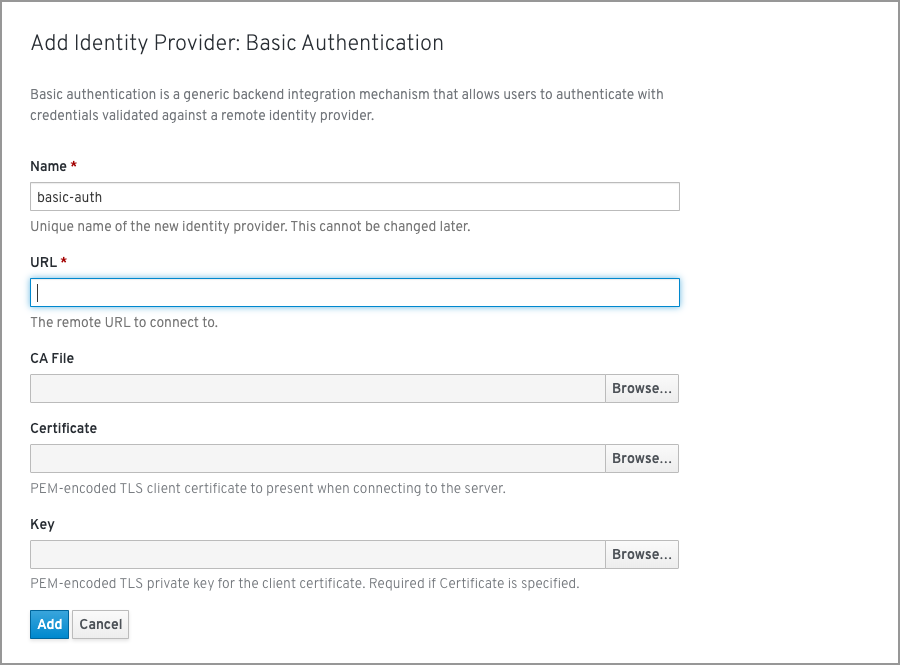

### GitHub
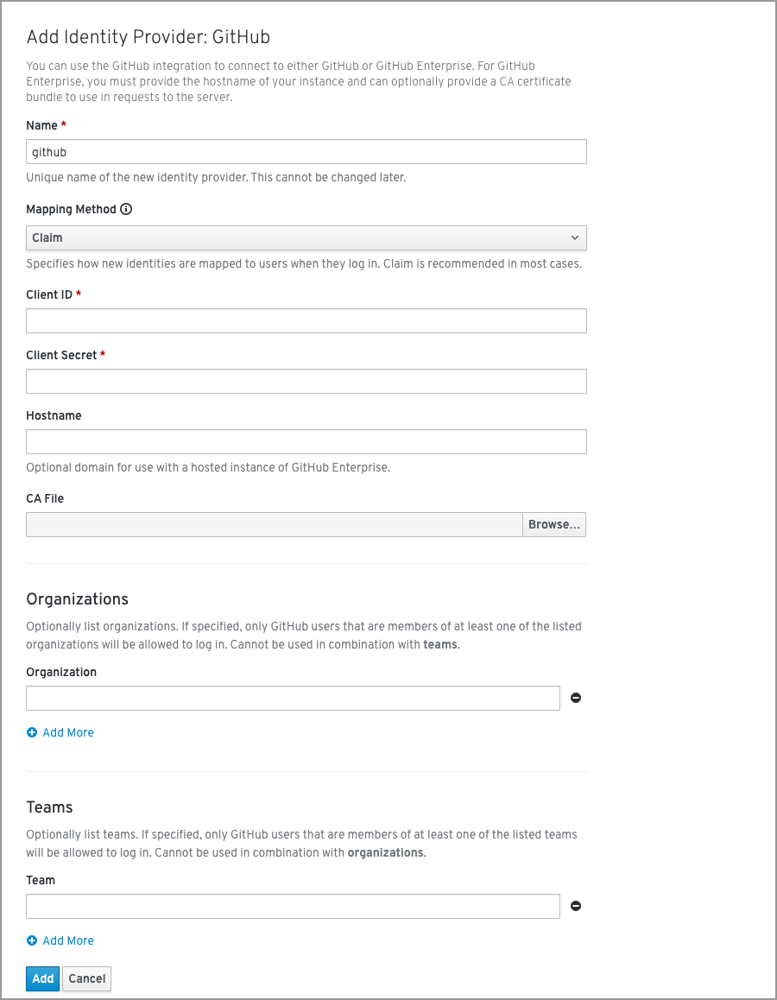

### GitLab
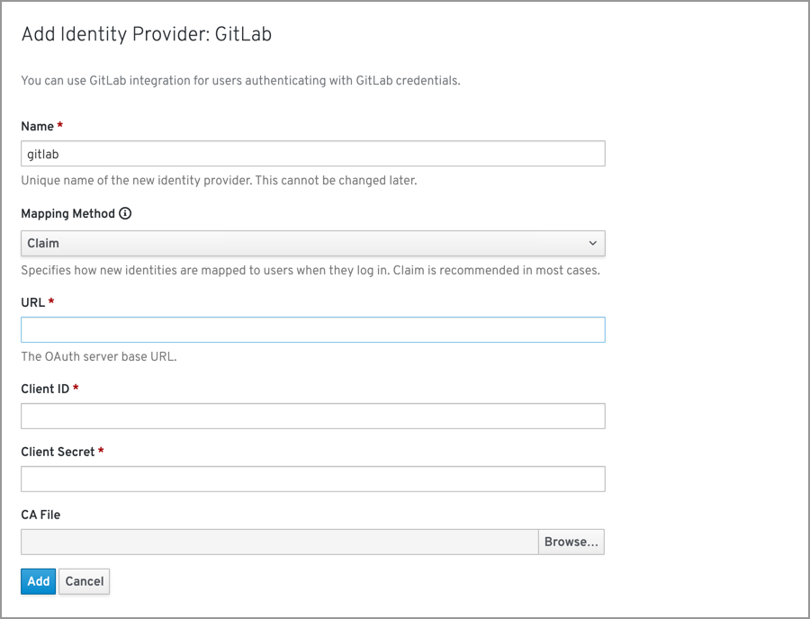

### Google
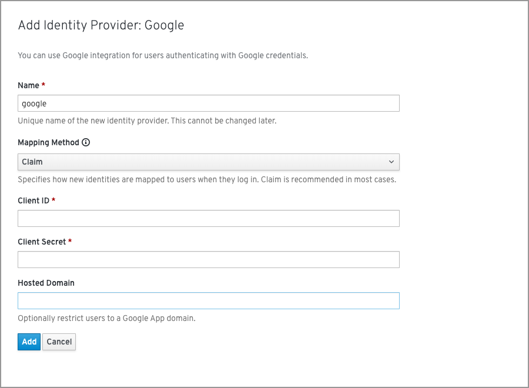

### HTPasswd
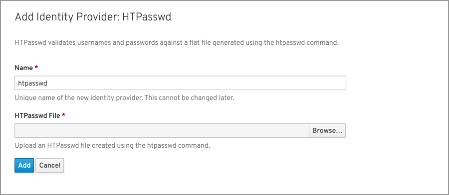

### Keystone
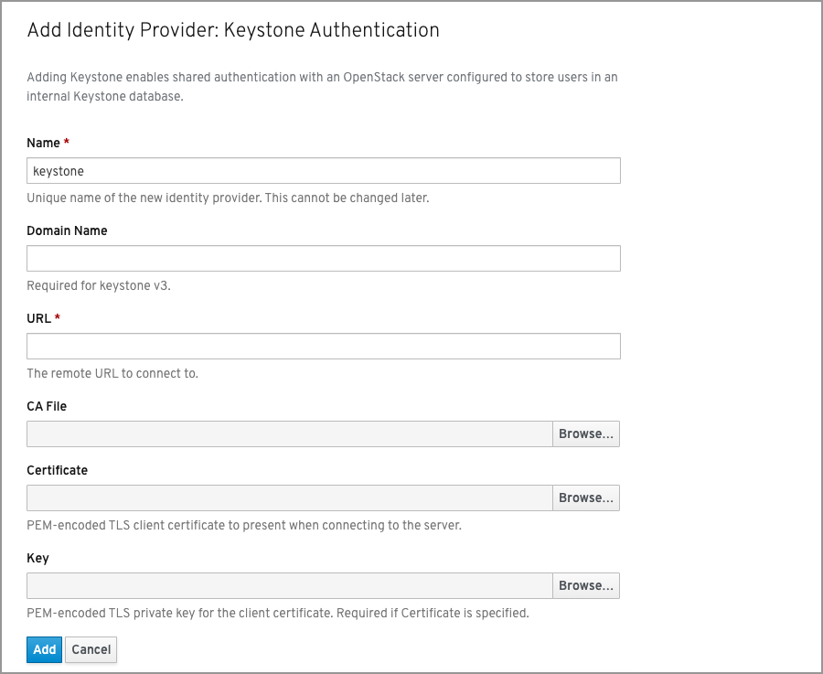

### LDAP
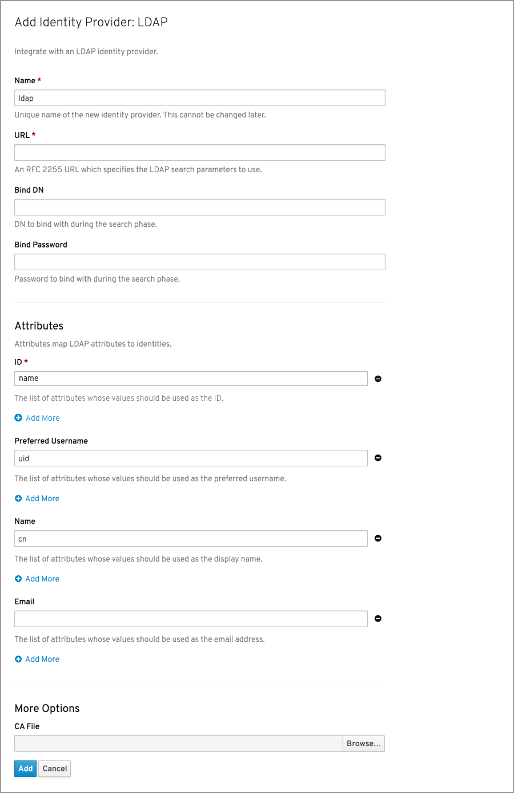

### OpenID
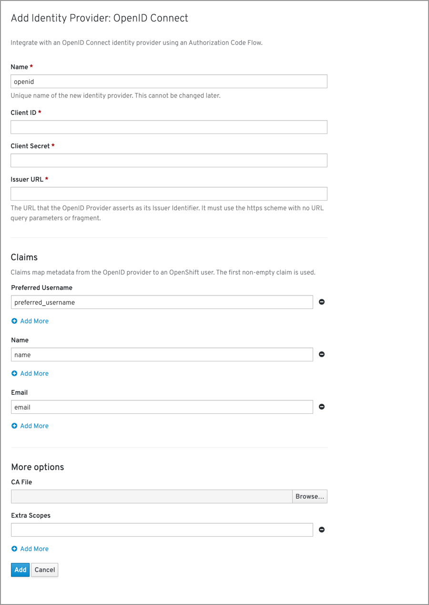

### Request header
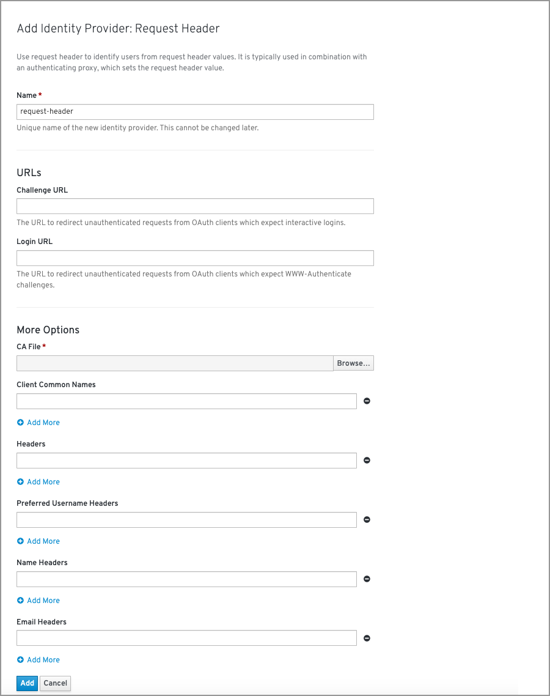

## IDP Overview pages

- The details view of IDPs shows information such as the name, challenge, login, and mapping method, along with any other relevant data.
- Breadcrumbs will be shown to help the user navigate back to the OAuth configuration page or the Global Configuration tab on the Cluster Settings page.
