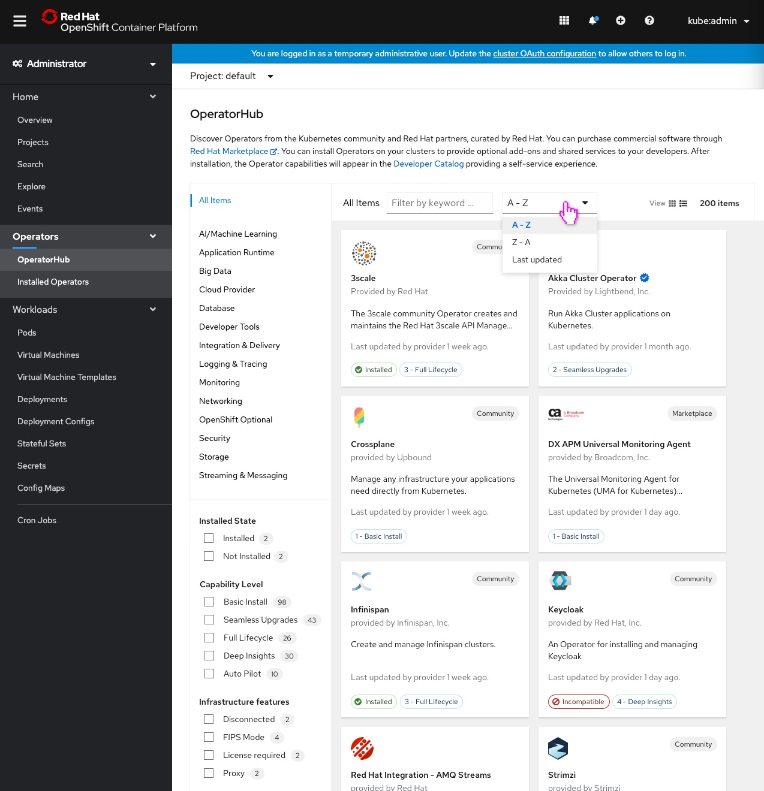
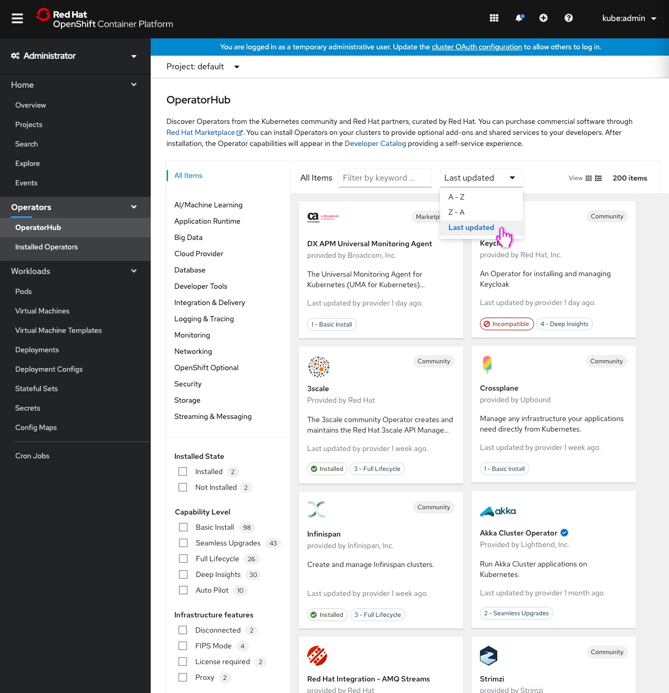

# Ehancing the filtering experince and adding sorting functionality to OperatorHub

OperatorHub currently provides users access to over 200 operators. As these contributions continue to grow, it is important that we make it as easy as possible for users to find what they are looking for. The concepts below expose additional capabiities on OperatorHub tiles and introduce the ability to sort by most recently updated (by provider).

## Exposing additional capabilities on OperatorHub tiles

By surfacing additional attributes on the tile, users can easily identify which filters apply to which operators.

Original attributes will remain on the tile:
- `Community` and `Marketplace` provider types appears in the top right hand corner of the tile and maintain the same style.
- `Installed` status appears in the bottom left of the tile.

The following attributes have been added to the tile and will persisit:
- `Capability Level` appears in the bottom left hand corner. It is styled with the blue outlined label and corresponding level.
- `Last updated by provider on [date]` is listed under the operator description.
- When applicable, the new `Red Hat Certified` badge appears to the right of the operator's name. The badge is styled as a blue starburst with a white checkmark in the center.

The following attribute has been added to the tile and will appear only when the corresponding filter is selected:
- `Infrastructure Features`, currenlty the only conditional category, appears on the tile when a user selects the corresponding filter. The label is styled with a gray outline and the corresponding feature. If more than one `Infrastructure Features` filter is applied, the labels will appear in alphabetical order. 

Note: Though `Infrastructure Features` is the only conditional filter today, we anticipate more will be added in the future and intend to reuse the same label style for those cases (gray outline and the corresponding feature).

## An example of filtering in context

Expanding the complex capabilities that we expose on the tile allows users to easily differentiate between operators without having to expand the details for each one.

- In this particular view, no filters have been applied.

- Clicking `Proxy` filters the list only to operators containing that feature, and surfaces the corresponding label on the tiles.

- Clicking `Disconnected` adds any corresponding operators to the list that do not already appear, and surfaces the corresponding label on the tiles.

Note: `Infrastructure Features` will always appear in alphabetical order on the tile if an operator contains more than one attribute.

## Sorting by last update

New sorting functionality on OperatorHub provides users the ability to surface operators most recently updated by the provider to the top of the screen.

- The cards are sorted alphabetically by default.

- When the user selects `Last updated` from the `Sort by` menu, operators are sorted by the most recently updated date. 

Note: We are hoping to add the ability to sort by `Capability Level` in the near future. 