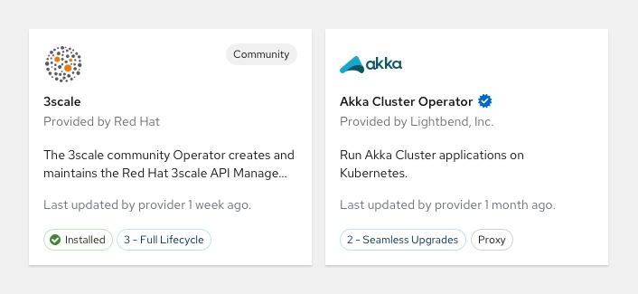
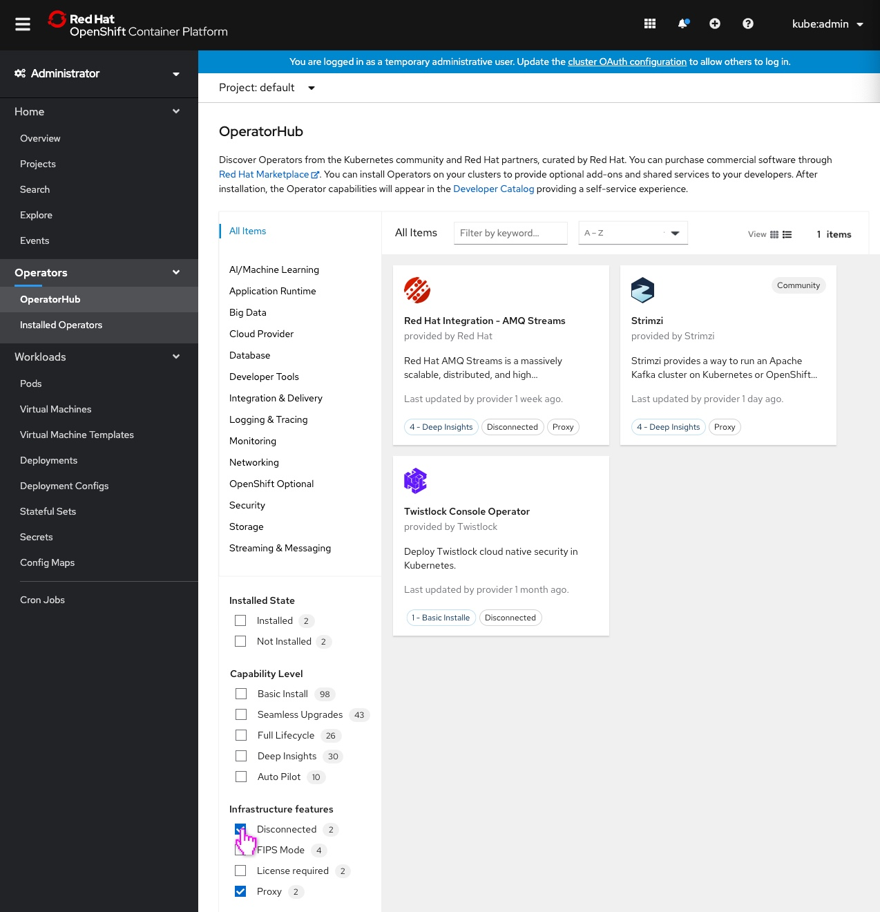

# Improving OperatorHub tile design to reflect the filtering expereience and expose additional capabilities

OperatorHub provides users access to hundreds of operators. The latest designs focus on improving the tile layout to reflect the filtering experience in realtime. By directly surfacing filter attributes on the tile, users can easily identify which filters apply to which operators. In addition, expanding the complex capabilities that we expose on the tile allows users to easily differentiate between operators without having to expand the details for each one.

## Updated tile design

Original capabilities remain on the tile:
- `Community` and `Marketplace` provider types will still appear in the top right hand corner and maintain the same style.
- `Installed` status will continue to appear in the bottom left of the tile.

New attributes added to the tile:
- `Capability Level` persists on the tile in the bottom left hand corner. It is styled with the blue outline label and corresponding level.
- `Last updated by provider on [date]` is always listed under the description.
- When applicable, the new `Red Hat Certified` badge will appear to the right of the Operator's name. The badge is styled as a blue starburst with a white checkmark in the center.
- `Infrastructure Features`, the only conditional label, is surfaced on the tile when a user selects the corresponding filter. The label is styled with a gray outline and corresponding feature.

Note: We chose to persist `Capability Level` and `Last updated by provider on [date]` as future enhancements will allow users to sort by those particular capabilities. 

## An Example of the new design in context

- In this partiuclar view, no filters have been applied.

- Clicking `Proxy` filters the list only to operators containing that feature, and surfaces the corresponding `Infrastructure Features` label.

- Clicking `Disconnected` adds those corresponding operators to the list, and surfaces the corresponding `Infrastructure Features` label.

Note: Infrastructure features will always appear in alphabetical order on the tile if an operator contains more than one attribute.

