# Surfacing resource-related quick starts

## Introduction
Sometimes quick starts can be closely associated with a resource type, for example, a virtual machine or a pipeline. With that in mind, it became important to surface quick starts on that resource's page to improve the flow of both creating a resource and using a resource. This design demonstrates how to do so.

## Design summary
The design is broken up into scenarios:
- [Populated resource list views](#populated-resource-list-views)
- [Empty resource list views](#empty-resource-list-views)

Whether the list view is populated or not, the general pattern of this design includes surfacing a dismissible label to make it clear that a quick start is available within the page heading.
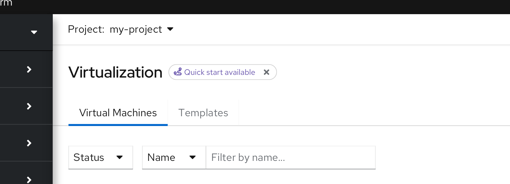

The label is more like a hint and can be hidden, which would then hide **all** resource-related quick start labels for that user.
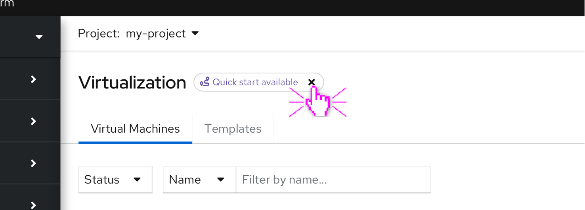

If there are multiple quick starts associated with a resource, they should be shown in a side panel, where the order logic should be as follows:
- In progress quick starts
- Not started quick starts
- Do not show completed quick starts
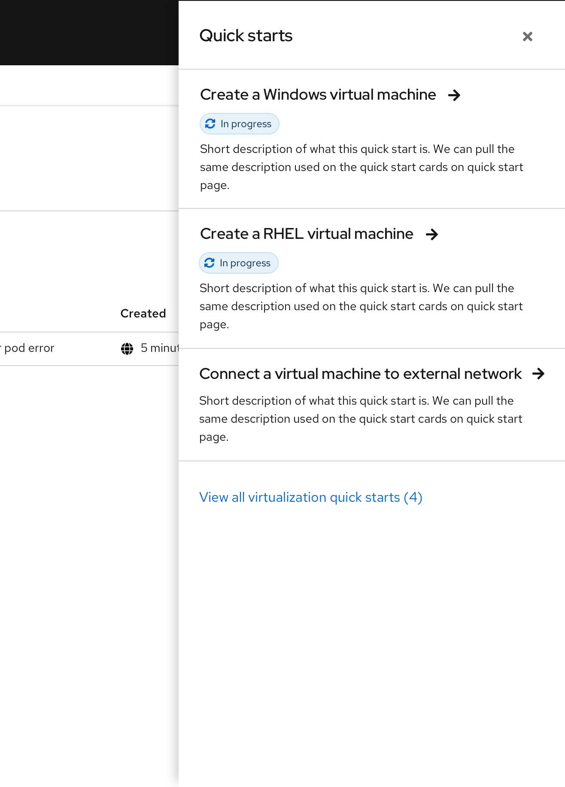

At the end of the list, there should be a link to view all quick starts associated with that resource. The button should take the user to the quick starts catalog page that is filtered by the resource type.

## Empty resource list views
If a quick start exists that will help the user create a resource type, it should be made available within the empty state of the list view.
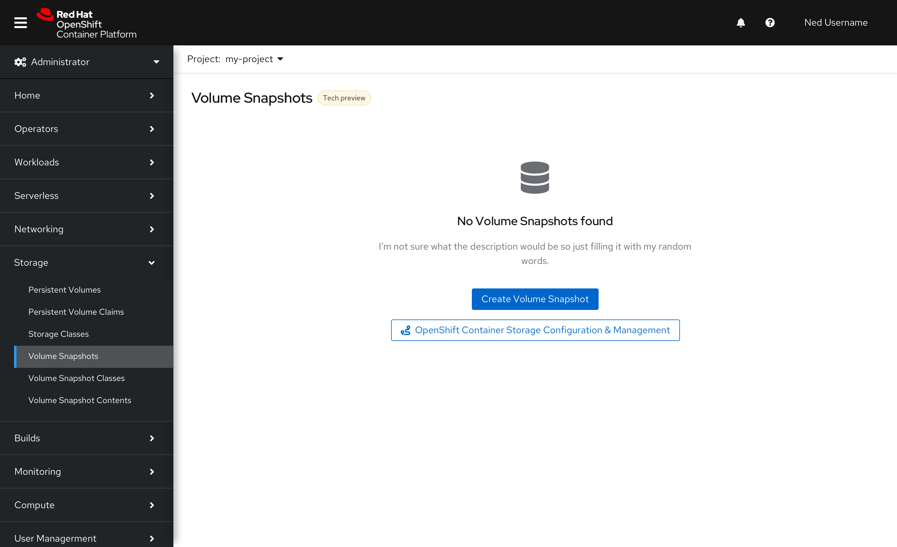

Selecting the button will immediately start the quick start on the page.

If multiple quick starts exist that will help the user create a resource type, a side panel should list the quick starts.
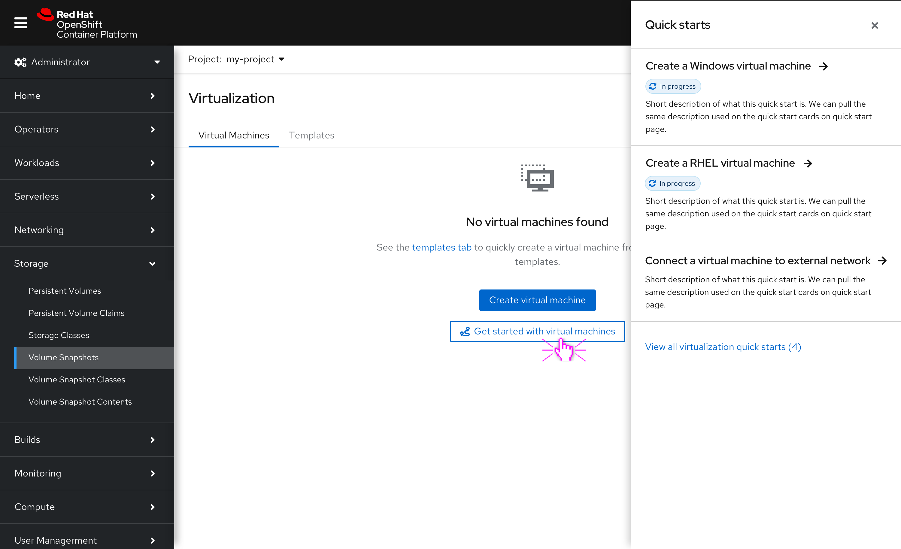

Choosing to resume or start a quick start from the side panel will resume or start the quick start on that page.

## Populated resource list views
If a quick start exists that will help the user use or explore a resource type, it should be made available as a label in the page heading.
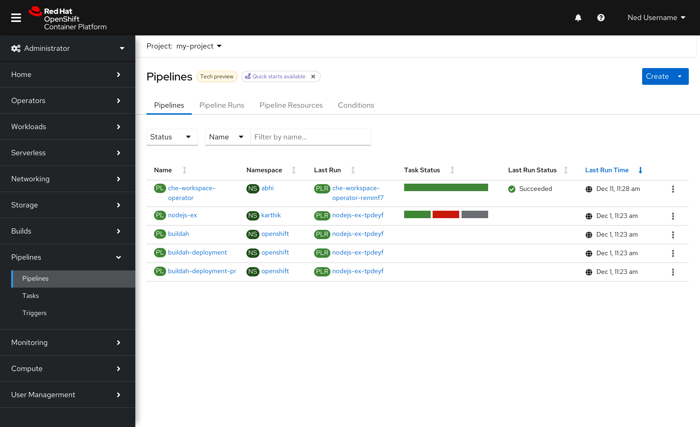

Selecting the label will immediately start the quick start on the page.
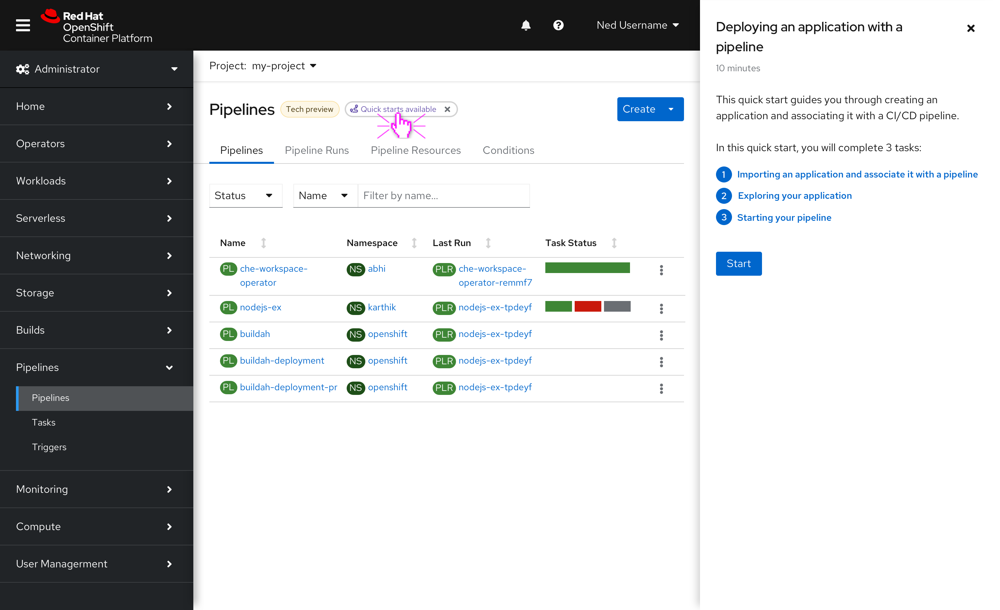

If multiple quick starts exist that will help the user use or explore a resource type, a side panel should list the quick starts.
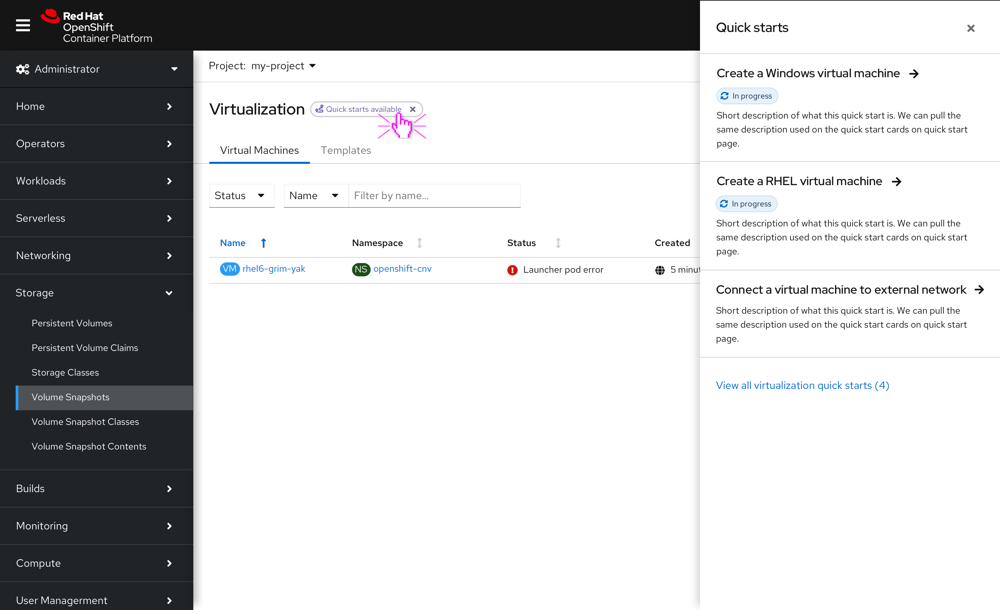

Choosing to resume or start a quick start from the side panel will resume or start the quick start on that page.
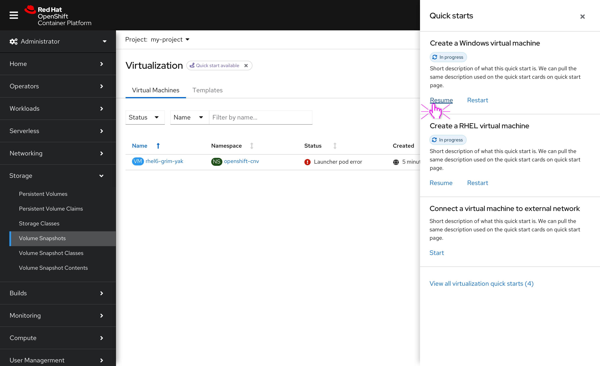
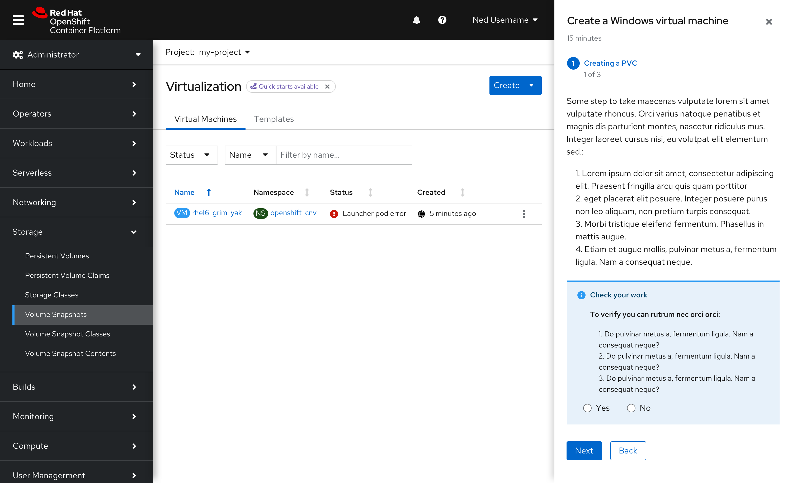

## Label behavior
If a resource has multiple labels in the page heading, we should use the following behavior as a guide.

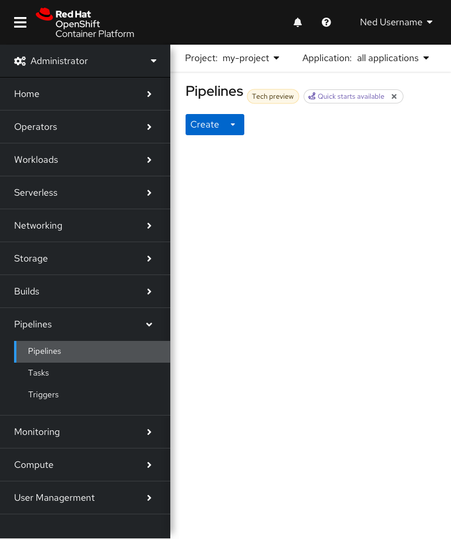
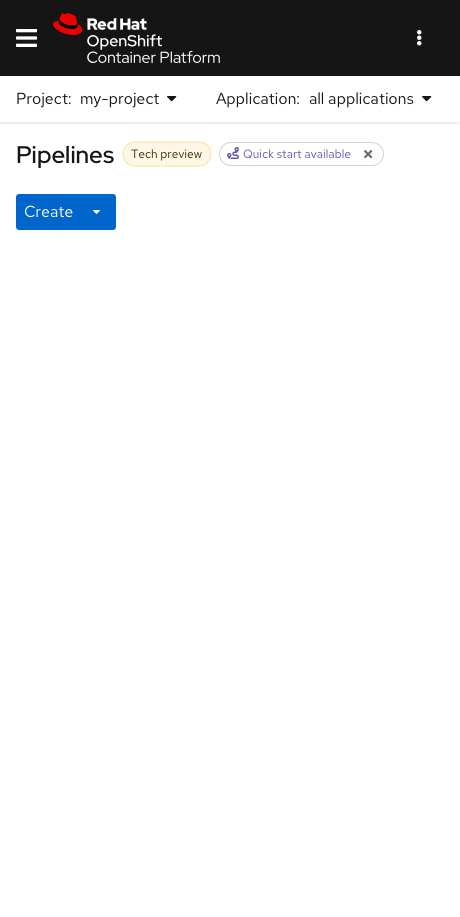

## Future design considerations
In the future, there may be more than just quick starts that will help the user get up and running with the resource. The icon used in the label can be generalized for all "getting started" resources, including guided tours, learning resources, etc. If we expand the design to include more resources, the side panel can still be used to showcase the content, but tabs could be good to use to section them out.
