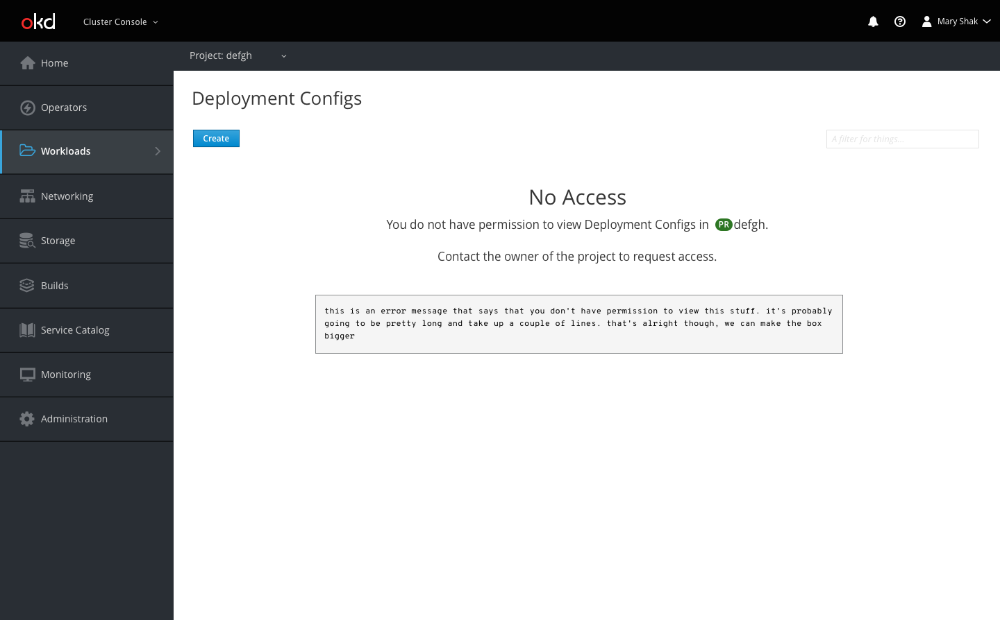
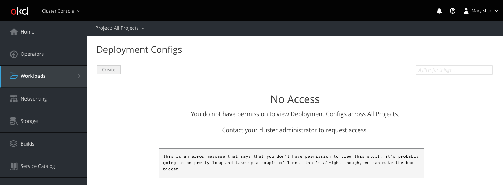
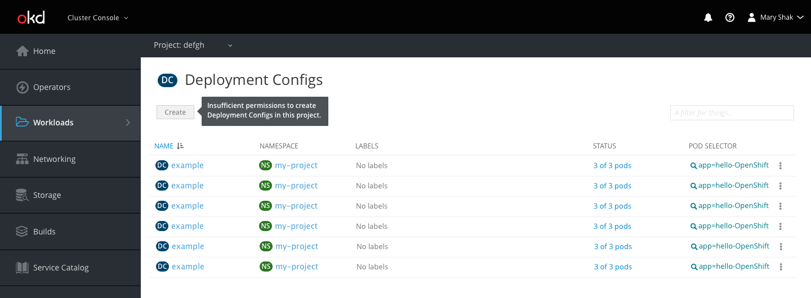
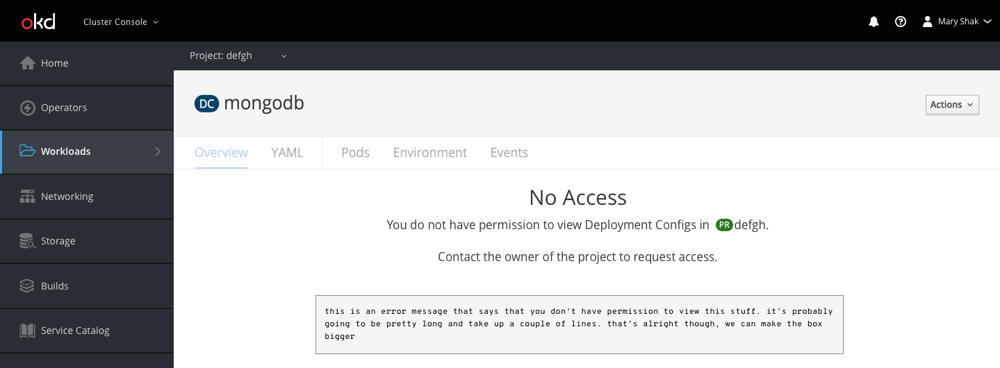
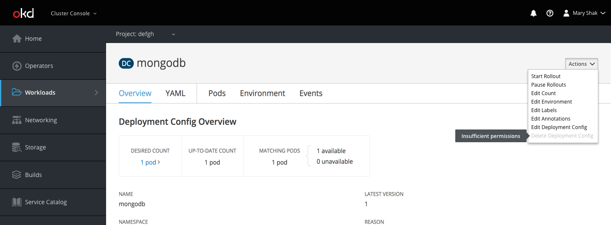
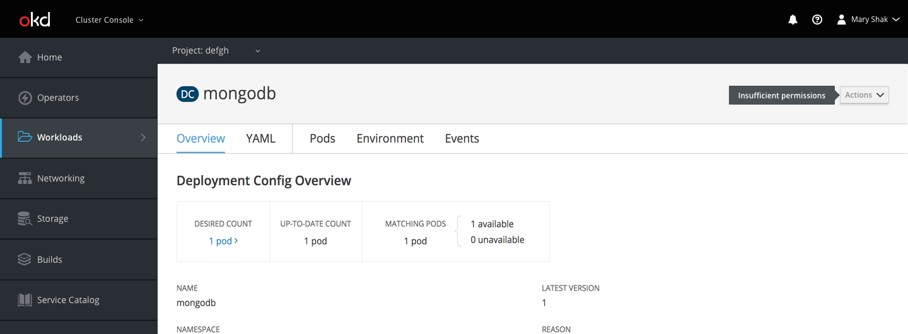
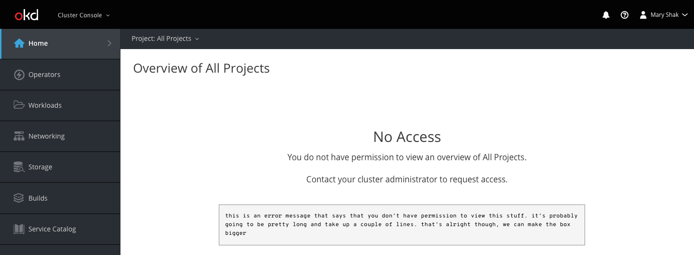
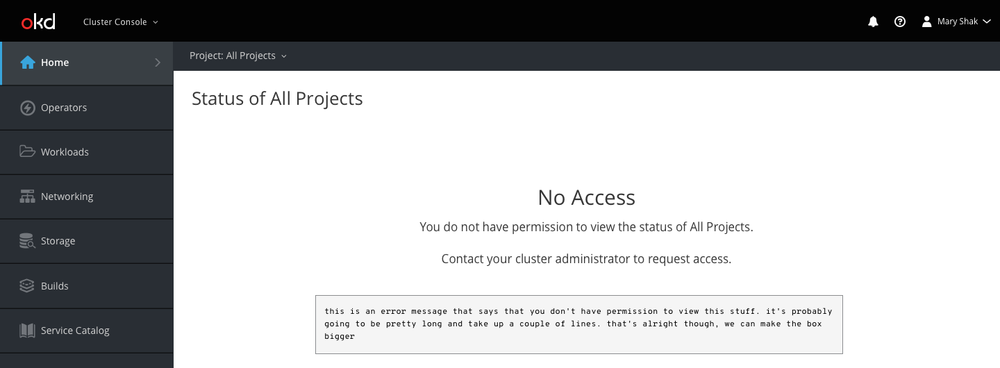
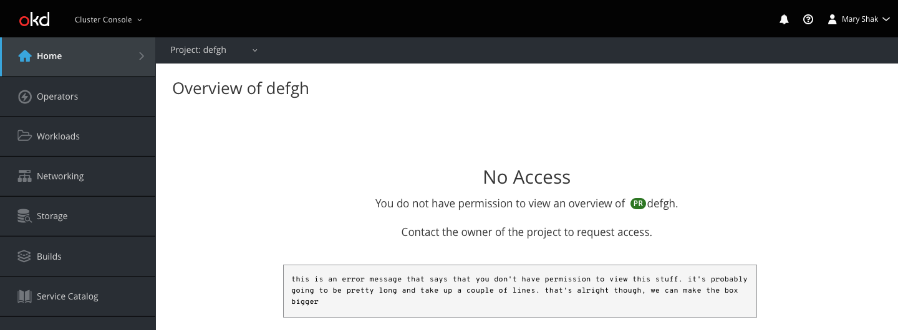

# Role Based Access Control (RBAC)

## Object Lists

- If a user does not have permissions to view a list of objects in a single namespace, they should be presented with a message that reads `You do not have permission to view <object name> in <project name and badge>` and should be prompted to contact the owner of the project to request access.
- Below the message, the page should display the exact wording of the error message in a code format.
- It is possible that a user may still have permission to create objects, and the create button should be enabled in this case.

- If a user does not have permissions to view a list of objects across namespaces, the message should read `You do not have permission to view <object name> across All Projects` and users should be prompted to contact their cluster administrator rather than the project owner.

- If a user has permission to view a list of objects in a single namespace but not create new objects, the create button should be disabled with the message `Insufficient permissions to create <resource name> in this project`.
- Even if a user does not have Permission to create objects at the cluster scope, the create button should still be enabled. The process should succeed if they enter a namespace in which they have permission and fail if they do not have adequate permissions.

## Object Details

- If a user navigates directly to an object that they would not normally have permissions to view, the page should be muted with no visible information and the same message should be presented as on a list view

- Depending on permission level, actions on a specific object should be restricted by disabling a specific action, or the entire actions dropdown. In this specific context, the tooltip can be limited to simply `Insufficient permissions`.

## Overview/Status

- On overview and status pages, phrasing will be similar to those for object list views.
