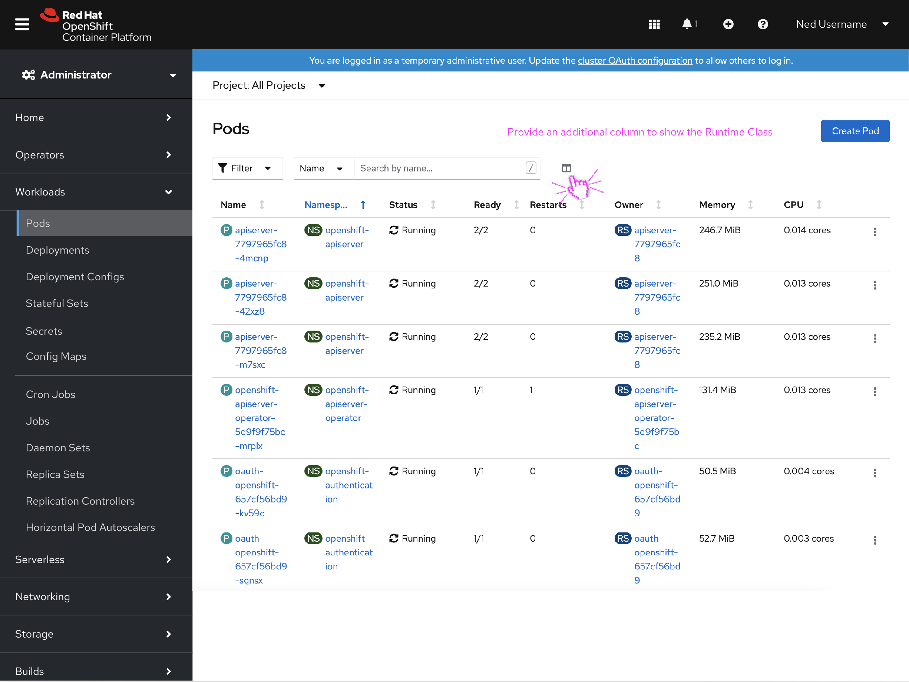
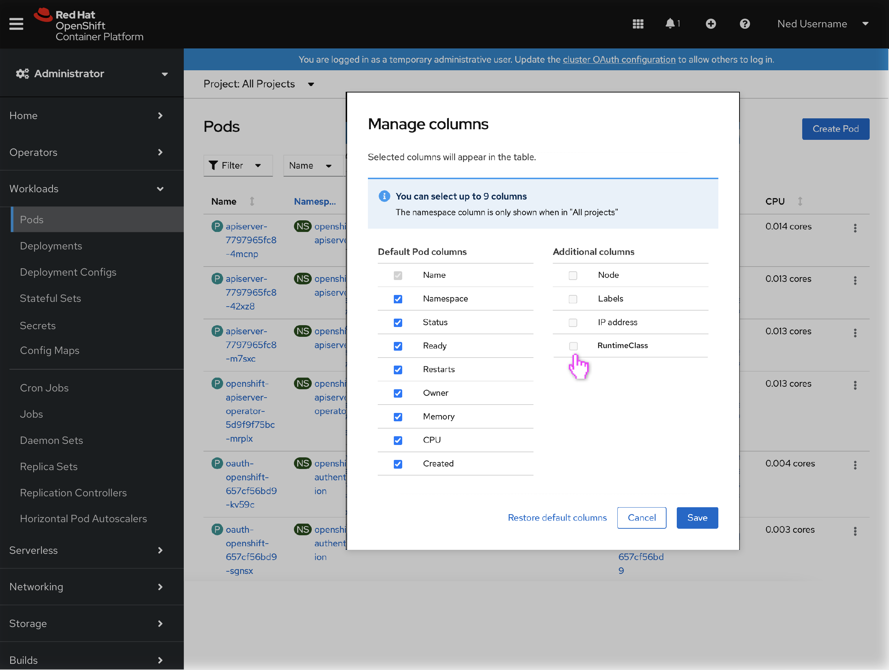

# Filtering by RuntimeClass

## Background
Kata containers are now being used in OpenShift sandbox. Kata containers are an open-source project that offers light-weight containers with the security of VMs. In OpenShift 4.8 the console team added the Runtime Class field to the Workloads details pages. This allows a user to see what workloads are using the kata runtime on both the Admin and Dev perspective. 

Why is this information important: Deployments using  Kata containers may require additional information and/or policies. Currently in the console the only way to identify which Pods are using the kata runtime class is by going to the details pages (Deployment, Pods, ReplicaSets, etc.).

## Goal

Adding a method to filter by Runtime Class in the Pods list view would give a higher level view of these pods improving observability. 

## Designs for a future release

The pods list page lets users customize the columns shown in the table.

When clicking on the columns icon a modal will show the available options that can appear in the table. This design adds RuntimeClass to the optional columns category. 

When apploed the RuntimeClass column will show either runC or kata on their respective pods. The sorting option on the runtime class should be alphabetical.
