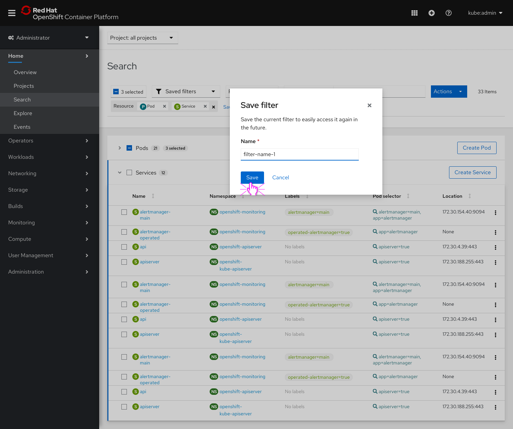
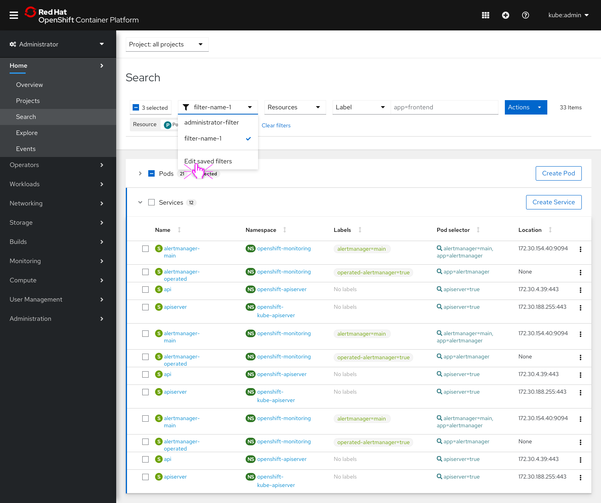
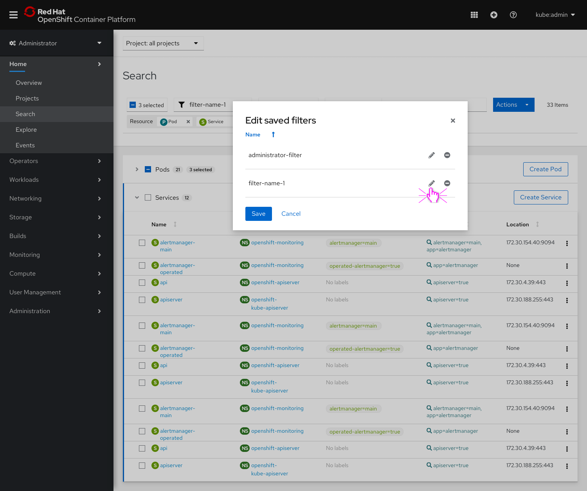
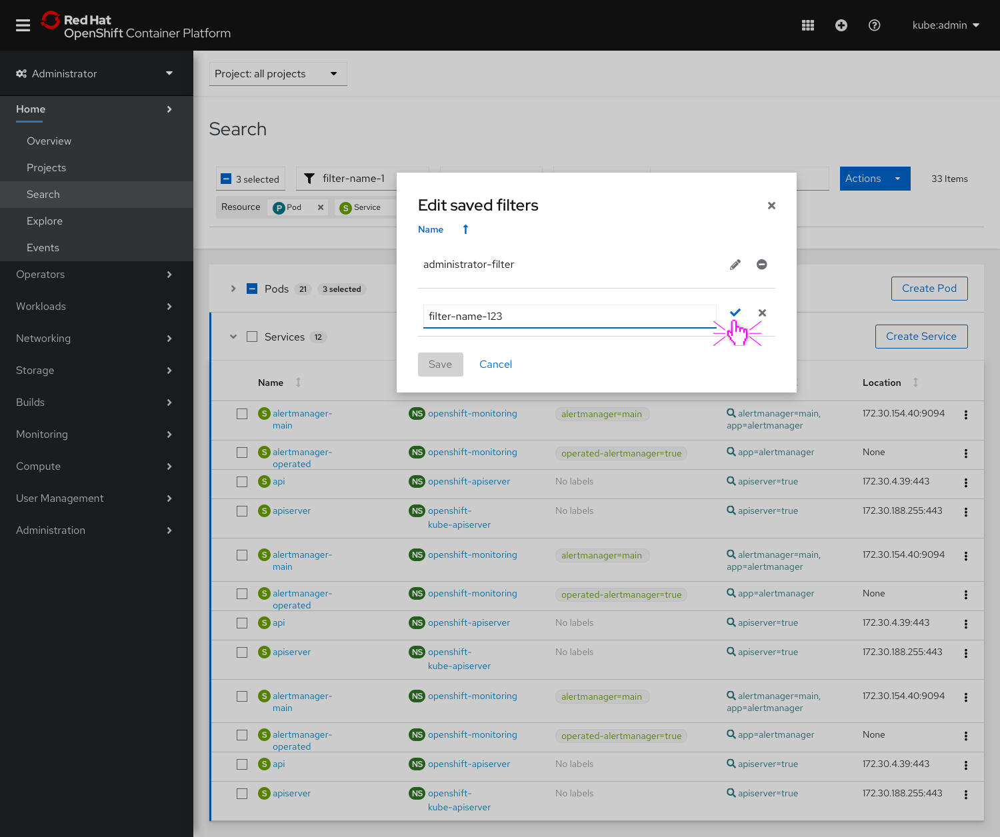
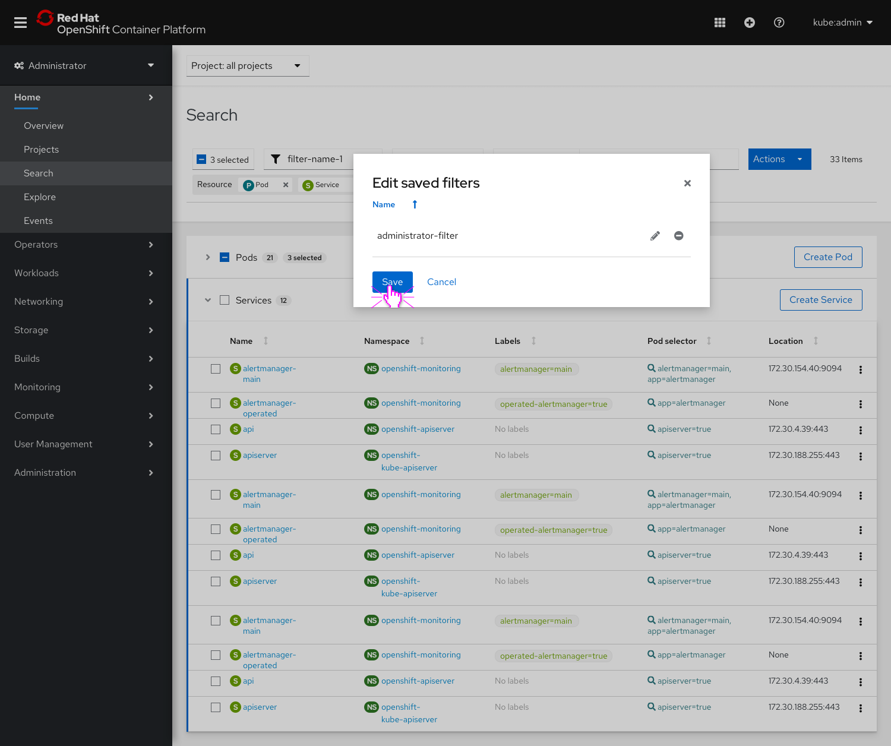

# Saved filters

The Search page will be updated to allow users to save searches.

## General flow

* If no filters have been saved, the **Saved filters** dropdown will have a small empty state.

* Users can save filters by clicking the **Save filter** button at the end of the filter chip row.

* Users will be able to enter a name for the saved filter in a modal.

* The **Saved filters** dropdown will update to show the saved filter name since it is the currently applied filter.

* Users can click the **Saved filters** dropdown to see all their saved filters.
* Through the dropdown, users may also choose to edit their saved filters.

* In the **Edit saved filters** modal, users are able to edit the name of any previously saved filter.

* Using [inline edit](https://www.patternfly.org/v4/documentation/core/components/inlineedit), users can update and save a new filter name.
* While the inline edit action is activated, the modal's **Save** button should be disabled.

* Users can also choose to remove a saved search by clicking the minus icon.

* Users can save the updates they made to their saved filters list by clicking the modal's **Save** button.

## Additional behavior
* If a user selects a saved filter and then adds another filter or resource, the **Save filter** button will reappear, allowing the user to save a new filter. The **Saved filter** dropdown will return to its unselected state.
* If a user selects a saved filter and then hits **Clear filters**, all the chips are removed and the **Saved filter** dropdown will return to its unselected state.

## Potential future enhancements
* In the future, we may want to explore allowing users to set one of their saved searches to be the default view on the Search page so it is already selected upon page load.
